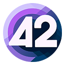

# [42for.net](https://42for.net) (akobr/mono.me)

Welcome to my mono-repository. The vault of my all small and bigger projects which I try to maintain and expand.

## Projects

- [Monorepo](docs/Monorepo/README.md): suggestions around a mono-repository approach + some helpful tooling
- [Texo](docs/Texo/README.md): universal text-based user interface for any type of application
- [Cetris](docs/Cetris/README.md): a Tetris game for command-lines
- Packages
  - [CLI.Toolkit](docs/Libraries/CLI/Toolkit/readme.md): handy toolkit for a fancy CLI application

## Main motos

> There's no wrong time to rock! 🎸

and

> Simplicity is the ultimate sophistication.
> *-- Leonardo da Vinci*
