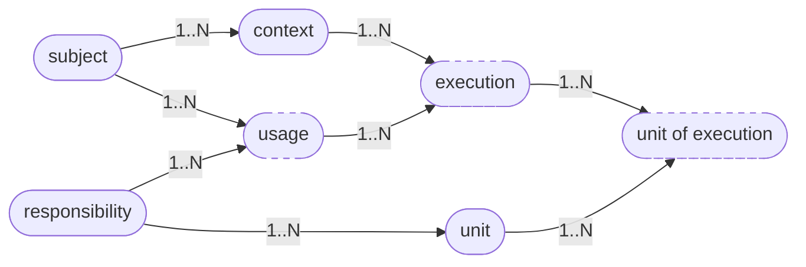

# Annotations

Annotations are how Storyteller describes a product. A handful of named records is enough to answer the questions that usually live in people's heads, in wikis, and in deployment repos that have drifted apart:

- Who consumes this capability?
- In which setup?
- With which configuration?
- Which job runs for them, and when?

The same records are the subscription catalog. A service asks Storyteller for the annotation it is about to run, reads the [effective configuration](configuration), and behaves accordingly. New people on the team read the same catalog. An incident starts from a key, and the key already says which customer, which capability, and which setup are involved.

::: tip
Seven annotation types cover a SaaS product, a consumer suite, a large distributed system, a monolith that still has several versions in production, and a physical product. The examples later in this guide use one model for all of them.
:::

## The shape

Three annotations are the nouns you choose. The others are the relations Storyteller keeps between them, so each relation can carry its own facts.



| Annotation | What it stands for | You choose it when |
| --- | --- | --- |
| **Subject** | The center of the catalog: a customer, a person, a version, a market, a product model | You need a single place that owns a family of setups |
| **Context** | One parallel setup of that subject: an environment, a legal entity, a release, a trim, a cell | The same subject runs in more than one world |
| **Responsibility** | A capability: a module, a service, a subsystem, a part family | You ship it, configure it, or watch it as its own thing |
| **Unit** | A job, event, or pipeline inside a responsibility | You need a smaller name than the whole capability |
| **Usage** | This subject consumes this responsibility | The commercial or entitlement facts belong to the pair |
| **Execution** | That usage, running in one context | The facts belong to one concrete setup |
| **Unit of execution** | One unit inside one execution | A job has its own schedule or payload per setup |

Usage, execution, and unit of execution are drawn with a dashed border because they are relations. They are still real records. Each one has a key, metadata, and a configuration document, which is what makes a customer-specific or environment-specific difference addressable.

A subject lists its contexts and the responsibilities it uses. A context lists the responsibilities that run there. A responsibility lists its units. Creating a deeper annotation fills in any missing parent and updates those lists, so the catalog stays linked from both sides.

## What each one is for

### Subject

The subject is the sun of the model. In a B2B product it is the customer. In a consumer finance suite it is the person. In a desktop product it can be a major version that is still alive. In a vehicle line it is the product model.

Everything you want to ask "for this one" hangs under the subject: its contexts, the responsibilities it uses, and the configuration that should be true for all of them.

### Context

A context is an optional second axis on a subject. It names a world in which the subject operates.

Typical contexts are an environment (`production`, `sandbox`), a legal entity a person represents, a software version still in production, a trim of a physical product, or a cell of a distributed system. A subject with a single world still has one context, often named `production` or `default`, so every running capability has an execution key.

### Responsibility

A responsibility is one building block of the product. In a [modulith](../architecture/modulith) that is usually one satellite. It can just as well be a microservice, a module inside a monolith, an add-on, or a subsystem of a physical product.

The responsibility holds the defaults of the capability itself: the behavior you ship before any customer has a say.

### Unit

A unit goes one step below a responsibility. It names a job, a workflow step, a file arrival, or a message the capability handles. Two fields describe it:

- `unitType` — what kind of trigger it is, such as `time`, `message`, `file`, or `event`
- `unitDefinition` — the concrete trigger, such as a CRON expression, a message template, or a file pattern

The scheduler actor that fires units is further along the [road map](road-map). The annotation is already part of the model, so a job can be named, documented, and configured per customer today.

### Usage

A usage is the pair *(subject, responsibility)*. It is the right place for facts that are true because this subject consumes this capability, in every context: the plan, the seats, the feature package, the contract.

A subject with three responsibilities has three usages. A responsibility sold to a hundred customers has a hundred usages. Listing usages is the answer to "what does this customer consume?" and "who uses this module?".

### Execution

An execution is the triple *(subject, responsibility, context)*. It is the runtime record of a satellite: this capability, for this subject, in this world.

This is where a production setup diverges from a sandbox, where one legal entity gets a different limit, and where one version of a monolith keeps an old flag. The effective configuration of an execution is what a running service should read.

### Unit of execution

A unit of execution is one unit inside one execution: this job, for this subject, in this context. A nightly export can keep the responsibility's definition and still override the hour for a single customer in a single environment.

## Keys

Every annotation has a key. The key is the address, and it already contains the names of its parents, so you can see the whole relation without a lookup.

| Type | Code | Key |
| --- | --- | --- |
| Responsibility | `rst` | `rst.{responsibility}` |
| Unit | `unt` | `unt.{responsibility}.{unit}` |
| Subject | `sbt` | `sbt.{subject}` |
| Usage | `usg` | `usg.{subject}.{responsibility}` |
| Context | `cnt` | `cnt.{subject}.{context}` |
| Execution | `exe` | `exe.{subject}.{responsibility}.{context}` |
| Unit of execution | `uxe` | `uxe.{subject}.{responsibility}.{context}.{unit}` |

A name is one segment. The separator is a dot, so a name itself does not contain a dot. `northwind`, `invoicing`, and `production` are names. `exe.northwind.invoicing.production` is the execution of the invoicing responsibility for Northwind in the production context.

Inside an organization, a project, and a view, the full address starts with `@`:

```text
@house.main.default.exe.northwind.invoicing.production
```

`house`, `main`, and `default` are the conventional organization, project, and view names. A second view, such as `@house.main.2026-q4.exe.northwind.invoicing.production`, is a parallel edition of the same catalog. Views are explained with configuration, because that is where they pay off.

## What every annotation can carry

The relation is the structure. These fields are the catalog you can show to a person:

| Field | Use it for |
| --- | --- |
| `title`, `description` | A human name and a short explanation |
| `documentationLink` | A deeper page, a runbook, or a contract |
| `labels` | Free tags: `billing`, `beta`, `pci`, `eu` |
| `values` | A small JSON object of facts other configuration may read |
| `isDisabled` | The record stays visible and is marked inactive |
| `validFrom`, `expiresAt` | A trial, a subscription window, a version that retires on a date |
| `timeZone` | The zone in which that window, or a unit's schedule, is interpreted |

`isDisabled` and the validity window are data on the annotation. A service, or the scheduler when it arrives, reads them and decides whether the record should run. The catalog keeps the record either way, which is what you want when someone asks why a customer stopped receiving a feature on a given day.

`values` is the bridge into configuration. A resolved document can pull a field from the annotation, or from an ancestor, with an `@annotation(...)` expression. The customer tier can live on the subject, and every execution can refer to it, without copying the tier into every document.

## Why this stays small

The model refuses a new entity type for every new business idea. A legal entity, a datacenter, a trim level, and a software version are all contexts. An add-on, a microservice, and a physical subsystem are all responsibilities. The platform stays fast at a large number of these records, including a subject per end customer, because the key shape does not change as the catalog grows.

What changes from product to product is the meaning you assign. [How to model a product](modeling) is a short way to assign it. The [examples](examples/) show the assignment for six different products.

## Where configuration sits

Each annotation stores its own configuration document: only the values that belong at that level. Reading an execution returns those documents merged, from the responsibility and the subject down to the execution itself. That merge is the whole point of describing a system with annotations, and it has its own page: [Configuration](configuration).
