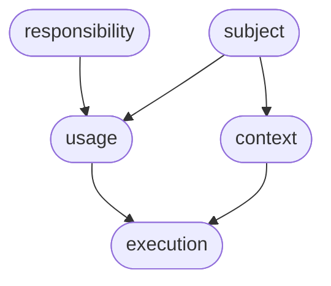

# Configuration

Annotation records say **what exists** and **how it is related**. Configuration says **how it is set up**.

The useful property is that you store a difference where the difference belongs, and you read one merged document at the level you are about to run. A default stays on the responsibility. A customer-wide choice stays on the subject or the usage. An environment choice stays on the context. A one-off stays on the execution. The next customer, the next environment, and the next version reuse the same documents and override only their own line.

::: tip
A catalog of annotations without configuration is already a map of the product. Configuration is what turns the map into the setup each running piece should use, with a history of who changed it.
:::

## One document per annotation

Every annotation can hold a JSON object. That object is the **stored document**: the values written at that exact key. It is often small.

```json
{
  "currency": "EUR",
  "retries": 3,
  "features": ["vat"]
}
```

Writing again merges into the stored document. Objects combine property by property. Arrays are unioned, so a new feature id is added to the list already stored. A JSON Patch can be sent on its own, or embedded in the write:

- `$remove` — an array of JSON paths to drop from the stored document after the merge
- `$patch` — a JSON Patch array applied after `$remove`

Both instructions are consumed by the write. They are not left in the stored document. Each change that actually alters the document becomes a version, with an author and a timestamp, and the previous document is kept. You can read any version and diff any two versions of that annotation's own document.

## The effective document

Ask for an execution and Storyteller walks the ancestors, deep-merges their stored documents, and returns one object. That is the **effective configuration**. Bindings are still visible as `@...` strings. Ask for the **resolved configuration** when those expressions should be evaluated. Secrets inside a resolved document are returned only to a caller allowed to see them.

For an execution the merge order, from the general document to the one that wins, is:

1. Responsibility
2. Subject
3. Usage
4. Context
5. Execution

For a unit of execution the unit is merged as well. The execution's effective document is applied after the unit, and the unit of execution is applied last:

1. Responsibility, then the unit
2. The execution's effective document
3. The unit of execution

Objects merge. A scalar written later replaces the same scalar written earlier, which is how a more specific document turns a flag off: store it as a boolean or a string, and set the new value. Arrays are **unioned**, so an allow-list or a package of feature ids grows as more specific annotations add entries. A more specific annotation can add entries to an inherited array, but it cannot remove or replace the entries it inherited. A null does not erase an inherited value. To change an inherited scalar setting, write the new value on the more specific annotation.



### A worked merge

Invoicing for the customer Northwind, in production.

Responsibility `rst.invoicing`:

```json
{ "currency": "EUR", "retries": 3, "features": ["vat"] }
```

Subject `sbt.northwind`:

```json
{ "currency": "NOK", "residency": "norway" }
```

Usage `usg.northwind.invoicing`:

```json
{ "plan": "enterprise", "features": ["e-invoice"] }
```

Context `cnt.northwind.production`:

```json
{ "endpoint": "https://northwind.example/invoices", "retries": 5 }
```

Execution `exe.northwind.invoicing.production`:

```json
{ "features": ["vip-support"] }
```

The effective document of that execution is:

```json
{
  "currency": "NOK",
  "retries": 5,
  "residency": "norway",
  "plan": "enterprise",
  "endpoint": "https://northwind.example/invoices",
  "features": ["vat", "e-invoice", "vip-support"]
}
```

Northwind's currency replaced the product default. Production's retry count replaced the product default, because the context is merged after the usage. The plan survived from the usage because nothing more specific replaced it. The feature list is the union of every list along the path. The endpoint exists only in production, so the sandbox context can point somewhere else without a copy of the rest.

This is the maintenance property that matters when every deployment is a little bit unique. The unique line is one small document. The shared lines stay shared. Reading the execution still shows the full setup.

## Schemas

A schema is a JSON Schema document. It describes the object stored on an annotation, so a new customer cannot be written into a shape the service does not understand. Validation looks at that stored document. Inherited values do not satisfy a required property; the annotation that owns the property is the one that must contain it.

Three layers are merged into the schema that is actually checked:

1. **Type.** One schema for every responsibility, every subject, every usage, and so on.
2. **Descendant type.** An ancestor declares the shape of a descendant kind. A responsibility can require every usage of itself to carry a `plan`. A subject can require every context to name a `region`.
3. **This annotation.** The single key can tighten the schema further.

Later layers win. Object schemas merge. `required` arrays are unioned, so a requirement introduced by the responsibility and another introduced by the subject are both required on the usage. The combined schema for a key is readable as one document, together with the list of layers that were applied.

| Descendant | Ancestors that may define its schema, in merge order |
| --- | --- |
| Unit | The responsibility |
| Context | The subject |
| Usage | The responsibility, then the subject |
| Execution | The responsibility, the subject, the usage, then the context |
| Unit of execution | The responsibility, the subject, the usage, the context, the execution, then the unit |

A type code on that descendant-type schema uses the short code: `unt`, `cnt`, `usg`, `exe`, `uxe`.

## Views

A view is a parallel edition of a project. The default view is `default`. A second view can hold the configuration of a rollout, a rehearsal, or a release candidate while the current view keeps serving.

Diffing a key between two views compares the effective configuration in each view. Diffing two versions compares the stored document of that one annotation. Together they answer "what will change for this customer if we promote this view?" before anything is promoted.

## Bindings

A string value that starts with `@` is an expression. It is evaluated when someone reads the **resolved** configuration. The effective configuration still shows the expression, which is the right document to review in a diff.

Expressions that the Storyteller API evaluates:

| Expression | Resolves to |
| --- | --- |
| `@config("$.currency")` or `@config("/currency")` | Another value in this resolved document. The lookup uses a snapshot taken before evaluation, so order inside the document does not matter. JSONPath and JSON Pointer are both accepted. |
| `@annotation("$.tier")` | A field of the `values` object on the annotation being resolved |
| `@annotation("$.tier", "Subject")` | The same lookup on an ancestor. The second argument is an annotation type name: `Subject`, `Responsibility`, `Context`, `Usage`, `Execution`, `Unit` |
| `@(api.key, keyvault)` | A value from a named source. With the Azure Key Vault source, the secret name is the path joined by `--`, here `api--key`. The source is skipped when the caller is not allowed to receive secrets |
| `@[Hello @config("$.name")]` | Text with expressions embedded |
| `@{1 + 2 * 3}` | A number |

```json
{
  "currency": "@annotation(\"$.currency\", \"Subject\")",
  "callbackUrl": "@[https://@config(\"/host\")]/hooks",
  "apiKey": "@(billing.apiKey, keyvault)"
}
```

The customer keeps `currency` in the subject's `values`. The execution refers to it. The secret never has to be copied into the catalog; a resolved read with the secret scope materializes it for the service that is allowed to hold it, and everyone else still sees the expression.

## What you gain

- **A place for every difference.** Customer, environment, version, and one-off each have a document. Shared behavior is written once.
- **A single answer at runtime.** The service reads the execution and receives the merge. It does not reimplement inheritance.
- **A shape you can enforce.** Schemas follow the same ancestry, so a module can define what a valid usage of itself looks like.
- **A history.** Versions, authors, and diffs are kept per annotation, and two views can be compared before a rollout.
- **Secrets stay behind an explicit read.** The catalog can name a secret without becoming a place that stores it.

The next page is the practical assignment of these levels to a real product: [How to model](modeling). The address of each document, and the HTTP API that reads and writes it, is in [Using the platform](using-the-platform).
