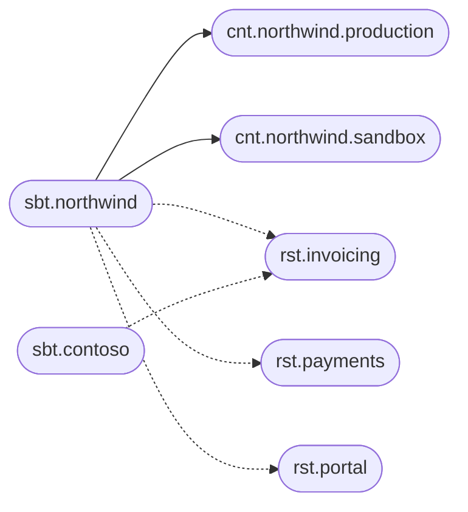

# B2B software as a service

A software house ships one product to many businesses. Each customer buys a slice of the functionality, gets one or more instances, and accumulates exceptions: a tax rule, a residency constraint, a feature that was switched on during a pilot and never switched off. After a few years every deployment is a little bit unique, and the full picture lives in a mix of tickets, repos, and the memory of whoever onboarded that customer.

Storyteller keeps that picture as annotations. The customer is a subject. Each instance is a context. Each module is a responsibility. The commercial relationship is a usage. The concrete setup of a module in one instance is an execution.

## The catalog

Northwind buys invoicing, payments, and a customer portal. They run a production instance and a sandbox. Contoso buys invoicing only, in a single production instance, on a smaller plan.



| | Northwind | Contoso |
| --- | --- | --- |
| Contexts | `production`, `sandbox` | `production` |
| Responsibilities | invoicing, payments, portal | invoicing |
| Plan, stored on the usage | `enterprise` | `standard` |

The keys for Northwind's production invoicing:

```text
sbt.northwind
cnt.northwind.production
cnt.northwind.sandbox
rst.invoicing
usg.northwind.invoicing
exe.northwind.invoicing.production
exe.northwind.invoicing.sandbox
unt.invoicing.nightly-export
uxe.northwind.invoicing.production.nightly-export
```

`nightly-export` is a unit of the invoicing module, a time trigger. Northwind's production unit of execution moves it to 02:00 in `Europe/Oslo`. Contoso keeps the module default. The sandbox execution of Northwind can disable the unit with `isDisabled` so a test tenant does not export real files.

## Configuration, from shared to unique

| Document | What belongs there for this product |
| --- | --- |
| `rst.invoicing` | Product defaults: base currency, retry policy, the features the module knows how to offer |
| `sbt.northwind` | Facts about the customer in every module: legal name, residency, support tier |
| `usg.northwind.invoicing` | The commercial slice: plan, seats, contracted features |
| `cnt.northwind.production` | Facts about that instance in every module: region, log level, the host name |
| `exe.northwind.invoicing.production` | The one-off: a custom tax profile, a limit that exists only in production invoicing |

A descendant-type schema on `rst.invoicing` for `usg` requires `plan`. A schema on `sbt.northwind` for `cnt` requires `region`. A new customer of invoicing cannot be saved without a plan, and a new Northwind instance cannot be saved without a region. The check sits on the document that owns the value.

The effective configuration of `exe.northwind.invoicing.production` is the merge described in [Configuration](../configuration): product defaults, then the customer, then the plan, then the instance, then the one-off. Adding a sandbox does not copy the enterprise plan. Adding Contoso does not copy Northwind's residency. Both are visible in one catalog.

## What you can answer

- **What does Northwind consume?** The usages under `sbt.northwind`: invoicing, payments, portal.
- **Who uses invoicing, and on which plan?** The usages under `rst.invoicing`, each with its own document.
- **What is Northwind's production setup for invoicing?** The resolved execution `exe.northwind.invoicing.production`.
- **Which jobs run for them?** The units of execution under that execution. The schedule is the unit definition, overridden only where a customer needs a different hour.
- **What will the next rollout change?** Diff the execution between the `default` view and the view that holds the change.

A new teammate reads the subject and sees the customer. An incident in production invoicing starts from a key that already names the customer, the module, and the instance. The custom tax profile is a few lines on that execution, with an author and a version, which is a calmer place to keep it than a branch named after the customer.
