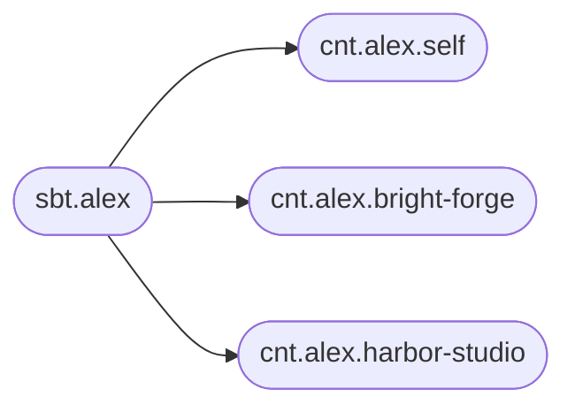

# A consumer suite of finance services

A finance suite sold to individuals has a different kind of variation. The person is stable. The legal entity they are acting as is not. The same login pays a household bill as a private individual in the morning and approves a supplier payment for a company in the afternoon. Limits, KYC, tax, available products, and settlement accounts all change with that hat.

The person is the subject. Each legal entity they represent is a context. Each product in the suite is a responsibility. The execution is the product as used by this person while wearing that hat.

## The catalog

Alex is a person. Alex acts as themselves, and as the director of two companies, Bright Forge and Harbor Studio. The suite offers accounts, payments, cards, and investments. Alex may hold a card as a person and must not hold the investment product inside Harbor Studio. Bright Forge uses payments and accounts, with a higher limit and a VAT invoice.



| Responsibility | As Alex | As Bright Forge | As Harbor Studio |
| --- | --- | --- | --- |
| `rst.accounts` | Everyday account | Business account | Business account |
| `rst.payments` | Consumer rails, low limit | VAT invoice, higher limit | Supplier payments |
| `rst.cards` | Debit card | Company card | — |
| `rst.investments` | Personal portfolio | — | — |

An absent cell is the absence of an execution. Harbor Studio has no `exe.alex.cards.harbor-studio`, so the card product is not part of that context. The usage can still exist on the person when the entitlement is personal (`usg.alex.cards`), while the execution is what actually runs.

```text
sbt.alex
cnt.alex.self
cnt.alex.bright-forge
cnt.alex.harbor-studio
usg.alex.payments
exe.alex.payments.self
exe.alex.payments.bright-forge
exe.alex.payments.harbor-studio
```

## Configuration that follows the hat

| Document | Example |
| --- | --- |
| `rst.payments` | The rails the product supports, the default limit for a new private customer, the schema every execution must satisfy |
| `sbt.alex` | The person's identity: customer number, preferred language, contact |
| `usg.alex.payments` | The fact that Alex is allowed to use payments at all, and the products inside payments they may turn on |
| `cnt.alex.bright-forge` | The company: legal name, organization number, home jurisdiction, settlement account |
| `exe.alex.payments.bright-forge` | The limit, the VAT flag, and the approval rule that exist only for this company |

```json
{
  "limit": 250000,
  "currency": "NOK",
  "vatInvoice": true,
  "approval": "two-eyes-above-50000"
}
```

That object is the whole of Bright Forge's difference. Alex's personal execution keeps the product default limit and leaves `vatInvoice` unset. Harbor Studio's execution sets a supplier-payment profile and a different approval rule. The language and the customer number are written once, on the subject, and every execution inherits them.

A schema on `rst.payments` for executions requires `limit` and `currency`. A schema on the subject for contexts requires `jurisdiction` on every hat, and `self` records `person`. The suite can grow a lending product by adding `rst.lending` and the executions for the contexts where lending is offered, without reshaping Alex.

## What you can answer

- **Which hats does Alex wear?** The contexts of `sbt.alex`.
- **Which products are live for Bright Forge?** The executions whose context is `bright-forge`.
- **Why was this payment checked with two-eyes?** The resolved document of `exe.alex.payments.bright-forge` says so, and the version history says who set it.
- **What changes if Harbor Studio should gain cards?** Create `exe.alex.cards.harbor-studio` and set the company-card document. The person, the company, and the card product are already in the catalog.

The same loop works when the subject is the company and the context is a mandate or a department. Pick the subject to be the page you open first. For a consumer suite that page is the person, because the person is who logs in and who calls support, and the legal entity is the world they are in right now.
