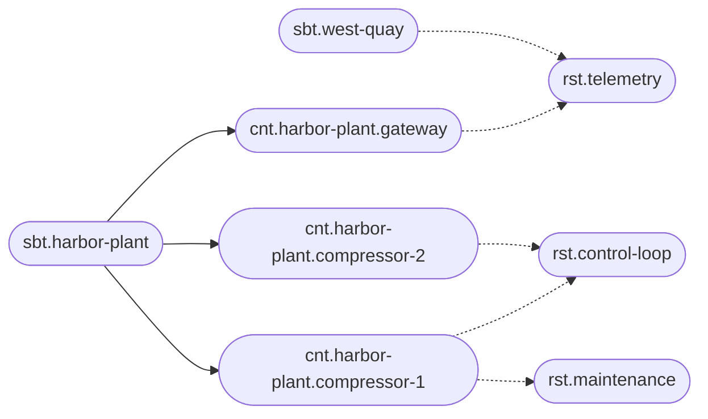

# A fleet of devices

Factories, ships, buildings, and shops end up with the same operational shape. Each site is different. Each site contains devices. Each device runs a small set of capabilities, on a schedule, with thresholds that maintenance has tuned by hand. The spreadsheet that tracks this is out of date by the time it is shared. The annotations are the spreadsheet, and the resolved execution is what the device is told to do.

The site is the subject. The device is the context. A capability is a responsibility: telemetry, a control loop, a maintenance window, a video channel. A sampling job or a control cycle is a unit.

## The catalog

Harbor Plant is a site. It has two compressors and one gateway. The gateway runs telemetry. Both compressors run a control loop. Compressor 1 also runs a maintenance window. A second site, West Quay, runs the same capabilities on different hardware and with different thresholds.



```text
sbt.harbor-plant
cnt.harbor-plant.compressor-1
cnt.harbor-plant.compressor-2
cnt.harbor-plant.gateway
rst.control-loop
rst.telemetry
rst.maintenance
usg.harbor-plant.control-loop
exe.harbor-plant.control-loop.compressor-1
exe.harbor-plant.control-loop.compressor-2
unt.control-loop.sample
uxe.harbor-plant.control-loop.compressor-1.sample
```

Compressor 2 can be marked `isDisabled` on its control-loop execution while it is stripped for service. The device stays in the catalog, the site's other compressor keeps running, and the history shows when it was taken out.

## Configuration a technician can explain

| Document | What the technician recognizes |
| --- | --- |
| `rst.control-loop` | The safe defaults shipped with the capability: sample period, maximum pressure, the schema of a legal override |
| `sbt.harbor-plant` | The site: timezone, owner, the network the devices share |
| `cnt.harbor-plant.compressor-1` | The device: model, serial, install date, firmware family |
| `exe.harbor-plant.control-loop.compressor-1` | The tuned thresholds for this machine |
| `uxe.harbor-plant.control-loop.compressor-1.sample` | A faster sample while the machine is being observed |

```json
{
  "samplePeriodMs": 500,
  "pressureMaxBar": 8.4,
  "alertChannel": "@annotation(\"$.alertChannel\", \"Subject\")"
}
```

The alert channel lives in the site's `values`, so both compressors and the gateway mention it once. The pressure limit is local to the machine, because the two compressors are not the same age. A schema on `rst.control-loop` for executions requires `pressureMaxBar` and caps it, so a typo cannot arm a threshold the hardware must never exceed.

A view named `campaign-march` can hold a temporary sample rate for a diagnostic week. Diffing the unit of execution against `default` shows the single number that will change. When the week ends, the service returns to the `default` view and the campaign view remains as the record of what was tried.

## What you can answer

- **What is installed at Harbor Plant?** The contexts of the subject, and the executions under each.
- **Which devices run the control loop, and with what limit?** The executions of `rst.control-loop`.
- **Why did compressor 1 alert at 8.4 bar?** The resolved execution says that was the configured maximum, who wrote it, and in which version.
- **What is offline for service?** Executions with `isDisabled`, still listed under their site.

The same catalog describes a ship (the vessel is the subject, a subsystem is the context) or a chain of shops (the shop is the subject, the till is the context). The nouns change. The question you ask the platform does not: what is here, what is it configured to do, and what did we change last.
