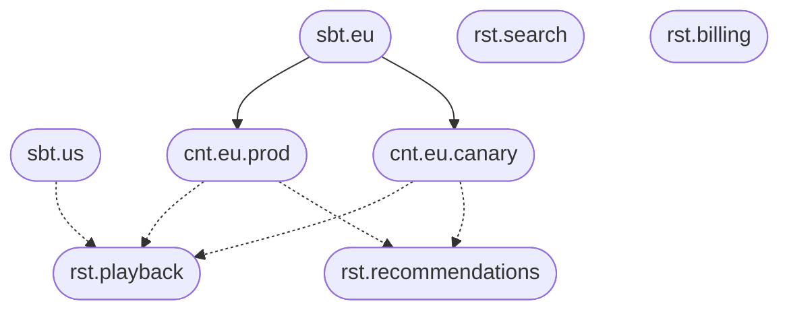

# A large distributed platform

A platform the size of a streaming service is hundreds of independently deployed services, several markets, and more than one cell per market so that a bad release can be caught before it is everywhere. The failure mode is losing the map. Nobody can say, for a given market, which services are in the canary cell, which config they resolved this morning, and which pipeline refreshes the catalog there.

The market is the subject. The cell is the context. The service is the responsibility. A pipeline inside a service is a unit.

## The catalog

The platform operates several markets and, in each of them, a production cell and a canary cell. Playback, recommendations, search, and billing are responsibilities. The diagram is a partial, illustrative slice: it shows two markets, `eu` and `us`, and draws the cells only for `eu`. Recommendations owns a unit, `model-refresh`, which runs on a schedule.



```text
sbt.eu
cnt.eu.prod
cnt.eu.canary
rst.recommendations
unt.recommendations.model-refresh
usg.eu.recommendations
exe.eu.recommendations.prod
exe.eu.recommendations.canary
uxe.eu.recommendations.canary.model-refresh
```

A market that has not launched billing yet has no usage `usg.eu.billing`. The service exists as a responsibility, which is the catalog of what the platform *can* run. The usage is what this market *does* run.

## Configuration across cells

| Document | What is true there |
| --- | --- |
| `rst.playback` | The codec ladder, the default timeout, the feature flags the service understands |
| `sbt.eu` | Market facts: default audio language, catalog window, currency of the store |
| `usg.eu.playback` | The package this market has licensed: which content tiers exist |
| `cnt.eu.canary` | Cell facts: the share of traffic, the tracing sample rate, the build channel |
| `exe.eu.playback.canary` | The flag that is on in canary and still off in production |
| `uxe.eu.recommendations.canary.model-refresh` | An earlier CRON, so the canary cell refreshes the model before production does |

A release is a view. `default` is the live catalog. `playback-14` is the candidate. Diffing `exe.eu.playback.prod` between those views shows the effective change for Europe production, including values inherited from the service and values overridden only in that cell. The canary execution can be moved to the new view first. Production stays on `default` until the diff is the one you meant to ship.

Labels on the services (`edge`, `ml`, `money`) and a documentation link on each responsibility give the map a place to hang the runbook. The annotation is the index; the runbook stays where it is.

## What you can answer

- **Which services does Europe run, and in which cells?** Usages of `sbt.eu`, then executions per context.
- **Where is this flag on?** The executions of `rst.playback` whose effective document contains it. The stored document that set it tells you whether the flag is market-wide, cell-wide, or a single override.
- **What will canary change for recommendations?** The view diff of `exe.eu.recommendations.canary`.
- **When does the model refresh run in canary?** The unit of execution, with the market's time zone taken from the subject.

Hundreds of services stay a list of responsibilities. Thousands of cell-level setups stay executions with small documents. The platform is built to hold that many annotations and to return the merged document quickly, which is the property you need when every request path resolves its own execution.
