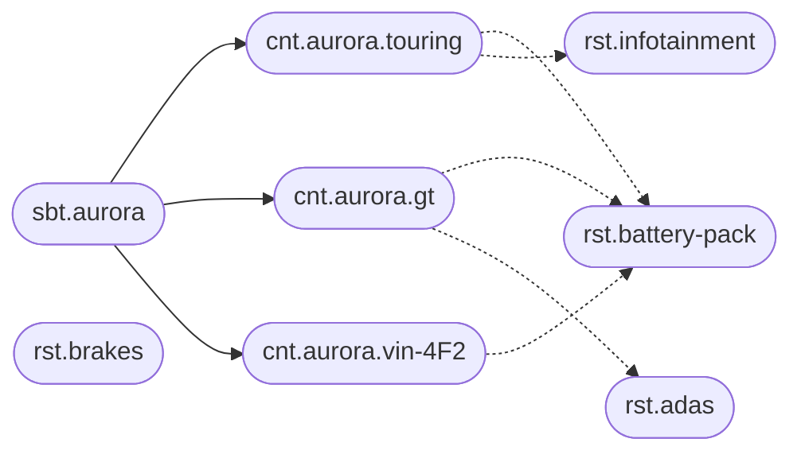

# A physical product and its parts

A product you can hold still has a configuration problem. A vehicle, a machine, or an appliance is sold as a model, built as a trim, and composed of subsystems that each have options: a battery chemistry, a firmware channel, a regional homologation, a brake package. The options change by plant and by year. The support question is always the same: what is on *this* vehicle, and which vehicles share the part that just failed?

The model is the subject. The trim, the plant build, or the individual vehicle is the context. A subsystem or a part family is a responsibility. A firmware component or a service procedure on that subsystem is a unit.

## The catalog

The Aurora is an electric vehicle. Two trims are sold, `touring` and `gt`. A specific vehicle is its own context when you care about one VIN; the trim stays the context when you care about the build recipe. Both grains fit. This page uses the trim as the context and shows one VIN as a further context of the same subject, because a single car can carry a part replaced after delivery.



```text
sbt.aurora
cnt.aurora.touring
cnt.aurora.gt
cnt.aurora.vin-4F2
rst.battery-pack
rst.infotainment
rst.adas
rst.brakes
usg.aurora.battery-pack
exe.aurora.battery-pack.touring
exe.aurora.battery-pack.gt
exe.aurora.battery-pack.vin-4F2
unt.infotainment.firmware
uxe.aurora.infotainment.gt.firmware
```

ADAS is part of the GT recipe and not of Touring, so only the GT context has that execution. The VIN context exists because that car had its battery module replaced; its execution carries the replacement part number and the date, and the trim recipe stays untouched. The VIN and the trim are sibling contexts of the same subject, so the VIN execution does not inherit from the GT execution. Its document is the complete battery record for that car: it inherits from `rst.battery-pack`, `sbt.aurora`, `usg.aurora.battery-pack`, and `cnt.aurora.vin-4F2`, and stores the full pack configuration itself.

## Configuration is the build

| Document | What it captures |
| --- | --- |
| `rst.battery-pack` | The part family: allowed chemistries, the schema a valid pack configuration must match |
| `sbt.aurora` | The model: platform generation, the markets it is homologated for |
| `usg.aurora.battery-pack` | The packs this model is allowed to ship |
| `cnt.aurora.gt` | The trim recipe shared by every GT: wheel package, interior, default firmware channel |
| `exe.aurora.battery-pack.gt` | The pack on that trim: chemistry, capacity, supplier |
| `exe.aurora.battery-pack.vin-4F2` | The replacement that is true for one car |
| `uxe.aurora.infotainment.gt.firmware` | The firmware channel and the current version for GT infotainment |

```json
{
  "chemistry": "nmc",
  "capacityKwh": 91,
  "supplier": "helios",
  "homologation": ["eu", "uk"]
}
```

A schema on `rst.battery-pack` for executions requires `chemistry` and `capacityKwh`, and restricts `chemistry` to the list the factory can build. A plant that tries to record a pack the service does not know is rejected at write time. The infotainment firmware unit uses `unitType: "file"` and a definition that names the artifact. GT's unit of execution pins the channel to `stable`; a canary vehicle context can pin `beta` without changing the trim.

The VIN-level context is optional. Use it when a car has diverged from its trim. Cars that still match the recipe are described entirely by `cnt.aurora.gt`, and you do not create a context per vehicle until you need one. The model tolerates millions of subjects or contexts when a VIN does become the thing you open first; at that point the vehicle is the subject and the trim is a value on it. Choose the page you open in support, and make that the subject.

## What you can answer

- **What is on a GT?** Every execution of `cnt.aurora.gt`. In this slice that is the battery pack and ADAS, plus infotainment through its firmware unit of execution. Brakes are a responsibility in the catalog but have no GT execution here.
- **Which trims use the Helios pack?** Executions of `rst.battery-pack` whose document names that supplier.
- **What changed on VIN 4F2?** The execution for that context, its version history, and the fact that the trim document did not change.
- **Which firmware is the GT infotainment supposed to run?** The unit of execution.

A part recall starts from the responsibility and walks the executions. The cars that match are a query over the catalog, and the cars that were already repaired are the VIN contexts whose document names the replacement.
