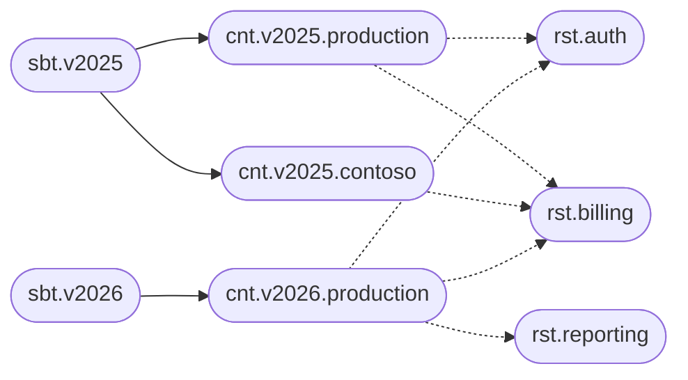

# A monolith with several versions in production

Some products ship as one deployable and still have three versions alive. A bank keeps last year's build because a group of customers has not passed regression. A desktop product supports the current major version and the previous one. A long-term-support branch runs beside the latest release, with different flags and, sometimes, a module that exists only on the new version.

The version is the subject. The channel still pinned to that version is the context. A module inside the process is a responsibility. The monolith stays one codebase; the catalog is how you see which slice is actually live.

## The catalog

`v2025` is in long-term support. `v2026` is current. Both still serve a production channel. `v2025` also serves a named customer channel, `contoso`, who has a contractual pin and a different reporting switch. The reporting module exists only in `v2026`. Auth and billing exist in both.



```text
sbt.v2025
sbt.v2026
cnt.v2025.production
cnt.v2025.contoso
cnt.v2026.production
rst.billing
usg.v2025.billing
usg.v2026.billing
exe.v2025.billing.production
exe.v2025.billing.contoso
exe.v2026.billing.production
exe.v2026.reporting.production
```

`sbt.v2025` carries `expiresAt` for the day support ends, and a label `lts`. The record remains after that day, so the reason a channel disappeared is still in the catalog. `isDisabled` on `exe.v2025.billing.contoso` is the switch for the week the pin is frozen during their own change window.

## Configuration per version

The responsibility holds the behavior of the module as it exists in code today. Each version subject holds the defaults of that line, such as the schema version of its database. The usage of billing on that version holds the feature set the line was born with. The channel context holds the endpoint and the maintenance window. The execution holds the contractual exception.

| Document | Example value |
| --- | --- |
| `rst.billing` | The flags the code understands, product defaults `vat: true` and `creditNote: true` |
| `sbt.v2025` | `schemaVersion: 14` |
| `sbt.v2026` | `schemaVersion: 18` |
| `usg.v2025.billing` | `creditNote: false`, because this line does not contain the feature |
| `usg.v2026.billing` | `creditNote: true` |
| `cnt.v2025.contoso` | `maintenanceWindow: "sun 01:00-03:00 Europe/Oslo"` |
| `exe.v2025.billing.contoso` | `legacyExport: true` |

A flag that a later level must be able to turn off is a boolean. A later document replaces it. An array would only grow, so it is the right shape for a package that more specific documents add to, and the wrong shape for a feature an older version must not inherit. Contoso's `legacyExport` flag sits on that one execution. Production of `v2026` never sees it, because Contoso is a context of a different subject.

Reporting has a usage only under `v2026`. The usages of `sbt.v2025` do not include it, which is the answer to "does the old build contain this module?". A backport is the creation of `usg.v2025.reporting`.

## What you can answer

- **Which versions are still in production?** The subjects whose contexts include a live channel, filtered by the `lts` or `current` label.
- **Who is still pinned, and to what?** `cnt.v2025.contoso` and its executions.
- **What is different about their billing?** The diff between `exe.v2025.billing.production` and `exe.v2025.billing.contoso`, or simply the stored document on the Contoso execution, which contains only the extra.
- **When does support end?** `expiresAt` on the version subject.

When the pin is lifted, delete the context `cnt.v2025.contoso`. The executions in that channel go with it. `v2025` and the production channel remain until the version itself is retired.
