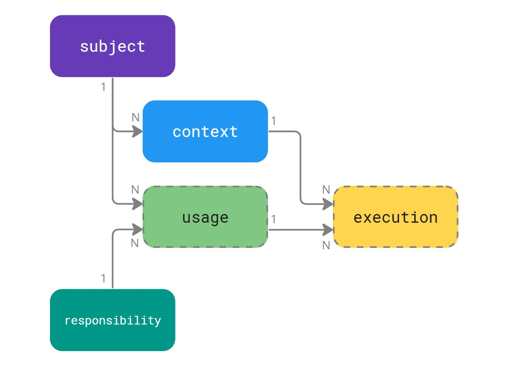

# Overview of Splatform

::: danger
The platform is under development, see [the road map](road-map).
:::

TBC

## Storyteller

The hearth of the platform. In the concept of managable modulith ecosystem is really important the description and a model of your product, because it can be a complex structure. In the same time this description can be used as data source for very important questions, like *what is used by this concrete customer?* The storyteller not just describes the entire ecosystem in shape of simple but flexible annotations, but in the same time acts as single point of truth for configuring a satelite in any state/context.

The model of annotations define all important relationships from the business point of view. This is really crusal to undestant and is probably the most important decision to make when you design it. The concept of annotation is quite abstract and flexible and in the same time still simple. There are three annotations:

TODO: change to interactive component with synonyms and examples

The **subject** should represent the most important entity, it is like the sun of your business solar system. The next one is **context**, which represet a parallel universe in the solar system. You can imagine it as a first level of abstraction. The last annotion of **responsibility** is like a planet or a building block of your business. It most of the cases a responsibility represet one satelite in the monolith application.

The relationships between these block are ilustrated on the next diagram. A subject has one or more contexts, and **use** multiple responsibilities. A combination of context and responsibility is a concrete unit of work or **execution** of a satelite.

TODO: change to interactive component with detailed tooltip descriptions

The model is kept simple but quite generic to make it possible to describe a lot of variations of complex software systems. It can describe relation between your SaS product and your customers, a complex business workflows or differences between versions of a software which is released in major versions every year. There are no limits for the imagination and what you want to describe by the annotation model, it should be always something which will help you to manage your product.

::: tip
This platform can be very useful for microservices aproach because it can help you to picture the full architecture of the system and simplify management. The platform is modeled to handle hundred thousands or millions of annotations and serve them blazingly fast. 
:::

## Supervisor

A service where entire ecosystem can be reviewed in real time and notifications based on variable rules can be send outside the boundaries of the ecosystem. It acts as a watcher for health of each satelite, and showing what is currently running. It's supporting self registration concept and auto-discovery.

You can connect to the superviser as to a stream source to see the real-time events from your ecosystem. There is a secured web UI or CLI client. The events can be overwatched based on variable rules and variable actions can be triggered, e.g. a notification will be send or new support ticket created.

The supervisor comes with a simple SDK library and its implemented on top of standartized concepts in .net, it uses healt-checks or can retrive messages through ILogger.

## Scheduler

The last actor for managing time based and recurent jobs. This can be handy when you have a lot of them and you want to describe smaller units then just responsibilities (satelites) in the ecosystem. You can imagine how convenient can be to know *what is running per each customer*, for billng pourposes or simillar.

