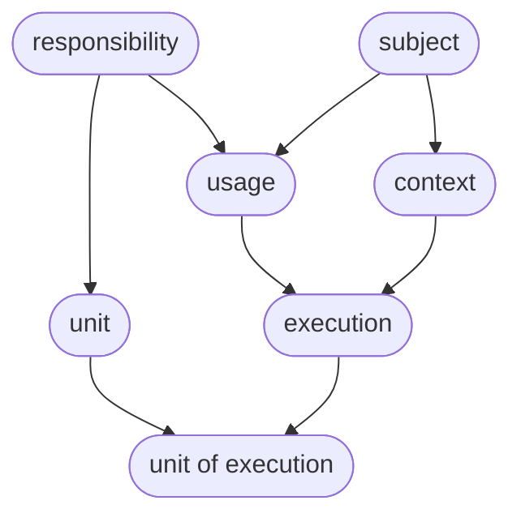

# Configuration Inheritance

This document describes how Storyteller builds the effective configuration JSON for one annotation, and how ancestor annotations change that JSON.

The read path is `CosmosConfigurationService.GetRawConfigurationAsync`. The merge itself is `CalculateAndCacheConfigurationAsync`. The ancestor graph is `BuildInheritanceGraph`. All three live in `src/Platform/Storyteller/Backend.CosmosDb/src/Configuring/CosmosConfigurationService.cs`.

A product-level walkthrough of the same model is in [Configuration](../../42for.net/platform/configuration.md). Type templates, which are merged during the same calculation, are specified in [templating.md](templating.md). `@` expressions are evaluated later, on the resolved read, and are specified in [binding.md](binding.md).

## Two JSON documents

Each annotation may have one configuration item in the organization container.

| Field | Meaning |
| --- | --- |
| `Content` | The document written at this annotation. Version history stores this object. |
| `CalculatedContent` | The effective document: ancestors, this annotation's type template, and `Content`, merged. |
| `CalculatedContentHash` | Identity of `CalculatedContent`. Eight lowercase hex digits, MurmurHash3 32-bit, seed `42`, of the calculated JSON serialized with `JsonSettingNames.Unique`. |

`GetRawConfigurationAsync` returns a `Configuration` whose `Content` property is the effective document. `Version` and `Author` come from the target annotation's configuration item. `Hash` is `CalculatedContentHash`.

The item id is `{viewName}.cnf.{annotationKey}`. Subject and context items use the subject partition `{project}.sbt.{subject}`. Every other annotation type uses the responsibility partition `{project}.rst.{responsibility}`. Ancestor keys are read from their own partitions. The walk crosses partitions.

## The ancestor graph

Seven annotation types form one graph. Responsibility and subject are roots. Deeper keys embed the names of their ancestors, so `BuildInheritanceGraph` derives every ancestor key from the key being read. It uses the same organization, project, and view. A second view is a separate catalog: `default` and `rollout` never inherit from each other.



| Annotation | Key | Direct ancestors, in merge order |
| --- | --- | --- |
| Responsibility | `rst.{responsibility}` | — |
| Subject | `sbt.{subject}` | — |
| Unit | `unt.{responsibility}.{unit}` | Responsibility |
| Context | `cnt.{subject}.{context}` | Subject |
| Usage | `usg.{subject}.{responsibility}` | Responsibility, then subject |
| Execution | `exe.{subject}.{responsibility}.{context}` | Usage, then context |
| Unit of execution | `uxe.{subject}.{responsibility}.{context}.{unit}` | Unit, then execution |

Merge order is `AnnotationType`: Responsibility (0), Unit (1), Subject (2), Usage (3), Context (4), Execution (5), Unit of execution (6). `InheritanceGraphNode.GetAncestors` sorts the direct parents by that value. The enum order only sorts one node's parents. It does not flatten the whole graph into a single list.

Two nodes are shared:

- On an execution, the usage branch and the context branch point at one subject node.
- On a unit of execution, the unit branch and the usage branch point at one responsibility node.

`InheritanceGraphNode.Descendant` is maintained while the graph is built and is unused by the calculation. The walk is from the requested annotation toward the roots.

## How a read is assembled

`GetRawConfigurationAsync` does the following.

1. Load `{view}.cnf.{annotationKey}` from the annotation's partition.
2. When that item is missing, require the annotation record (`{view}.{annotationKey}` in the same partition). A missing annotation and a missing configuration item return `null`. An empty effective document is returned when the annotation exists and nothing contributes JSON.
3. When the item already has `CalculatedContent`, return it. Ancestors and templates are left unread.
4. Otherwise build the graph and run `CalculateAndCacheConfigurationAsync` on the requested node.
5. Reload the configuration item so the response carries the hash just written.
6. Return that item with the calculated object as `Content`. When no item exists after calculation, return the calculated object with version `0` and author `system`.

`CalculateAndCacheConfigurationAsync` runs for the requested node and, recursively, for every ancestor:

1. Load this node's configuration item.
2. When `CalculatedContent` is already stored, return it.
3. Start from an empty object.
4. For each direct ancestor in `AnnotationType` order, calculate that ancestor and `MergeInto` its calculated document.
5. `MergeInto` the type template `{view}.gen.{typeCode}` from this node's partition, when that item exists. See [templating.md](templating.md).
6. `MergeInto` this node's stored `Content`, when the configuration item exists.
7. When the merged object has at least one property, persist it. An existing item is upserted with `CalculatedContent` and `CalculatedContentHash`; stored `Content`, `Version`, and `Author` stay as they were. A missing item is created with empty `Content`, author `system`, and the merge in `CalculatedContent`. An empty merge is returned and left unstored, so the next read calculates it again.

The value merged from an ancestor is that ancestor's full calculated document. It already contains the ancestor's own ancestors, the ancestor's template, and the ancestor's stored content. A node that has no configuration item contributes an empty object, plus anything its ancestors and its template produced.

Because a shared ancestor is reached through more than one parent, its calculated document is merged once on each branch. The second merge writes those properties again. The second branch reuses the cache row written by the first branch only when that write is visible to its read, which requires the Cosmos account to provide session consistency (or stronger). `CosmosClientProvider` does not set a consistency level, so the client uses the account default. Under a weaker level the second branch may recalculate the shared ancestor, which produces the same document.

## Merge rules

`JObject.MergeInto` (`Backend.CosmosDb/src/JsonExtensions.cs`) calls Newtonsoft `JObject.Merge` with:

- `MergeArrayHandling.Union` — array items are appended. An item that is already present, compared by deep equality, is skipped.
- `MergeNullValueHandling.Ignore` — a null in the incoming object leaves the current value in place.

Objects merge property by property, including nested objects. A later scalar replaces an earlier scalar. A later object overlays the earlier object and keeps earlier properties that the later object does not mention. Arrays grow by union along the whole sequence. A later document cannot drop an inherited property, and it cannot replace an inherited array; it can add items and it can replace scalars.

`$remove` and `$patch` are applied when a document is written, inside `CreateOrUpdateConfigurationAsync`, before `Content` is stored. Calculation only calls `MergeInto`, so those properties are ordinary JSON if they appear in an already stored document or in a template.

Schema documents are checked against stored `Content` at write time. They are assembled separately by `CosmosConfigurationSchemaService` and stay out of the calculated configuration.

## What an ancestor changes

Inside one node's calculation the sequence is fixed: ancestor documents, then this node's template, then this node's stored `Content`. For a property that appears on only one path, the later step wins. The requested annotation's stored scalars therefore win against its own template and against the documents of its direct ancestors.

A shared ancestor breaks that reading as soon as a second branch is merged. The later branch carries the shared ancestor again, and that second copy is applied after the earlier branch's overrides.

### Execution

Direct parents are the usage document, then the context document. Each is already calculated:

- Usage = responsibility, then subject, then the usage template, then the usage content.
- Context = subject, then the context template, then the context content.

The execution template and the execution content are merged after both parents.

Responsibility values flow only through the usage. A usage scalar that replaced a responsibility scalar is still in the usage document, and the context document does not carry the responsibility, so that usage scalar survives unless the context or the execution sets the same property.

Subject values flow through both parents. The context document contains the subject again. Merging the context after the usage writes the subject's scalars back over the usage wherever the context left them untouched.

Subject `sbt.northwind`:

```json
{ "currency": "NOK", "residency": "norway" }
```

Usage `usg.northwind.invoicing`:

```json
{ "currency": "USD", "plan": "enterprise" }
```

Context `cnt.northwind.production`:

```json
{ "endpoint": "https://northwind.example/invoices" }
```

The usage calculation produces `{ "currency": "USD", "residency": "norway", "plan": "enterprise" }`. The context calculation produces `{ "currency": "NOK", "residency": "norway", "endpoint": "https://northwind.example/invoices" }`. Merging the context after the usage restores `currency` to `NOK`. `plan` stays, because the context document has no `plan`. The effective execution document is:

```json
{
  "currency": "NOK",
  "residency": "norway",
  "plan": "enterprise",
  "endpoint": "https://northwind.example/invoices"
}
```

A scalar the context itself sets still wins over the usage, and a scalar the execution stores wins over both. In the public guide's invoicing example, `retries` moves from `3` on the responsibility to `5` on the context for that reason, and the usage never set `currency`, so the subject's `NOK` is the only currency either branch contributes.

Arrays do not show this reversal. Union of the same items is idempotent, and a usage that added an item keeps it when the context is merged, because the context's copy of the subject array has no extra item that would remove it. Nothing in the merge removes an item.

### Unit of execution

Direct parents are the unit document, then the execution document:

- Unit = responsibility, then the unit template, then the unit content.
- Execution = the execution calculation from the previous section.

The unit-of-execution template and stored content are merged last, so they win against both parents.

The execution document contains the responsibility again, through the usage. A unit scalar that replaced a responsibility scalar is overwritten by that responsibility value, unless the usage, the context, or the execution also set the property. A unit property the execution path never mentions is kept. The execution path's scalars win over the unit for every property both documents contain.

Responsibility `rst.invoicing` stored `{ "retries": 1 }`. Unit `unt.invoicing.export` stored `{ "retries": 9, "schedule": "0 * * * *" }`. No usage, context, or execution document sets `retries`. The unit of execution stores `{ "schedule": "0 2 * * *" }`.

The unit calculation holds `retries: 9`. The execution calculation holds `retries: 1` from the responsibility. Merging the execution after the unit restores `retries` to `1`. The unit-of-execution document then replaces `schedule` and leaves `retries` alone:

```json
{ "retries": 1, "schedule": "0 2 * * *" }
```

A usage that stored `retries: 4` would put `4` into the execution document, and `4` would replace the unit's `9`. The unit-of-execution document can set `retries` itself and then win.

### Nested objects

A nested object follows the same property merge. Ancestor fields inside it remain when a later document sets only some of the fields.

Responsibility `{ "address": { "city": "Oslo", "zip": "0001" } }` and execution `{ "address": { "city": "Bergen" } }` calculate to:

```json
{ "address": { "city": "Bergen", "zip": "0001" } }
```

## Cache and descendant freshness

A later read of an item whose `CalculatedContent` is present returns that object and skips the walk. `ConfigurationEntity.IsCachingDisabled` is stored on the item and is unread by this path, so the flag leaves caching on.

These writes clear the target item's `CalculatedContent` and `CalculatedContentHash`, and then clear the same fields on the descendants whose effective document includes this annotation. The patch also increments `AffectedCounter`.

| Written annotation | Descendants whose cache is cleared |
| --- | --- |
| Responsibility | Every configuration item in that responsibility partition and view |
| Unit | Unit-of-execution items in that partition and view whose id ends with `.{unit}` |
| Usage | Execution and unit-of-execution items in that partition and view for that subject |
| Subject | Context items in the subject partition and view, plus usage, execution, and unit-of-execution items of that subject in the same project and view |
| Context | Execution items of that subject ending in `.{context}`, and unit-of-execution items of that subject whose id contains `.{context}.`, in the same project and view |
| Execution | Unit-of-execution items in that partition and view under that subject, responsibility, and context |
| Unit of execution | None |

`CreateOrUpdateConfigurationAsync` on an item that already exists, and `PatchConfigurationAsync`, null the target cache in the same write as the new `Content`. `ClearConfigurationAsync` and `DeleteAsync` remove the item when it has stored content, or delete a system cache row directly, and then invalidate descendants.

The first insert, when no configuration item exists yet, saves `Content` and leaves descendant caches as they are. A descendant that was calculated before that insert keeps the old effective document until one of the writes above clears it.

Replacing a type-template item also leaves existing `CalculatedContent` in place. The new template is applied on the next calculation. [templating.md](templating.md) covers that case.

The call site comments this invalidation as ancestors. The queries select descendants: the items that merged this document in.

## Other reads

| Read | JSON it returns |
| --- | --- |
| `GetRawConfigurationAsync` | The effective document, including ancestors and templates. |
| `GetResolvedConfigurationAsync`, with or without secrets | That same document, then `@` bindings evaluated in place. |
| `GetConfigurationHierarchyViewAsync` | One property per visited annotation key. The value is that annotation's stored `Content`. Ancestors are walked with the same graph, and a shared node is recorded once. A key is omitted when it has no configuration item. A system cache row from an earlier calculation has empty stored `Content`, so that key appears as `{}`. |
| `GetConfigurationVersionContentAsync` | The stored document of that version. |
| `GetConfigurationViewChangesAsync` | A diff of the effective document of one annotation in two views. |

`GetConfigurationHierarchyViewAsync` is the per-level breakdown. `GetRawConfigurationAsync` is the single merged object.
