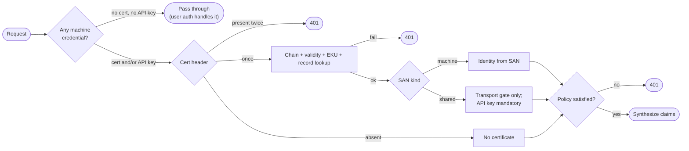

# mTLS Per-Machine Authentication (Transport-Layer Identity)
## Problem
Machine access today is either an external IdP (Azure AD / Keycloak JWT) or the self-contained API key. We want a third variant: transport-layer identity via mutual TLS, backed by a simple local CA that the API itself operates (issues and delivers X.509 client certificates).
Two variants must be supported:
1. **Per-machine certificate** — a unique client certificate per machine (application instance). Identity (`organization` / `project` / `machineAccessId`) is carried in the certificate SAN. An API key may optionally be combined; when present it must be consistent with the certificate, and a project can require it.
2. **Shared certificate** — one certificate reused by many machines/applications within a project. It is only a transport gate; identity comes from the API key, which is then mandatory. No key, no access.
## Current State
**Hosting / transport.** `Api.Functions` is a .NET 10 isolated-worker Azure Functions app (`ConfigureFunctionsWebApplication`). TLS is terminated by the App Service front end, so the worker never sees the TLS session — `FunctionContext.GetHttpContext()?.Connection.ClientCertificate` is `null` in the isolated worker (Azure/azure-functions-dotnet-worker#1997). The only supported path is the platform-injected `X-ARR-ClientCert` header (base64 DER of the **leaf only**, no chain), read from `HttpRequestData.Headers`.
**Machine credential issuance.** `IMachineAccessService` (`Backend.Core/src/Accessing/IMachineAccessService.cs`) has `Create/Reset/DeleteMachineAccessAsync`. Implementations: `Access.ApiKeys`, `Access.AzureAd`, `Access.Keycloak`. `Program.cs:67` wires `AddApiKeyMachineAccess()`.
`CosmosAccessService.CreateMachineAccessAsync` (`Backend.CosmosDb/src/Accessing/CosmosAccessService.cs (368-402)`) delegates issuance, masks the credential to `xxx***`, and writes it into `org.{organization}` / partition `{project}.access`. Two pre-existing issues in that method: it persists the `MachineAccess` **model** (which has no `PartitionKey` property, while containers use `/PartitionKey` — see `ContainerFactory.cs:27`) instead of `MachineAccessEntity`, and `accessKey[..3]` will throw for a credential-less/short access key.
**API key auth.** `ApiKeyMachineAccessService` also implements `IApiKeyValidator`; the raw key is a self-describing `StructuredApiKey` (`2s.<base64url(org:project:machineAccessId)>.<secret>`) so validation is a point read of `akh.{machineAccessId}` via `CosmosApiKeyHashStore`, then a constant-time hash compare.
`ApiKeyAuthenticationMiddleware` (`Api.Functions/src/Security/ApiKeyAuthenticationMiddleware.cs`) reads `Authorization: ApiKey <key>`, validates, then synthesizes claims (`azp`/`sub` = machineAccessId, `roles` from `MachineAccessScope`) into `FunctionContext.Items[CachedClaims]`; invalid key => 401. `HttpRequestDataExtensions.GetClaims()` returns those cached claims, so `CheckScope` / `TryGetApplicationIdentity` / `CheckAccessToAsync` -> `VerifyAccessForMachineAsync(org, project, appId)` work unchanged.
**Middleware order** (`Program.cs (22-23)`): `ExceptionHandlingMiddleware` then `ApiKeyAuthenticationMiddleware`.
**`Api.Web` is explicitly out of scope.** It is not up to date and will need separate modernization work in the future. The mTLS implementation targets `Api.Functions` only.
## Proposed Changes
### 1. Identity in the certificate
Identity lives **only** in a URI SAN, SPIFFE-shaped so it is recognizable to standard tooling. There is no custom-OID fallback, which removes the need for a registered Private Enterprise Number and leaves a single parsing path:
* per-machine — `spiffe://{trustDomain}/org/{organization}/project/{project}/machine/{machineAccessId}`
* shared — `spiffe://{trustDomain}/org/{organization}/project/{project}/shared/{label}`
`trustDomain` is configurable, default `2s.platform`. Both forms carry organization and project, so any certificate resolves to its owning project without a database scan.
Subject DN mirrors the identity for humans only and is never authoritative: `CN={machineAccessId}, O={organization}, OU={project}`.
**SAN value encoding.** Organization, project, machineAccessId and label values embedded in the SAN URI must conform to SPIFFE path segment rules: `[a-zA-Z0-9._-]` only. Values are validated against this restricted character set at creation time (in `MachineAccessCreate` / shared-certificate issuance); any value containing characters outside this set is rejected with a 400 Bad Request before a certificate is ever issued. This avoids URI-encoding ambiguity and ensures the SAN round-trips cleanly through `EnumerateUris()`.
Parsing uses `X509SubjectAlternativeNameExtension.EnumerateUris()` (no hand-rolled ASN.1). Availability of this API on .NET 10 must be verified during implementation and covered by unit tests that exercise SAN round-tripping. A certificate carrying no platform SAN, or more than one, is rejected.
### 2. Configuration and per-project policy
There is deliberately **no deployment-wide certificate mode**. The SAN shape already tells the middleware which kind of certificate it is holding (`/machine/{id}` versus `/shared/{label}`), and the project already declares what its machines must present, so a global mode could only contradict them. One deployment can therefore host a project on per-machine certificates and another on a shared certificate.
Deployment-wide settings in a `MachineAuth` section bound to `MachineAuthenticationOptions` are defaults and knobs only:
* `DefaultCredentialKind`: `ApiKey` (default — today's behaviour) | `Certificate` | `CertificateAndApiKey`. Applies only to projects that declare no policy of their own.
* `CertificateHeaderName`: default `X-ARR-ClientCert` (override for App Gateway / nginx)
* `IsCertificateHeaderFromClientAllowed`: **development only**, lets a local caller supply the header itself since `func start` does not negotiate client certificates
* `TrustDomain` (default `2s.platform`)
* `CertificateLifetimeDays` (default 365) between `MinCertificateLifetimeDays` (1) and `MaxCertificateLifetimeDays` (3650) — anything from one day to ten years is issuable
* `CaLifetimeYears` (default 20) — deliberately longer than the maximum leaf lifetime, so a ten-year certificate stays issuable for most of the CA's life instead of being clamped from day one
* `RenewalWindowDays` (30), `RenewalOverlapDays` (7)
**Per-project policy.** Because the SAN always carries organization and project, the middleware can resolve the owning project before deciding whether the presented credentials suffice. The policy hangs off the existing project access point (`AccessPointEntity`, `core` container, partition `access`, id `apt.{organization}.{project}`) — already a point read on a small document:
```csharp
public record MachineAuthenticationPolicy
{
    public MachineCredentialKind CredentialKind { get; init; }  // ApiKey | Certificate | CertificateAndApiKey
    public int? CertificateLifetimeDays { get; init; }          // null => MachineAuth:CertificateLifetimeDays
}
```
* `AccessPoint` / `IAccessPoint` / `AccessPointEntity` gain an optional `MachineAuthentication` property. `null` means "inherit the deployment defaults", so every existing access point keeps working untouched.
* Set at creation through `AccessPointCreate`, and afterwards through `PUT v1/access/points/{key}/machine-authentication` (owner/administrator only).
* Read through a new `IMachineAuthenticationPolicyStore` in `Backend.Core`, implemented in `Backend.CosmosDb`. This deliberately avoids injecting `IAccessService` into the issuing services: `CosmosAccessService` already depends on `IMachineAccessService`, so the reverse edge would be a DI cycle.
* Policies are cached via `IMemoryCache` with per-entry expiration (default 60 s). `IMemoryCache` is the correct primitive here because policies are keyed per project (many entries), unlike `CachedAsync<T>` which wraps a single value. Credential records are **not** cached, so a revocation takes effect on the very next request.
Resolution per request:

**Pass-through rule.** When neither a certificate header nor an `Authorization: ApiKey` header is present, the middleware calls `next()` and exits immediately — exactly as the current `ApiKeyAuthenticationMiddleware` does. This ensures user requests (bearer tokens from the admin UI or human callers) are never evaluated against machine authentication policy. The middleware only engages when at least one machine credential is detected.
A **shared** certificate carries no `machineAccessId`, so an API key is mandatory alongside it whatever the project policy says, and the key's organization and project must match the certificate's. When a per-machine certificate and an API key are both present the `(organization, project, machineAccessId)` triples must match exactly, otherwise 401; both credentials point to the same `MachineAccessEntity`, so the single `MachineAccessScope` from that record determines the effective scope — there is no intersection to compute.
**`MachineAccessScope` semantics.** The enum is ordinal, not flags-based. Each value defines a specific, fixed set of claims:
* `AnnotationRead` => `[Annotation.Read]`
* `AnnotationReadWrite` => `[Annotation.Read, Annotation.ReadWrite]`
* `ConfigurationRead` => `[Configuration.Read]`
* `ConfigurationReadWrite` => `[Configuration.Read, Configuration.ReadWrite]`
* `DefaultRead` => `[Default.Read, Annotation.Read, Configuration.Read]`
* `DefaultReadWrite` => `[Default.Read, Default.Write, Annotation.Read, Annotation.ReadWrite, Configuration.Read, Configuration.ReadWrite]`
Each level either extends the previous or is a specific combination. They are never handled as flags.
### 3. New project `Access.Certificates`
Mirrors `Access.ApiKeys` (`AssemblyName` `42.Platform.Storyteller.Backend.Certificates`, `RootNamespace` `_42.Platform.Storyteller`, net10.0, references `Backend.Core`).
* `LocalCertificateAuthority : IClientCertificateAuthority` — bootstraps a self-signed root (RSA-4096, `BasicConstraints` CA, `KeyCertSign|CrlSign`, SKI) when the configured store is empty and auto-bootstrap is enabled; issues leaves with `CertificateRequest` (RSA-2048, `DigitalSignature`, EKU `clientAuth` 1.3.6.1.5.5.7.3.2, SAN URI, SKI, `X509AuthorityKeyIdentifierExtension.CreateFromCertificate`, random 16-byte serial), signed through the `X509SignatureGenerator` handed out by `ICertificateAuthorityProvider` (SS6). Export supports two PKCS#12 encryption schemes: modern `Pbes2Aes256Sha256` (default) and legacy `TripleDes3KeyPkcs12` (selectable via a query parameter or request field), so non-.NET clients (older OpenSSL, Java keystores) can also load the certificate; load via `X509CertificateLoader` (the `X509Certificate2` byte constructors are obsolete on net10.0).
* `ClientCertificateValidator : IClientCertificateValidator` — `X509Chain` with `TrustMode = CustomRootTrust`, `CustomTrustStore` = the CAs from `GetTrustedAsync()`, `RevocationMode = NoCheck`, `ApplicationPolicy` = clientAuth; then validity window, SAN identity extraction, record lookup, thumbprint pinning (current or, during an overlap, previous) and revocation check. **The validator branches on `ClientCertificateKind`** (derived from the SAN path: `/machine/{id}` vs `/shared/{label}`): per-machine certificates are validated against `MachineAccessEntity`, shared certificates against `SharedCertificateEntity`. Revocation is record-based (delete/flag in Cosmos), so no CRL/OCSP is needed.
* `CertificateMachineAccessService` — per-machine certificate issuance/reset/delete and `RenewAsync` for self-service rollover. Does **not** implement `IMachineAccessService` directly; instead exposes `ExtendWithCertificateAsync` (matching the new `IMachineAccessService.ExtendMachineAccessAsync` contract) for adding a certificate to an already-created machine access, and `CreateCertificateAsync` / `RevokeCertificateAsync` for the certificate-specific operations.
* `PolicyAwareMachineAccessService : IMachineAccessService` — the implementation actually registered. It reads the project's `MachineAuthenticationPolicy` via `IMachineAuthenticationPolicyStore` and orchestrates credential creation:
    * `ApiKey` — delegates entirely to `ApiKeyMachineAccessService.CreateMachineAccessAsync`.
    * `Certificate` — delegates entirely to `CertificateMachineAccessService` (wraps the result in a `MachineAccess`).
    * `CertificateAndApiKey` — **two-phase create with compensation:** first calls `ApiKeyMachineAccessService.CreateMachineAccessAsync` (creates the machine access record with API key, sets `Id`/`ObjectId`), then calls `IMachineAccessService.ExtendMachineAccessAsync` on the certificate service to add the certificate on top of the existing machine access (using the same `Id`/`ObjectId`). If the certificate extension fails, the orchestrator rolls back by deleting the API key machine access (compensation). The combined `MachineAccess` result carries both `AccessKey` (API key) and `Certificate`/`CertificatePassword` (PKCS#12). `CosmosAccessService` then persists the single `MachineAccessEntity` with all fields populated.
* `EntryPoint.AddCertificateMachineAccess(configuration)` — binds `MachineAuthenticationOptions` and registers the CA, the validator, `PolicyAwareMachineAccessService` as `IMachineAccessService`, and **explicitly registers `IApiKeyValidator`** backed by the same `ApiKeyMachineAccessService` singleton instance that `AddApiKeyMachineAccess()` creates. This ensures the middleware can validate API keys regardless of which `IMachineAccessService` is active. **Ordering dependency: `AddApiKeyMachineAccess()` must be called before `AddCertificateMachineAccess()`** so that the `ApiKeyMachineAccessService` singleton is available for both `IApiKeyValidator` resolution and delegation from `PolicyAwareMachineAccessService`. This is enforced by a runtime check: `AddCertificateMachineAccess()` throws if `ApiKeyMachineAccessService` is not already registered.
### 4. `Backend.Core` abstractions
New files under `Backend.Core/src/Accessing/`:
* `IClientCertificateAuthority`, `IClientCertificateValidator`, `IClientCertificateStore`, `ICertificateAuthorityProvider`, `ICertificateAuthorityStore`, `IMachineAuthenticationPolicyStore`
* `Model/ClientCertificateValidationResult` (organization, project, machineAccessId, scope, thumbprint, kind), `Model/IssuedCertificate` (pkcs12, password, thumbprint, serial, notBefore/notAfter), `Model/CertificateAuthorityMaterial` (certificate + `X509SignatureGenerator`), `Model/ClientCertificateKind` (`Machine` | `Shared`)
* `MachineAuthenticationOptions` + `CertificateAuthorityKind`. `MachineAuthenticationPolicy` and `MachineCredentialKind` live in `Abstractions.Access` beside `AccessPoint`, since they are part of the access-point contract.
* `IMachineAccessService` gains a new method: `ExtendMachineAccessAsync(MachineAccess existingAccess, MachineAccessCreate model)` — adds an additional credential kind (e.g., certificate) to an already-created machine access without creating a new `Id`/`ObjectId`. Returns the extended `MachineAccess` with the new fields populated. The default implementation throws `NotSupportedException`; only services that support extension (e.g., `CertificateMachineAccessService`) override it. This enables the `CertificateAndApiKey` two-phase create in `PolicyAwareMachineAccessService`.

New file under `Libraries/Utils/Async/src/`:
* `CachedAsync<T>` — a time-based caching primitive that wraps an async factory, caches the result for a configurable TTL, and re-evaluates on the next access after expiry. Unlike `AsyncLazy<T>` (which evaluates once and never refreshes), this supports the CA certificate/key handle refresh interval. Thread-safe: concurrent callers during a refresh share a single evaluation. **On refresh failure, the previous value is kept and the error is logged; the next access retries the factory.** This ensures a transient Cosmos or Key Vault outage does not invalidate the cached CA public certificate and break authentication for all machines.
### 5. `Backend.CosmosDb` storage
Credential material is **consolidated into `MachineAccessEntity`** rather than spread across sibling documents. Today an authenticated request already costs a point read of `akh.{machineAccessId}` plus, inside `VerifyAccessForMachineAsync`, a read of the machine access record; a third `ccr.*` document would have made it three, with `MachineAccessScope` duplicated in all three and free to drift.
**On bloat:** the merged document gains a base64 SHA-256 secret hash (43 chars), a thumbprint, a previous thumbprint and its expiry, a serial, `NotBefore`/`NotAfter`, `IsRevoked`, `CredentialKind` and `LastRenewalAt` — roughly 350 bytes on top of the existing record, so it stays comfortably under 1 KB. Cosmos bills a point read of anything up to 1 KB at 1 RU, so three 1 RU reads collapse into one. Consolidation is cheaper in RU *and* removes the drift risk; there is no practical bloat cost.
* `Entities/Access/MachineAccessEntity.cs` absorbs `HashedSecret` (from `ApiKeyHashEntity`) and the certificate fields, including `PreviousThumbprint` / `PreviousValidUntil` so a renewal can overlap (SS8), and `LastRenewalAt` (DateTimeOffset?) for diagnostics/audit. Renewal idempotency is detected by comparing the presenting certificate's thumbprint against `PreviousThumbprint` — if it matches, the renewal already happened. `LastRenewalAt` is used only for the response message timestamp. The AutoMapper profile must project it to `MachineAccess` **without** `HashedSecret`, since `GetMachineAccessesAsync` hands that model straight back to callers.
* `ApiKeyHashEntity` and `CosmosApiKeyHashStore` are retired. **A new `CosmosMergedApiKeyHashStore : IApiKeyHashStore`** replaces them, reading/writing `HashedSecret` and `Scope` directly from/to `MachineAccessEntity` instead of the separate `ApiKeyHashEntity`. `ApiKeyMachineAccessService` depends on `IApiKeyHashStore` and is unchanged — only the implementation swaps. During Phase A, the new store tolerates both old (`akh.*`) and new (merged) document shapes on read; since the system is under development with no production data, no formal migration mechanism is needed — old documents are simply overwritten or deleted as machines are re-created.
* `Entities/Access/SharedCertificateEntity.cs` — project-scoped shared record in `org.{organization}` / partition `{project}.access`, id `scr.{thumbprint}`: label, validity, `IsRevoked`. Shared certificates belong to no machine access, so they stay a separate document. **Label uniqueness** is enforced at creation time: if a label already exists within the project, the system automatically appends a timestamp suffix in the format `-YYYY-MM-DD-HH-mm-ss` to disambiguate.
* `Entities/Access/CertificateAuthorityEntity.cs` — CA material in `core`, partition `certificates`, id `cau.{version}` (versioned so rotation can keep predecessors readable).
* `Accessing/CosmosCertificateAuthorityStore.cs` and `Accessing/CosmosMachineAuthenticationPolicyStore.cs` (reads the policy off `AccessPointEntity`), registered in `Backend.CosmosDb/src/EntryPoint.cs`.

**No container-level TTL changes.** Renewal idempotency is handled entirely at the application level via thumbprint comparison on `MachineAccessEntity` (see SS8). When a renewal succeeds, the old thumbprint moves to `PreviousThumbprint` and the entity's `Thumbprint`/`NotAfter` reflect the new certificate. Any subsequent renewal attempt presenting a certificate whose thumbprint matches `PreviousThumbprint` is inherently detectable as "already renewed" for the entire remaining validity of the old certificate. `LastRenewalAt` is kept for diagnostic/audit purposes. No `DefaultTimeToLive` is set on any container and no separate `CertificateRenewalEntity` is needed.

**No data migration.** The system is under development with no production data. Existing documents are handled opportunistically: reads tolerate both old and new shapes during Phase A, and old-format documents are replaced as machines are re-created or reset.
### 6. CA key storage — non-exportable key in Key Vault, signed remotely
Issuance never assumes the CA private key is loadable in-process. `Backend.Core` defines `ICertificateAuthorityProvider` with `GetActiveAsync()` (the CA certificate plus the `X509SignatureGenerator` used to sign leaves) and `GetTrustedAsync()` (every CA certificate accepted during validation, so rotations can overlap).
Leaves are created with `CertificateRequest.Create(issuerName, signatureGenerator, notBefore, notAfter, serialNumber)` rather than the `X509Certificate2` issuer overload, which is what allows the signer to be remote.
Two provider families, selected by `MachineAuth:Authority:Kind`:
* **`KeyVault` — production.** `KeyVaultCertificateAuthorityProvider` in the new `Access.Certificates.Azure.KeyVault` project. The CA private key is an RSA-4096 key created *inside* the vault with no release policy, so its material is non-exportable — no API can return it. Signing happens in the vault through `CryptographyClient`. Compromise of the app or the database therefore no longer yields the CA key: an attacker can mint certificates only while they hold the app identity, and **every signature is logged** by Key Vault, giving a countable audit trail that a locally held key cannot.
* **`Cosmos` (local dev) / `Configuration` (tests and CI).** `LocalCertificateAuthorityProvider` loads a PKCS#12 through `ICertificateAuthorityStore` and signs in-process with `X509SignatureGenerator.CreateForRSA`. Zero setup, and the only path that works without Azure. Both are exportable by construction and must not be used in production.
The previously considered "PKCS#12 as a Key Vault secret" variant is dropped: a secret is readable by definition, so it would have carried the cost of Key Vault without the benefit. Anyone who does want escrow-able material in a vault can point `Configuration` at an App Service setting backed by a Key Vault reference.
**Standard tier is sufficient.** Non-exportability is a property of Key Vault `key` objects, not of the pricing tier — software-protected keys cannot be exported either. Standard bills software keys per transaction only, with no per-key monthly fee, so one CA signing a few thousand certificates a year costs cents. Premium/HSM (roughly $1 per key per month for RSA-2048) would only raise the protection boundary from FIPS 140-2 Level 1 to Level 2/3 and is explicitly not adopted.
#### `KeyVaultSignatureGenerator`
Around forty lines over `X509SignatureGenerator`:
* `BuildPublicKey()` returns the CA public key, read once from `KeyClient` and cached.
* `GetSignatureAlgorithmIdentifier(hash)` must return **DER-encoded** `AlgorithmIdentifier` bytes. Those depend only on algorithm, padding and hash — never on the key — so it delegates to a throwaway `X509SignatureGenerator.CreateForRSA(RSA.Create(2048), RSASignaturePadding.Pkcs1)` instead of hand-rolling ASN.1.
* `SignData(data, hash)` hashes locally and calls `CryptographyClient` with `RS256`. The method is synchronous by contract and the Azure SDK provides sync overloads, so there is no sync-over-async hack — but it is a blocking network call, acceptable only because signing happens on issuance and renewal, never on the request path. **A guard assertion must verify at construction time that this generator is never injected into or called from the validation hot path** — the validator uses only the CA's public certificate (cached), never the signer.
`AddKeyVaultCertificateAuthority` registers a named `KeyClient` through `AddAzureClients`, reusing the vault URI from the existing `AzureKeyVaults` configuration section and the same managed-identity credential chain that `Binding.Azure.KeyVault` already sets up.
Enabling it is one line in `Program.cs`, matching the existing `//services.AddAzureAdMachineAccess();` idiom:
```csharp
services
    .AddCertificateMachineAccess(context.Configuration)      // local-key provider by default
    .AddKeyVaultCertificateAuthority(context.Configuration); // comment out to fall back
```
It replaces the `ICertificateAuthorityProvider` registration and logs a startup warning if `MachineAuth:Authority:Kind` is not `KeyVault`, so the DI switch and the config switch cannot disagree silently.
#### Auto-bootstrap, kept for every kind including Key Vault
`IsAutoBootstrapEnabled` defaults to `true` everywhere, so no environment needs an out-of-band provisioning step. For the Key Vault provider:
1. `KeyClient.CreateRsaKeyAsync` creates the RSA-4096 CA key if it is absent.
2. Its public key is read back, a `CertificateRequest` is built with the CA extensions, and the certificate is **self-signed through `KeyVaultSignatureGenerator`** — `CreateSelfSigned` cannot be used, because we never hold the private key. The self-signing is a two-step dance: build a `CertificateRequest` with the CA's subject and extensions, then call `CertificateRequest.Create()` passing the same subject as the issuer name and the `KeyVaultSignatureGenerator` as the signature generator. This produces a valid self-signed certificate because the issuer DN equals the subject DN and the signature is made by the subject's own key (held in Key Vault). **This two-step approach must be verified during implementation with a unit test that confirms the resulting certificate validates against its own public key and has the correct `BasicConstraints`, `KeyUsage`, and `SubjectKeyIdentifier` extensions.**
3. The resulting certificate is public material, so it is persisted in the existing `CertificateAuthorityEntity` (`core` / `certificates` / `cau.{version}`) together with the Key Vault key identifier. For the local kinds that same entity instead holds the PKCS#12.
Scale-out races are settled by the Cosmos record rather than by Key Vault: step 3 uses a conditional create (`IfNoneMatch: *`), so exactly one instance defines the active CA and the key version it points at, and the losers simply read the winner's record. Any orphaned key version is harmless and, on Standard, not billed. This is materially simpler than reconciling Key Vault secret versions, which have no conditional write.
Keeping auto-bootstrap means the app identity needs **Key Vault Crypto Officer** (create key) rather than only *Crypto User* (sign); it can be downgraded to *Crypto User* after the first successful run if least privilege is preferred later.
#### Other options under `MachineAuth:Authority`
* `Kind`: `KeyVault` | `Cosmos` | `Configuration`
* `KeyVault:VaultName` (a key into the existing `AzureKeyVaults` section, default `default`) and `KeyVault:KeyName` (default `storyteller-machine-ca`)
* `RefreshInterval` (default 1 hour) — the CA certificate and key handle are loaded once via a new `CachedAsync<T>` primitive from `Libraries/Utils/Async` (a time-based cache that re-evaluates its async factory after the configured TTL expires, unlike `AsyncLazy<T>` which evaluates once and never refreshes) and re-read on this interval, so a rotation is picked up without a restart.
**Key Vault is never on the hot path.** Validating a request needs only the CA's *public* certificate, which is cached, so a Key Vault outage blocks issuing and renewing machines but never breaks authentication for machines that already hold a certificate.
Rotation: `GetTrustedAsync()` returns the active CA plus still-valid predecessors, so a new CA key and certificate can be introduced, machines re-issued, and the old CA retired with no window in which existing certificates are rejected.
### 7. `Api.Functions` authentication pipeline
**`clientCertMode = Optional` on the App Service.** mTLS and certificates are for machine authentication only, operating alongside existing user authentication (bearer tokens). Setting the mode to `Optional` (not `Required`) ensures that user requests from the admin UI and other human callers pass through without a client certificate, while machine requests can present one. The middleware enforces certificate requirements based on per-project policy, not the transport layer.
Replace `ApiKeyAuthenticationMiddleware` with `Security/MachineAuthenticationMiddleware.cs`, which owns the whole policy above:
* **passes through immediately** (calls `next()`) when neither a certificate header nor an `Authorization: ApiKey` header is present — the middleware never evaluates user requests against machine authentication policy. This mirrors the current `ApiKeyAuthenticationMiddleware` behaviour and ensures bearer-token requests (admin UI, human callers) and unauthenticated endpoints (CA certificate) are unaffected;
* extracts the optional certificate header — **rejecting the request outright when that header appears more than once** (SS9) — and the optional `Authorization: ApiKey` value;
* calls `IClientCertificateValidator` and/or `IApiKeyValidator`;
* resolves the owning project (from the certificate SAN, or from the self-describing API key) and loads its `MachineAuthenticationPolicy` from the `IMemoryCache`-backed policy cache to decide whether the presented credential set is sufficient;
* reconciles identity and scope, then synthesizes claims via a new `Security/MachineScopeClaims.cs` (the `MachineAccessScope` -> `Scopes.*` map extracted verbatim from the current middleware) into `FunctionContextItemKeys.CachedClaims`. **`AnnotationKey` from the `MachineAccessEntity` is carried into the claims** (as a custom claim type) so that annotation-level scoping is still enforced by downstream endpoints — certificate authentication must not bypass single-annotation access restrictions;
* adds `FunctionContextItemKeys.MachineIdentity` for downstream diagnostics/audit (`GetAuthor()`);
* short-circuits 401 through `context.GetInvocationResult().Value = response` (the same pattern the current middleware uses). The plan originally proposed `FunctionContextExtensions.SetInvocationResult`, but this method does not exist in the Azure Functions Worker SDK — `GetInvocationResult().Value` is the correct API for setting the response from middleware.
`HttpRequestDataExtensions` needs no change — it already prefers cached claims.
**Fix `CheckScope` logic bug.** The current implementation (`HttpRequestDataExtensions.cs:76`) uses `scopes.All(scope => !allScopes.Contains(scope))` which rejects only when **none** of the required scopes are present — effectively "match any" semantics. This must be fixed to "match all" semantics: `scopes.Any(scope => !allScopes.Contains(scope))` should trigger the rejection (i.e., reject if **any** required scope is missing). This fix is included in Phase A with characterization tests covering both the old and new behaviour.
`Program.cs`: register `AddCertificateMachineAccess(context.Configuration)` and `worker.UseMiddleware<MachineAuthenticationMiddleware>()`.
### 8. Credential delivery and management API
* Extend `MachineAccess` / `IMachineAccess` / `MachineAccessEntity` (+ AutoMapper profile in `Backend.CosmosDb/src/EntryPoint.cs:115`) with `CredentialKind`, `Certificate` (base64 PKCS#12, response only), `CertificatePassword` (one-time, response only), `CertificateThumbprint` (persisted), `LastRenewalAt` (DateTimeOffset?, persisted — diagnostic/audit only, not the primary idempotency mechanism). Outside the single issuance/renewal response, no stored document ever holds a PKCS#12 or its password.
* Fix `CosmosAccessService.CreateMachineAccessAsync` to persist `MachineAccessEntity` with `PartitionKey` set and to mask defensively when `AccessKey` is empty; extend `Reset`/`Delete` to also roll/remove the certificate fields. No data migration is needed — the system is under development with no production data.
* `MachineAccessCreate` gains an optional `CertificateLifetimeDays`. Precedence: request value -> project policy -> `MachineAuth:CertificateLifetimeDays`, validated against `MinCertificateLifetimeDays` / `MaxCertificateLifetimeDays` (one day to ten years).
* PKCS#12 export supports two encryption schemes: modern `Pbes2Aes256Sha256` (default) and legacy `TripleDes3KeyPkcs12`, selectable via a `pkcs12Encryption` query parameter (`modern` | `legacy`) or request field. This ensures clients on older platforms (Java keystores, older OpenSSL) can load the certificate without conversion.
* New endpoints in `V1/AccessHttp.cs` (+ `Definitions.Routes`/`RouteIds`):
    * `GET v1/access/certificate-authority` — the CA certificate as PEM so operators and clients can pin/trust it. **This endpoint is unauthenticated** because the CA public certificate is not a secret and machines need to obtain it before they can authenticate.
    * `PUT v1/access/points/{key}/machine-authentication` — set a project's `MachineAuthenticationPolicy` (owner/administrator only).
    * `GET|POST v1/{organization}/{project}/access/certificates` — list/issue **shared** certificates for the project (`Scopes.User.Impersonation` + `AccountRole.Administrator`).
    * `DELETE v1/{organization}/{project}/access/certificates/{thumbprint}` — revoke a shared certificate.
    * `POST v1/{organization}/{project}/access/machines/{id}/certificate/renew` — **self-service renewal**, authenticated by the machine's own still-valid certificate rather than a user token.
**Renewal rules.** The presenting certificate must be currently valid, not revoked, and its SAN `machineAccessId` must equal the route `{id}`. An expired certificate can never renew itself — otherwise expiry would mean nothing — and there is deliberately **no grace period and no escape hatch**: a machine that misses its 30-day renewal window is recovered only by an administrator `Reset`. This is an intentional operational stance — 30 days is a generous window, and the hard boundary eliminates ambiguity about certificate validity. Renewal is permitted only within `RenewalWindowDays` of expiry.
**Renewal is idempotent for the entire renewal window.** Several instances commonly share one machine access record; without idempotency they would all renew at once, each minting its own key pair and evicting the others from `PreviousThumbprint`. The write is an ETag-guarded compare-and-swap on `MachineAccessEntity`, ensuring thread-safety — exactly one caller wins the race:
1. **Winner:** issues the new certificate, updates the entity (`Thumbprint` = new, `NotAfter` = new, `PreviousThumbprint` = old, `PreviousValidUntil` = `min(old NotAfter, now + RenewalOverlapDays)`, `LastRenewalAt` = `DateTimeOffset.UtcNow`), and receives the PKCS#12 in the response. The PKCS#12 is **never persisted**.
2. **Any subsequent caller** presenting a certificate whose thumbprint matches `PreviousThumbprint` (i.e., the old, pre-renewal certificate): the endpoint detects that a renewal already occurred — because the presenting cert no longer matches the entity's current `Thumbprint` — and returns an HTTP 200 with a descriptive response: *"The certificate for this machine access was already renewed at {LastRenewalAt:O}. The new certificate was delivered to the first renewing instance. Propagation of the renewed certificate to other instances sharing this machine access is the responsibility of your deployment infrastructure (e.g., shared volume, secret store, orchestrator)."*
3. **Any caller presenting the new certificate:** the new certificate's renewal window does not start until `NewNotAfter - RenewalWindowDays` (typically ~335 days away), so renewal is rejected with "not in renewal window."

**ETag CAS retry.** When a concurrent caller's write fails with HTTP 412 (Precondition Failed), the endpoint performs a **single re-read** of the entity. On re-read, the caller's presenting certificate will match `PreviousThumbprint` (the winner already updated the entity), so the "already renewed" response is returned. No retry loop is needed because after one successful CAS the entity is stable — no further writes can occur within the same renewal window.

This means **no second certificate is ever minted during a renewal window** — once renewed, every subsequent attempt for the rest of the old certificate's validity returns the warning. The idempotency is inherent in the data model (thumbprint comparison), not dependent on an arbitrary time constant. `Reset` keeps its existing hard-cutover semantics and clears `PreviousThumbprint`.

**Distinction: `RenewalWindowDays` vs `RenewalOverlapDays`.** These serve different purposes and must not be confused:
* `RenewalWindowDays` (30) = how early before expiry a machine can initiate renewal. This is the **permission window** for the renew endpoint.
* `RenewalOverlapDays` (7) = how long after renewal the **old certificate** is still accepted by the validator (via `PreviousThumbprint`/`PreviousValidUntil`). This is the **propagation grace period** for distributing the new certificate to all instances.
A machine that renews on day 1 of the renewal window (30 days before expiry) has only `RenewalOverlapDays` (7 days) for its deployment infrastructure to propagate the new certificate. After the overlap expires, instances still presenting the old certificate lose access. The 30-day window gives time to *initiate* renewal; the 7-day overlap gives time to *complete propagation*. Operators must plan accordingly.
**On dynamic lifetimes — nothing in the storage layer imposes a limit.** Certificate records carry ordinary `NotBefore`/`NotAfter` data fields with no Cosmos TTL involvement. The CA providers only ever sign and never see or record leaf validity, and a Key Vault key has no notion of the lifetime of what it signs. The single real constraint is cryptographic: a leaf outliving its issuer stops validating the moment the CA expires. The requested lifetime is therefore clamped to the active CA's remaining validity and to the configured bounds, with the clamp reported in the response rather than applied silently — which is why `CaLifetimeYears` defaults to 20 against a ten-year maximum leaf. Long lifetimes are less dangerous here than in a CRL/OCSP design, because revocation is record-based and takes effect on the very next request.
* OpenAPI: add a `mtls` entry to `Definitions.SecuritySchemas` and document that machine endpoints accept `apiKey`, `mtls`, or both; regenerating `Sdk.NSwag`/`Sdk.Kiota` picks up the new operations. The RestSharp-based `Platform/Sdk` already exposes `Configuration.ClientCertificates`, so no generator change is needed for clients to present a certificate. CLI support is Phase D (SS10). The practical impact on SDK generators is investigated in Phase E (SS10).
### 9. Security notes to encode in the implementation
* **`clientCertMode = Optional` on App Service** so that user authentication (bearer tokens) continues to work alongside mTLS. Machine certificate requirements are enforced by the middleware per project policy, not by the transport layer. `clientCertMode = Required` must NOT be used — it would break all non-machine clients (admin UI, user API calls).
* **Reject any request whose certificate header appears more than once.** A duplicate is the signature of a client-supplied value surviving alongside the platform's, and picking either one would be a bypass. Combined with HTTPS-only — so every request reaching the app has completed a real TLS handshake — this closes the append case. `IsCertificateHeaderFromClientAllowed` defaults to `false` and must never be enabled in production.
* App Service forwards only the leaf certificate, which is why the chain is rebuilt in-process against our CA via `CustomRootTrust`.
* In production the CA private key never exists outside Key Vault (SS6). The accepted trade-off is that it can never be escrowed offline either: **soft-delete and purge protection are mandatory** on the vault, and losing it means re-issuing every machine certificate. The documented rotation runbook, made practical by the multi-CA trust window, is the compensating control. The exportable `Cosmos` / `Configuration` kinds exist so local development and the Aspire host work with no setup and must not be used in production.
* **`KeyVaultSignatureGenerator` must never be called on the hot path.** The validator uses only the CA's cached public certificate, never the signer. A guard assertion at construction time must verify this invariant — the generator is injected only into issuance/renewal services, never into the validator.
* **`IApiKeyValidator` must remain explicitly registered** regardless of which `IMachineAccessService` implementation is active. `AddCertificateMachineAccess()` registers `PolicyAwareMachineAccessService` as `IMachineAccessService` and separately registers `IApiKeyValidator` backed by the same `ApiKeyMachineAccessService` singleton. The middleware resolves both independently.
* The PKCS#12 from issuance and renewal is returned only in the HTTP response and is **never persisted** in any stored document. Renewal idempotency is achieved through thumbprint comparison on `MachineAccessEntity` (presenting cert matches `PreviousThumbprint` → already renewed), not through stored key material. `LastRenewalAt` is kept for the response message and audit trail only.
* Certificate issuance responses must not be logged; treat them like the raw API key.
### 10. Delivery phases
The change is too large to land in one go, so it ships as five independently deployable phases. Each leaves the system working, and the `ApiKey` default means nothing changes for existing machines until a project opts in.
**Phase A — foundation.** `Backend.Core` abstractions; `CachedAsync<T>` in `Libraries/Utils/Async`; `Access.Certificates` with the local CA provider, issuer and validator; the consolidated `MachineAccessEntity` (tolerating old `akh.*` documents without formal migration — the system is under development); per-project `MachineAuthenticationPolicy` and its store; `MachineAuthenticationMiddleware` replacing `ApiKeyAuthenticationMiddleware`; the two `CosmosAccessService` fixes; and the `CheckScope` logic fix (changing "match any" to "match all"). Certificates can be issued and validated end to end on the local-key provider. Because this rewrites a working security-critical path, the phase opens with characterisation tests pinning today's API-key behaviour — including the quirks that an unmapped scope yields 401, that `CheckScope` strips an `App.` prefix, and the current "match any" semantics (verified then corrected).
**Phase B — Key Vault.** `Access.Certificates.Azure.KeyVault` with `KeyVaultSignatureGenerator` (including the guard assertion that it is never on the hot path) and the remote-signing provider, the `Azure.Security.KeyVault.Keys` package, auto-bootstrap against the vault (with the self-signing two-step dance verified by tests) and the conditional-create race handling. Production switches from the local provider to the vault with one line in `Program.cs`.
**Phase C — renewal and shared certificates.** The self-service renew endpoint with its ETag-guarded idempotency (thumbprint-based detection: presenting cert matches `PreviousThumbprint` → already renewed, returning a descriptive response to all subsequent callers for the rest of the renewal window), plus issue/list/revoke for project-scoped shared certificates with label uniqueness enforcement.
**Phase D — CLI.** `Platform/Cli/src/Commands/MachineAccess` learns certificates: `MachineCreateCommand` gains credential-kind, lifetime, and PKCS#12 encryption scheme options and writes the returned PKCS#12 to a file instead of printing it; new commands cover renew, the project machine-authentication policy, shared-certificate issue/list/revoke, and downloading the CA certificate as PEM. Without this the feature can only be exercised by hand from raw JSON, so it is in scope rather than a follow-up.
**Phase E — OpenAPI and SDK generators.** Investigate the practical impact of the `mtls` security scheme on `Sdk.NSwag` and `Sdk.Kiota` code generation. Determine whether NSwag and Kiota natively understand the `mutualTLS` security scheme (defined in OpenAPI 3.1) or require custom configuration/templates. Deliverables: a working generator configuration that produces correct client code for mTLS-authenticated endpoints, documentation of any workarounds needed, and verification that generated TypeScript SDK (`sdk.typescript`) and C# SDK (`Platform/Sdk`) correctly expose certificate configuration. If generators cannot handle `mutualTLS` natively, evaluate alternatives (e.g., treating it as a custom scheme with manual client code, using `apiKey` scheme with documentation, or contributing generator support upstream).
Migration guidance for moving an existing API-key fleet onto certificates is documented separately, alongside the other authentication options; it is not part of this plan.
## DI graph verification
The proposed dependency graph has been verified as **cycle-free**:
```
CosmosAccessService (IAccessService)
  -> IMachineAccessService? (optional, nullable) = PolicyAwareMachineAccessService
       -> IMachineAuthenticationPolicyStore = CosmosMachineAuthenticationPolicyStore
            -> IContainerRepositoryProvider (infrastructure, no cycle)
       -> ApiKeyMachineAccessService
            -> IApiKeyHashStore = CosmosApiKeyHashStore
                 -> IContainerRepositoryProvider (infrastructure, no cycle)
       -> CertificateMachineAccessService
            -> ICertificateAuthorityProvider (infrastructure, no cycle)
            -> IClientCertificateStore (infrastructure, no cycle)
```
All `IMachineAccessService` implementations are leaf nodes — they depend only on infrastructure (stores, providers), never on `IAccessService` or `CosmosAccessService`. `CosmosMachineAuthenticationPolicyStore` reads from `AccessPointEntity` via `IContainerRepositoryProvider`, with no dependency on any access service. The `IMachineAccessService?` parameter on `CosmosAccessService` is nullable, which also prevents any registration-time cycle.
## Testing
### Framework
`Access.Certificates/test/Access.Certificates.UnitTests.csproj` follows the existing `Backend.CosmosDb.UnitTests` conventions (net10.0, `IsTestProject=true`, `IsPackable=false`, `Microsoft.NET.Test.Sdk` + `xunit` + `xunit.runner.visualstudio`), but asserts with **Shouldly** instead of FluentAssertions, which is no longer open source. `Shouldly` 4.3.0 is already catalogued in `Directory.Packages.props` at the latest stable version and is not yet referenced by any project, so no package-version change is needed; `Moq` is added for the store/validator fakes.
Staying on xunit keeps the whole solution on VSTest, so `dotnet test src` continues to work unchanged. A later move to TUnit is deliberately deferred: it is a repo-wide decision rather than a per-project one, because Microsoft.Testing.Platform and VSTest cannot be mixed in a single `dotnet test` run, so the existing xunit project would have to move at the same time.
`CLAUDE.md:217` should note Shouldly as the assertion library for new tests (it currently prescribes FluentAssertions).
### Integration test project
A new `Access.Certificates/test/Access.Certificates.IntegrationTests.csproj` project is created specifically for integration tests that exercise the full middleware pipeline. This project uses `Testcontainers.CosmosDb` for real Cosmos storage and wires up the complete Azure Functions middleware chain (request -> `MachineAuthenticationMiddleware` -> claims -> endpoint) with a test host. Coverage includes:
* Full pipeline: API key request -> middleware -> claims -> endpoint response (regression against existing behaviour)
* Full pipeline: certificate request -> middleware -> claims -> endpoint response
* Full pipeline: certificate + API key combined -> middleware -> claims -> endpoint response
* Full pipeline: shared certificate without API key -> 401
* Full pipeline: duplicate certificate header -> 401
* Policy enforcement: project requiring `CertificateAndApiKey` with only one credential -> 401
* CA endpoint: unauthenticated access returns PEM
* Renewal endpoint: end-to-end with real Cosmos (ETag contention, idempotency window)
### Unit test coverage
* `Access.Certificates.UnitTests` — CA bootstrap and leaf issuance; SAN round-trip (verifying `X509SubjectAlternativeNameExtension.EnumerateUris()` works on .NET 10); rejection of a certificate with a missing or ambiguous platform SAN; chain validation success; rejection of a foreign-CA certificate, expired certificate, wrong EKU, thumbprint mismatch and revoked record; requested-lifetime precedence and the clamp to the CA's remaining validity; renewal inside and outside the window, renewal attempted by an expired certificate, renewal with a mismatched `machineAccessId`, and acceptance of the previous thumbprint during the overlap; PKCS#12 export with both `Pbes2Aes256Sha256` and `TripleDes3KeyPkcs12` encryption schemes.
* Policy-matrix tests for `MachineAuthenticationMiddleware`: certificate only, certificate + matching key, certificate + mismatched key, shared certificate without a key, a project demanding `CertificateAndApiKey` versus one inheriting `DefaultCredentialKind`, an API-key-only regression proving today's behaviour is unchanged, and a duplicated certificate header — with fake `IClientCertificateValidator` / `IApiKeyValidator` / `IMachineAuthenticationPolicyStore`.
* `CheckScope` fix tests: verify "match all" semantics (any missing scope -> reject), verify `App.` prefix stripping, verify backward-compatible behavior for single-scope checks.
* Renewal idempotency: two simultaneous renewals of the same machine access must yield one certificate (ETag CAS), with the loser receiving the "already renewed" response. A subsequent renewal attempt using the old certificate at any point during the renewal window must also return the "already renewed" response (thumbprint matches `PreviousThumbprint`). A renewal attempt using the new certificate must be rejected with "not in renewal window."
* `KeyVaultSignatureGenerator` — `CryptographyClient` members are virtual, so Moq can stand in for the vault: assert the DER `AlgorithmIdentifier` matches the one produced by `CreateForRSA`, that a CA self-signed through the generator verifies against its own public key (validating the two-step self-signing dance), and that a leaf signed through it chains to that CA.
* Extend the Testcontainers-backed `Backend.CosmosDb.UnitTests` for the new stores' create/read/revoke paths, including the conditional-create race on `cau.{version}`.
## Files to create / change
**New**
* `Access.Certificates/src/{Access.Certificates.csproj, EntryPoint.cs, LocalCertificateAuthority.cs, LocalCertificateAuthorityProvider.cs, ClientCertificateValidator.cs, CertificateMachineAccessService.cs, PolicyAwareMachineAccessService.cs, CertificateIdentity.cs, ConfigurationCertificateAuthorityStore.cs}`
* `Access.Certificates/test/Access.Certificates.UnitTests.csproj` (+ tests)
* `Access.Certificates/test/Access.Certificates.IntegrationTests.csproj` (+ integration tests)
* `Access.Certificates.Azure.KeyVault/src/{Access.Certificates.Azure.KeyVault.csproj, EntryPoint.cs, KeyVaultCertificateAuthorityProvider.cs, KeyVaultSignatureGenerator.cs}`
* `Backend.Core/src/Accessing/{IClientCertificateAuthority.cs, IClientCertificateValidator.cs, IClientCertificateStore.cs, ICertificateAuthorityProvider.cs, ICertificateAuthorityStore.cs, IMachineAuthenticationPolicyStore.cs, MachineAuthenticationOptions.cs}` and `Backend.Core/src/Accessing/Model/{ClientCertificateValidationResult.cs, IssuedCertificate.cs, CertificateAuthorityMaterial.cs, ClientCertificateKind.cs}`
* `Abstractions.Access/src/{MachineCredentialKind.cs, Model/MachineAuthenticationPolicy.cs}`
* `Backend.CosmosDb/src/Entities/Access/{SharedCertificateEntity.cs, CertificateAuthorityEntity.cs}`, `Backend.CosmosDb/src/Accessing/{CosmosCertificateAuthorityStore.cs, CosmosMachineAuthenticationPolicyStore.cs, CosmosMergedApiKeyHashStore.cs}`
* `Api.Functions/src/Security/{MachineAuthenticationMiddleware.cs, MachineScopeClaims.cs}`
* `Libraries/Utils/Async/src/CachedAsync.cs` — time-based caching primitive with TTL-based expiry and thread-safe refresh
* Phase D — new commands under `Platform/Cli/src/Commands/MachineAccess` (renew, machine-authentication policy, shared-certificate issue/list/revoke, CA download)
**Removed**
* `Api.Functions/src/Security/ApiKeyAuthenticationMiddleware.cs` — logic folded into `MachineAuthenticationMiddleware`
* `Backend.CosmosDb/src/Entities/Access/ApiKeyHashEntity.cs` and `Backend.CosmosDb/src/Accessing/CosmosApiKeyHashStore.cs` — folded into `MachineAccessEntity` (SS5)
**Modified**
* `Api.Functions/src/{Program.cs, Api.Functions.csproj, Definitions.cs, FunctionContextItemKeys.cs, V1/AccessHttp.cs}`
* `Api.Functions/src/Security/HttpRequestDataExtensions.cs` — fix `CheckScope` logic from "match any" to "match all"
* `Abstractions.Access/src/Model/{MachineAccess.cs, IMachineAccess.cs, AccessPoint.cs, IAccessPoint.cs}`
* `Backend.Core/src/Accessing/{IMachineAccessService.cs, IApiKeyHashStore.cs, Model/MachineAccessCreate.cs, Model/AccessPointCreate.cs}` — `IMachineAccessService` gains `ExtendMachineAccessAsync`; hash store reads the merged field; certificate lifetime and project policy on creation
* `Backend.CosmosDb/src/{EntryPoint.cs, Entities/Access/MachineAccessEntity.cs, Entities/Access/AccessPointEntity.cs, Accessing/CosmosAccessService.cs}`
* `Platform/Cli/src/Commands/MachineAccess/MachineCreateCommand.cs` — Phase D: credential-kind, lifetime, and PKCS#12 encryption options, write the PKCS#12 to a file
* `42.mono.slnx` — add the new projects (Access.Certificates, Access.Certificates.Azure.KeyVault, integration tests)
* `Api.Functions/src/local.settings.json` — dev `MachineAuth:*` values
* `CLAUDE.md` — assertion-library guidance for new tests (Shouldly instead of FluentAssertions)
* `Directory.Packages.props` — add `Azure.Security.KeyVault.Keys` 4.10.1 (supplies both `KeyClient` and `CryptographyClient`), alphabetically after `Azure.Security.KeyVault.Secrets`. `Azure.Security.KeyVault.Certificates` is **not** needed: the CA certificate is built and self-signed by us, which also keeps full control of `BasicConstraints` / `KeyUsage` / lifetime instead of being limited by a Key Vault certificate policy. `Shouldly`, `Azure.Identity` and `Microsoft.Extensions.Azure` are already catalogued.
## Decisions (resolved open questions)
1. **Shared-certificate scope — project-level.** Shared certificates are issued, listed and revoked per project, and stored beside machine access records in `org.{organization}` / `{project}.access`. The `core` container gains nothing but the CA.
2. **Credential kind — per project.** A project declares whether its machines need an API key, a certificate, or both, through `MachineAuthenticationPolicy` on its access point. Deployment config supplies the fallback for projects that declare nothing, so existing behaviour is unchanged.
3. **Custom OID — dropped.** The URI SAN is the single identity source; no Private Enterprise Number is needed and there is one parsing path instead of two.
4. **Self-service renewal — yes, with configurable lifetimes.** `POST .../machines/{id}/certificate/renew`, authenticated by the machine's own valid certificate, with an overlap window so a failed rollout cannot lock a machine out. Lifetime is settable in days per request, per project, or per deployment. **No store constrains it** — the only ceiling is the CA's own expiry, which the issuer clamps to explicitly and reports.
5. **CA bootstrap — automatic everywhere,** Key Vault included, so the app identity needs *Key Vault Crypto Officer*. Bootstrap is made race-safe for scale-out through a conditional create on the Cosmos CA record.
6. **Pre-existing `CosmosAccessService` defects — fixed inline** as part of this change, with no separate preparatory commit.
7. **Remote signing — in scope, on the Standard tier.** The production CA key is a non-exportable Key Vault key signed through `CryptographyClient`, not a PKCS#12 blob. Standard-tier software-protected keys are non-exportable too, so no Premium/HSM spend is needed. The cost is one extra package, a ~40-line `X509SignatureGenerator`, and accepting that the CA can never be escrowed offline.
8. **`CertificateMode` deleted.** A deployment-wide mode contradicted the per-project credential kind. The SAN shape decides how a certificate is handled and the project decides what is required, so the knob is gone rather than reconciled (SS2).
9. **Renewal made idempotent for the entire renewal window.** An ETag-guarded compare-and-swap on `MachineAccessEntity` ensures thread-safety — exactly one caller wins. Idempotency is detected via thumbprint comparison: if the presenting certificate matches `PreviousThumbprint` (not `Thumbprint`), the renewal already happened. This is inherent in the data model and lasts for the entire remaining validity of the old certificate — no arbitrary time window. The winning caller receives the PKCS#12; all subsequent callers receive a descriptive "already renewed" response directing them to their deployment infrastructure for certificate propagation. `LastRenewalAt` is kept for the response message and audit trail. No separate renewal entity is needed and no PKCS#12 is ever persisted.
10. **Duplicate certificate headers are rejected.** That closes the header-append bypass; `clientCertMode = Optional` ensures user auth continues working (SS9).
11. **Credential documents consolidated.** `HashedSecret` and the certificate fields move into `MachineAccessEntity`, retiring `ApiKeyHashEntity`. Three 1 RU point reads become one and `MachineAccessScope` stops being stored three times; the merged document stays under Cosmos's 1 KB point-read boundary, so there is no bloat cost (SS5). No data migration is needed — the system is under development.
12. **Lifetimes span one day to ten years,** with `CaLifetimeYears` raised to 20 so the maximum leaf is actually issuable. The CA certificate endpoint is **unauthenticated** since the public certificate is not a secret and machines need it before they can authenticate. `DEV_AUTH` is left untouched, and migration guidance is documented separately.
13. **`clientCertMode = Optional`, not `Required`.** mTLS is for machine authentication only. User authentication (bearer tokens) must always work simultaneously. The middleware enforces per-project certificate requirements, not the transport layer.
14. **Scope semantics are ordinal, not flags.** Each `MachineAccessScope` value maps to a fixed set of claims. When both certificate and API key are present, both must point to the same `MachineAccessEntity` and its single scope applies — no intersection is computed.
15. **`CheckScope` logic bug fixed.** The "match any" semantics in `HttpRequestDataExtensions.CheckScope` are corrected to "match all" in Phase A, with characterization tests covering the transition.
16. **`Api.Web` is out of scope.** It requires separate modernization work and is not a current deployment target.
17. **No Cosmos container TTL changes.** Renewal idempotency uses thumbprint comparison on `MachineAccessEntity` (presenting cert matches `PreviousThumbprint` → already renewed), not Cosmos per-document TTL. No `DefaultTimeToLive` is set on any container.
18. **Shared certificate label uniqueness.** Enforced at creation time; duplicate labels within a project are disambiguated by appending `-YYYY-MM-DD-HH-mm-ss`.
19. **DI graph verified cycle-free.** All `IMachineAccessService` implementations are leaf nodes. `CosmosMachineAuthenticationPolicyStore` depends only on infrastructure. `IApiKeyValidator` is explicitly registered alongside the new `IMachineAccessService`.
20. **PKCS#12 dual encryption.** Both `Pbes2Aes256Sha256` (modern, default) and `TripleDes3KeyPkcs12` (legacy) are supported to enable non-.NET client onboarding.
21. **Phase E added** for investigating OpenAPI `mutualTLS` security scheme impact on NSwag/Kiota SDK generators.
22. **Middleware passes through when no machine credentials are present.** If neither a certificate header nor an API key header exists, the middleware calls `next()` immediately. User/bearer-token requests and unauthenticated endpoints (CA certificate) are never evaluated against machine authentication policy.
23. **`IApiKeyHashStore` replaced, not removed.** `CosmosApiKeyHashStore` is retired; a new `CosmosMergedApiKeyHashStore` reads/writes `HashedSecret` from the consolidated `MachineAccessEntity`. `ApiKeyMachineAccessService` continues to depend on `IApiKeyHashStore` unchanged.
24. **`AddApiKeyMachineAccess()` must be called before `AddCertificateMachineAccess()`.** The certificate entry point depends on the `ApiKeyMachineAccessService` singleton being already registered. This is enforced by a runtime check.
25. **`CertificateAndApiKey` uses two-phase create with compensation.** `PolicyAwareMachineAccessService` first creates the API key machine access (setting `Id`/`ObjectId`), then extends it with a certificate via `IMachineAccessService.ExtendMachineAccessAsync`. If the certificate step fails, the API key is rolled back (deleted). The combined `MachineAccess` carries both `AccessKey` and `Certificate`/`CertificatePassword`.
26. **`AnnotationKey` scoping enforced with certificate auth.** Certificate authentication must not bypass single-annotation access restrictions. The `AnnotationKey` from `MachineAccessEntity` is carried into the synthesized claims.
27. **SAN values validated against SPIFFE path segment rules** (`[a-zA-Z0-9._-]`) at creation time. Values outside this character set are rejected with 400 Bad Request.
28. **`CachedAsync<T>` serves stale value on refresh failure.** A transient Cosmos/Key Vault outage does not invalidate the cached CA public certificate. The error is logged and the next access retries.
29. **Policy cache uses `IMemoryCache`** with per-entry expiration (60 s), not `CachedAsync<T>`, because policies are keyed per project (many entries).
