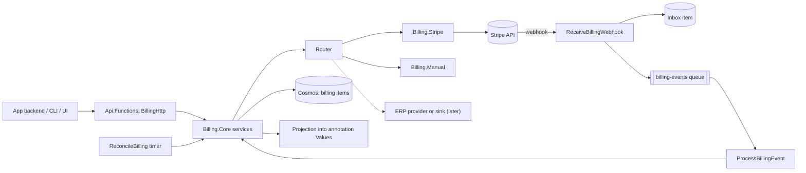

# Billing and Subscriptions for Annotations

Provider-agnostic billing for Storyteller, with Stripe as the first payment provider.

> **Updated 2026-10-01, after review and before implementation.** Billing became per *billing scope* instead of strictly per project (D2), so a view such as `sandbox` can use a Stripe sandbox account while `default` stays live. One subscription per payer with an item per usage is the default shape, with endpoints to add and remove usages (D10). Tenancy (D4), projection (D9), and one-time payments in Phase C were confirmed.

## Problem

Storyteller already describes the commercial catalog. [annotations.md](../../../42for.net/platform/annotations.md) calls the annotations "the subscription catalog" and puts "the plan, the seats, the feature package, the contract" on the usage. The [road map](../../../42for.net/platform/road-map.md) lists "built-in initial support for managing quotas and payments of subscriptions". Nothing connects that catalog to payments:

1. **No link to money.** The only way to say "this usage is paid by Stripe subscription `sub_…`" is to write provider ids into `Values` by hand, and nothing keeps them up to date.
2. **No lifecycle.** A service that reads an annotation cannot tell whether the customer is in a trial, paid, past due, or canceled.
3. **No invoices, payments, or receipts** can be listed for an annotation.
4. **Every application integrates Stripe on its own.** Each one repeats checkout, webhook handling, signature checks, retries, and its own mapping between Stripe customers and subjects.
5. **One provider at a time.** Combining Stripe with an ERP for invoicing, moving some customers to another payment platform, or recording offline contracts is not possible.

The goal is a billing module inside Storyteller that:

- links customers, subscriptions, invoices, payments, and receipts to **any** annotation;
- lets every project (one application or system) declare which annotation types pay, which can be subscribed, and how payment state turns into access;
- ships a Stripe provider and ready-to-use HTTP endpoints: checkout, customer portal, subscriptions, invoices, payments and receipts, webhooks, and an access summary per annotation;
- keeps providers **switchable** (per project, per plan, for new subscriptions) and **combinable** (one system of record per capability, plus mirrors such as an ERP).

## Current State

### Annotation model

- `Abstractions.Annotations/src/Model/Annotation.cs`: `Values` is a free-form `IReadOnlyDictionary<string, object>?` with no schema. `IsDisabled`, `ValidFrom`, `ExpiresAt` and `TimeZone` are documented as "a trial, a subscription window", but nothing writes them automatically.
- Annotations are stored per view. The id is `{view}.{annotationKey}` (`Backend.CosmosDb/src/Entities/Annotations/AnnotationEntity.cs`).
- Partitioning (`Backend.CosmosDb/src/PartitionKeys.cs`): `rst`, `unt`, `usg`, `exe` and `uxe` live in `{project}.rst.{responsibility}`. `sbt` and `cnt` live in `{project}.sbt.{subject}`. Project-level partitions already exist: `{project}.access`, `{project}.schema`, `{project}.template`.
- `CosmosAnnotationService.UpdateAnnotationAsync` (`Backend.CosmosDb/src/Annotating/CosmosAnnotationService.cs:292`) checks that the annotation exists, then upserts the **whole** entity through `UpsertAnnotationEntityAsync` (line 745) with no ETag. A client `PUT` replaces `Values` completely.
- `DeleteAnnotationAsync` (line 473): deleting a subject removes its contexts, usages, and executions. Deleting a responsibility calls `DeleteAllItemsByPartitionKeyStreamAsync` (line 518) on the whole `{project}.rst.{name}` partition, so anything else stored in that partition is lost with it.
- The `@annotation("<expr>", "<ancestorType>")` binding ([binding.md](../binding.md)) reads `Values` at resolve time. Bindings run on every resolved read (`CosmosConfigurationService.GetResolvedConfigurationInternalAsync`, line 591). A value written into `Values` is therefore visible to the next resolved read without cache invalidation.

### API host

- `Api.Functions/src/Program.cs` registers `ExceptionHandlingMiddleware → MachineAuthenticationMiddleware`. Both pass through when `GetHttpRequestDataAsync()` returns `null`, so queue and timer functions can live in the same app. Today there are only HTTP triggers. `AzureWebJobsStorage` is `UseDevelopmentStorage=true` in `local.settings.json`.
- Authorization happens inside each function: `request.CheckScope(...)` and `CheckAccessToProjectAsync(_access, organization, project, role)` (`Security/HttpRequestDataExtensions.cs:64` and `:155`). For machine identities, `CheckAccessToAsync` (line 114) checks project access only and ignores `minimalRole`.
- Scopes are in `Security/Scopes.cs` (`Default`, `Annotation`, `Configuration`). Machine scopes are in `Abstractions.Access/src/MachineAccessScope.cs`, mapped to claims in `Security/MachineScopeClaims.cs`.
- Routes, route ids, parameters, and OpenAPI tags are in `Api.Functions/src/Definitions.cs`. Errors use `Models/ErrorResponse.cs`.

### Secrets and infrastructure

- Key Vault is already used by `Binding.Azure.KeyVault` (configuration secrets) and `Access.Certificates.Azure.KeyVault` (the CA). `Azure.Security.KeyVault.Secrets` 4.9.0 and `Azure.Identity` 1.19.0 are in `Directory.Packages.props`.
- `Directory.Packages.props` has `Azure.Storage.Queues` 12.25.0, `Microsoft.Azure.Functions.Worker.Extensions.Timer` 4.3.1, and `Polly` 8.6.6. It has no `Stripe.net` and no `Microsoft.Azure.Functions.Worker.Extensions.Storage.Queues`.
- In `Aspire.Host/src/AppHost.cs` the Azurite storage lines are commented out. Only the Cosmos emulator, `DbCreator`, and `api-functions` run.

### Clients

- The CLI (`sform story …`, `src/Platform/Cli/src/Commands/`) uses `Sdk.NSwag`. `ApiSdk.g.cs` is generated from the OpenAPI document, with one client per tag. The TypeScript SDK and `ui.admin` consume the same OpenAPI document.

## Stripe capabilities (research summary)

As of 2026-10-01, the current API version is `2026-08-26.dahlia`. The current Stripe.net release is **52.4.2** (9 Sep 2026), and it pins `2026-08-26.dahlia`. The .NET SDK is strongly typed and cannot target another API version, so the API version is chosen by upgrading the package.

| Topic | What matters for this design |
| --- | --- |
| Object graph | Customer → Subscription (items → Price → Product) → Invoice → PaymentIntent → Charge. Since `2025-03-31.basil`: `current_period_start`/`current_period_end` are on **subscription items**; the invoice's subscription is `invoice.parent.subscription_details.subscription`; the payments of an invoice come from `GET /v1/invoice_payments?invoice=…`. |
| Subscription statuses | `incomplete` (23 h to pay), `incomplete_expired` (terminal), `trialing`, `active`, `past_due` (retries running), `unpaid`, `paused` (trial ended without a payment method), `canceled` (terminal). Stripe recommends provisioning on `trialing`/`active` and revoking on `canceled`/`unpaid`. Whether status follows the most recent invoice or all invoices is a dashboard setting. |
| Collection | `charge_automatically` (card or debit; `incomplete` until the first payment) or `send_invoice` + `days_until_due` (B2B, bank transfer; `active` immediately). |
| Checkout | `mode=subscription` (or `payment`), `customer`, `line_items[{price, quantity}]` (max 20 recurring + 20 one-time), `client_reference_id` (≤ 200 chars), `metadata`, `subscription_data.metadata` / `trial_period_days`, `success_url` (supports `{CHECKOUT_SESSION_ID}`), `cancel_url`, `expires_at` (30 min to 24 h), `ui_mode` (`hosted_page`, `embedded_page`, `elements`). |
| Customer portal | `POST /v1/billing_portal/sessions {customer, return_url, configuration?, flow_data?}` returns a short-lived URL. Customers update payment methods, see invoice history, and upgrade or cancel. |
| Metadata | 50 keys, key ≤ 40 chars, value ≤ 500 chars. Not copied between objects, except: Checkout `subscription_data.metadata` → Subscription; Subscription → Invoice `parent.subscription_details.metadata` (snapshot); PaymentIntent → Charge (snapshot). Searchable with `metadata["k"]:"v"` on customers, subscriptions, invoices, payment intents, charges, prices, and products. |
| Search API | Eventually consistent (normally < 1 min), 20 read requests/s, not available to businesses in India, not for read-after-write. |
| Webhooks | `Stripe-Signature` = HMAC-SHA256 over `{t}.{raw body}` with a `whsec_` secret per endpoint; default tolerance 5 min; the raw body must not be modified. Live mode retries for up to 3 days, sandboxes 3 times. **No ordering guarantee**, duplicates possible: deduplicate by event id and re-fetch objects. Return 2xx quickly and process asynchronously. Up to 16 endpoints per account. The payload shape follows the destination's `snapshot_api_version`. **If a destination subscribed to `invoice.created` fails, automatic invoice finalization is delayed for up to 72 h.** Alternatives: Azure Event Grid partner topics (CloudEvents envelope); thin events (v1 thin events are in private preview). |
| Subscription events | `checkout.session.completed`/`expired`/`async_payment_succeeded`/`async_payment_failed`, `customer.subscription.created`/`updated`/`deleted`/`paused`/`resumed`/`trial_will_end`, `invoice.finalized`/`paid`/`payment_failed`/`payment_action_required`/`finalization_failed`/`voided`/`marked_uncollectible`, `charge.refunded`, `charge.dispute.created`/`closed`, `customer.updated`/`deleted`, `entitlements.active_entitlement_summary.updated`. |
| Entitlements | Features (`lookup_key`) are attached to products. Active entitlements are per **customer**. The summary event lists at most 10 inline (`entitlements.url` for the rest). `GET /v1/entitlements/active_entitlements?customer=`. Stripe recommends persisting them locally. |
| Receipts | Charge `receipt_url`: the link expires after 30 days, the receipt does not. Invoice: `hosted_invoice_url`, `invoice_pdf`, `receipt_number`. Automatic receipt emails are a dashboard setting. |
| Keys | Prefer restricted keys (`rk_…`), keep them in a vault, rotate them. Sandbox and live keys differ. IP restrictions are available. |
| Multi-party | Connect: the platform key plus a `Stripe-Account: acct_…` header. Events from connected accounts carry `account`. Onboarding through Account Links. Portal sessions take `on_behalf_of`. Accounts v2 "customer-configured accounts" are recommended for new integrations: GA for Connect, public preview otherwise. |
| Idempotency | `Idempotency-Key` header on POST (Stripe.net `RequestOptions.IdempotencyKey`). Keys are kept for at least 24 h. |
| Testing | Sandboxes; test clocks (simulate renewals); `stripe listen --forward-to …`; `stripe trigger …`; `stripe/stripe-mock` (stateless, validates requests against the OpenAPI spec, returns fixtures, ports 12111/12112). |

## Design options

### Where the link between an annotation and billing data lives

| | A. `Values` of the annotation | B. Configuration document | C. Dedicated billing records | D. Provider only (metadata + Search) |
| --- | --- | --- | --- | --- |
| Write path | Full replace of the annotation, no ETag. Webhook writes and user edits overwrite each other. | Versioned merge with schema check and cache invalidation on every write | Own items, ETag, idempotent upserts | Provider API |
| Views | Per view: copied and drifting | Per view | Billing scopes bound to views (D2) | n/a |
| History (invoices, payments) | No; the document keeps growing | Every renewal becomes a configuration version | Yes, as separate items | At the provider |
| One subscription for several annotations (bundle) | Awkward | Awkward | Natural (subscription items) | Only through metadata |
| "All past-due subscriptions" | Scan of every annotation | Same | One query per billing root or project | Search API: eventual, 20 rps, Stripe only |
| Annotation deleted | Billing state deleted with it; the Stripe subscription keeps charging, orphaned | Same | Separate partition plus a delete guard | Survives |
| Provider-neutral, combinable | No | No | Yes | No |
| Read cost for a service | Free, already in the annotation | Free, in the resolved configuration | One call, or free through the projection | A provider call on every check |

**Recommendation (D1): C is the source of truth, A is an optional read projection, D provides backlinks.**

- Billing records are dedicated Cosmos items linked to annotation keys.
- A server-owned summary can be projected into `Values["billing"]`, and optionally into `IsDisabled`/`ExpiresAt`, so `@annotation("/billing/access")` works in configuration without an extra call.
- Every provider object created by Storyteller carries `2s_*` metadata. Webhooks are routed with it, and the store can be rebuilt from the provider.

B is rejected. Configuration is intent authored by people, and billing state is an external fact. Writing it there would create a configuration version on every renewal and fight with the schema rules in [definitions.md](../definitions.md).

### Billing roles on annotation types

Default mapping, taken from the meaning in [annotations.md](../../../42for.net/platform/annotations.md):

| Billing concept | Default annotation | Reason |
| --- | --- | --- |
| Payer: billing account, provider customer | Subject (`sbt`). A context (`cnt`) when one subject has several legal entities. | The subject is the customer; "legal entity" is a documented context. |
| Product | Responsibility (`rst`) | A capability that is sold |
| Subscription item | Usage (`usg`). By default all usages of one payer are items of **one** subscription, so the customer gets one invoice (D10). | "The commercial or entitlement facts belong to the pair" |
| Item for one setup only | Execution (`exe`) | e.g. production is paid, sandbox is free |
| Feature | Plan feature code | Free strings, optionally matching unit names or Stripe feature lookup keys |
| Invoice, payment, receipt | The payer, plus every annotation targeted by the invoiced subscription | |

The mapping is not hard-coded. The **billing profile** of a project (section 3) declares payer types and subscribable types. Any annotation can also carry generic links to arbitrary provider objects (`BillingLink`, section 2).

**Billing root (D3).** A subscription item must target the payer annotation itself or one of its descendants. The billing root is the subject when the key has one, otherwise the responsibility. This puts all billing data of one customer into one Cosmos logical partition (section 8). A reseller paying for another subject's usage is out of scope.

### Who owns the Stripe account (multi-tenancy)

| Model | How | Pros | Cons |
| --- | --- | --- | --- |
| **M1. Bring your own account** | Per project connection. The tenant creates a restricted key and a webhook in their own Stripe account. Storyteller keeps the key in Key Vault. | Simple. No Stripe platform agreement. The tenant owns customers, money, and liability. | Setup per tenant. Storyteller holds tenant secrets. |
| **M2. Stripe Connect** | Storyteller is a Connect platform. Tenants onboard through Account Links. Calls use the platform key with `Stripe-Account`. | No tenant keys. One webhook for all tenants. Application fees possible. | Platform onboarding, compliance, more code, Connect-specific charge types. |
| **M3. Platform-owned** | Storyteller's own Stripe account bills everybody. | Trivial | Only fits the platform billing its own tenants. |

**Decision (D4, confirmed):** implement M1 now. `BillingConnection` stays independent of the credential kind (`ApiKey` now, `Connect` later), so M2 becomes a new credential kind plus webhook routing by `account`, not a redesign. M3 is M1 used by the `house` organization: the platform billing its own SaaS tenants uses the same module.

### Views and billing scopes

Payments are facts in the real world, and a view is "a parallel edition of the same catalog". In most projects one billing state serves the `default` view. Some projects need a second, isolated billing state for another view: for example a `sandbox` view wired to a Stripe sandbox account while `default` stays on the live account.

**Decision (D2): billing scopes.** A *billing scope* is a named, isolated billing state inside a project, bound to one or more views.

- A new profile has one scope, `default`, bound to the view `default`. Most projects never add another.
- A view belongs to at most one scope. A view that no scope names has no billing.
- Several views can share one scope, for example `default` and the catalog edition `2026-q4`. A new edition of the catalog then keeps the same customers and subscriptions.
- Each connection belongs to exactly one scope. A scope is either live or test, and all its connections must match it. A live key can never be used for a sandbox view by mistake.
- Accounts, subscriptions, invoices, payments, and links are stored per scope. Profile settings (payer types, access policy, projection), plans, and the connection list are project-level. A plan is priced on the connections of every scope that sells it.
- Operational routes carry `{view}` like the rest of the API (`v1/{org}/{project}/{view}/billing/…`), and the view selects the scope. Setup routes (profile, connections, plans, events) stay project-level.
- Annotation keys are validated in the request's view. The delete guard and the projection apply to every view bound to the scope.

## Proposed Changes



---

### 1. Projects

| Project | Assembly | Root namespace | Content | References |
| --- | --- | --- | --- | --- |
| `Abstractions.Billing/src` (new) | `42.Platform.Storyteller.Abstractions.Billing` | `_42.Platform.Storyteller.Billing` | Public models and enums (section 2) used by the API, SDK, and CLI | none |
| `Billing.Abstractions/src` (new) | `42.Platform.Storyteller.Billing.Abstractions` | `_42.Platform.Storyteller.Billing` | Provider SPI (section 6), sink SPI, secret store SPI | `Abstractions.Billing` |
| `Backend.Core/src/Billing/` (existing project) | | `_42.Platform.Storyteller.Billing` | Service interfaces used by the API, storage port `IBillingStore`, queue port, exceptions | adds `Abstractions.Billing` |
| `Billing.Core/src` + `test` (new) | `42.Platform.Storyteller.Billing.Core` | `_42.Platform.Storyteller.Billing` | Service implementations, provider registry, router, access resolver, synchronizer, projector, `AddBilling()` | `Backend.Core`, `Billing.Abstractions` |
| `Billing.Manual/src` + `test` (new) | `42.Platform.Storyteller.Billing.Manual` | `_42.Platform.Storyteller.Billing.Manual` | Offline provider (section 14), also the reference implementation for tests | `Billing.Abstractions` |
| `Billing.Stripe/src` + `test` + `testint` (new) | `42.Platform.Storyteller.Billing.Stripe` | `_42.Platform.Storyteller.Billing.Stripe` | Stripe provider (section 13) | `Billing.Abstractions`, `Stripe.net` |
| `Billing.Azure.KeyVault/src` (new) | `42.Platform.Storyteller.Billing.Azure.KeyVault` | `_42.Platform.Storyteller.Billing` | `KeyVaultBillingSecretStore` | `Billing.Abstractions`, `Azure.Security.KeyVault.Secrets`, `Azure.Identity` |
| `Backend.CosmosDb/src/Billing/` (existing project) | | `_42.Platform.Storyteller.Billing` | `CosmosBillingStore`, entities, mappings | adds `Abstractions.Billing` |
| `Api.Functions/src/V1/Billing*.cs`, `Api.Functions/src/Billing/` | | | HTTP endpoints, webhook, queue and timer functions, queue adapter | adds the billing projects |

`Abstractions.Billing` is separate from `Billing.Abstractions` for the same reason `Abstractions.Annotations` is separate from `Binding.Abstractions`. SDK and CLI consumers see only the public models, never the provider SPI. All projects follow the existing conventions: `net10.0`, nullable, StyleCop, central package versions.

### 2. Domain model (`Abstractions.Billing`)

Amounts are `long` in minor units, the way providers report them. Currencies are upper-case ISO 4217 codes. Times are `DateTimeOffset` in UTC.

```csharp
[Flags]
public enum BillingCapabilities
{
    None = 0,
    Customers = 1 << 0,
    Catalog = 1 << 1,          // price lookup / validation
    Checkout = 1 << 2,         // hosted or embedded payment page
    CustomerPortal = 1 << 3,
    Subscriptions = 1 << 4,
    Invoices = 1 << 5,
    Payments = 1 << 6,         // payments, receipts
    Refunds = 1 << 7,
    Entitlements = 1 << 8,
    UsageMetering = 1 << 9,    // reserved, future
    Webhooks = 1 << 10,
    ManualRecording = 1 << 11, // invoices and payments recorded through the API
}

public enum SubscriptionStatus { Pending, Incomplete, Trialing, Active, PastDue, Unpaid, Paused, Canceled, Expired }
public enum AccessState { None, Revoked, Grace, Granted }          // ordered: higher wins
public enum InvoiceStatus { Draft, Open, Paid, Void, Uncollectible }
public enum PaymentStatus { Pending, RequiresAction, Succeeded, Failed, Canceled }
public enum CollectionMethod { ChargeAutomatically, SendInvoice }
public enum CancellationTiming { Immediately, PeriodEnd }
public enum CheckoutMode { Subscription, OneTime }
public enum PaymentActionType { None, ConfirmPayment, PayInvoice, Redirect }

public record class ProviderReference
{
    public required string Connection { get; init; }   // connection name, e.g. stripe-main
    public required string ObjectType { get; init; }   // customer, subscription, invoice, payment_intent, …
    public required string ObjectId { get; init; }     // cus_…, sub_…, in_…, pi_…
}

public record class ExternalReference                  // a mirror's id, e.g. an ERP invoice number
{
    public required string Connection { get; init; }
    public required string ObjectId { get; init; }
    public string? Number { get; init; }
    public DateTimeOffset SyncedAt { get; init; }
}

public record class BillingAccount
{
    public required string PayerKey { get; init; }     // annotation key, e.g. sbt.northwind
    public string? Email { get; init; }
    public string? Name { get; init; }
    public string? PreferredLocale { get; init; }
    public string? Currency { get; init; }
    public IReadOnlyList<ProviderReference> References { get; init; } = [];  // one customer per connection
    public IReadOnlyList<string> ProviderEntitlements { get; init; } = [];   // Stripe lookup keys (Phase E)
    public DateTimeOffset CreatedAt { get; init; }
    public DateTimeOffset UpdatedAt { get; init; }
}

public record class BillingSubscriptionItem
{
    public string? Plan { get; init; }                 // null for imported items with an unknown price
    public required string AnnotationKey { get; init; } // target: the payer or a descendant
    public long Quantity { get; init; } = 1;
    public string? PriceReference { get; init; }       // resolved provider price id
    public string? Interval { get; init; }             // month | year | …, from the resolved price
    public string? ProviderItemId { get; init; }       // si_…
    public DateTimeOffset? CurrentPeriodStart { get; init; }
    public DateTimeOffset? CurrentPeriodEnd { get; init; }
    public bool IsPending { get; init; }               // added, waiting for its payment (pending update)
    public DateTimeOffset AddedAt { get; init; }
    public DateTimeOffset? EndedAt { get; init; }      // removed; kept so the target reads Revoked, not None
}

public record class BillingSubscription
{
    public required string Id { get; init; }           // platform id (Guid v7, "N")
    public required string PayerKey { get; init; }
    public required string Connection { get; init; }
    public string? ProviderSubscriptionId { get; init; }
    public string? ProviderCheckoutId { get; init; }
    public required SubscriptionStatus Status { get; init; }
    public string? ProviderStatus { get; init; }       // raw, e.g. past_due
    public DateTimeOffset StatusChangedAt { get; init; }
    public AccessState Access { get; init; }           // evaluated with the profile's policy at write time
    public DateTimeOffset? GraceUntil { get; init; }
    public IReadOnlyList<BillingSubscriptionItem> Items { get; init; } = [];
    public CollectionMethod CollectionMethod { get; init; }
    public string? Currency { get; init; }
    public DateTimeOffset? CurrentPeriodStart { get; init; }   // min/max over items
    public DateTimeOffset? CurrentPeriodEnd { get; init; }
    public DateTimeOffset? TrialEnd { get; init; }
    public DateTimeOffset? CancelAt { get; init; }             // from cancel_at, or period end when cancel_at_period_end
    public DateTimeOffset? CanceledAt { get; init; }
    public DateTimeOffset? EndedAt { get; init; }
    public string? LatestInvoiceId { get; init; }
    public IReadOnlyDictionary<string, string>? Metadata { get; init; }
    public required string CreatedBy { get; init; }
    public DateTimeOffset CreatedAt { get; init; }
    public DateTimeOffset UpdatedAt { get; init; }
}

public record class BillingInvoice
{
    public required string Id { get; init; }           // {connection}.{providerInvoiceId}
    public required string PayerKey { get; init; }
    public required string Connection { get; init; }
    public required string ProviderInvoiceId { get; init; }
    public string? SubscriptionId { get; init; }
    public IReadOnlyList<string> AnnotationKeys { get; init; } = [];
    public string? Number { get; init; }
    public required InvoiceStatus Status { get; init; }
    public required string Currency { get; init; }
    public long Subtotal { get; init; }
    public long Tax { get; init; }
    public long Total { get; init; }
    public long AmountDue { get; init; }
    public long AmountPaid { get; init; }
    public long AmountRemaining { get; init; }
    public DateTimeOffset? PeriodStart { get; init; }
    public DateTimeOffset? PeriodEnd { get; init; }
    public DateTimeOffset CreatedAt { get; init; }
    public DateTimeOffset? FinalizedAt { get; init; }
    public DateTimeOffset? DueAt { get; init; }
    public DateTimeOffset? PaidAt { get; init; }
    public string? HostedUrl { get; init; }
    public string? PdfUrl { get; init; }
    public IReadOnlyList<ExternalReference> ExternalReferences { get; init; } = [];
}

public record class BillingPayment
{
    public required string Id { get; init; }           // {connection}.{providerPaymentId}
    public required string PayerKey { get; init; }
    public required string Connection { get; init; }
    public required string ProviderPaymentId { get; init; }   // pi_…, or cs_… until the intent exists
    public string? InvoiceId { get; init; }
    public string? SubscriptionId { get; init; }
    public IReadOnlyList<string> AnnotationKeys { get; init; } = [];
    public required PaymentStatus Status { get; init; }
    public required string Currency { get; init; }
    public long Amount { get; init; }
    public long AmountRefunded { get; init; }
    public bool IsDisputed { get; init; }
    public string? ReceiptUrl { get; init; }
    public DateTimeOffset? ReceiptUrlFetchedAt { get; init; }
    public string? ReceiptNumber { get; init; }
    public string? FailureCode { get; init; }
    public string? FailureMessage { get; init; }
    public DateTimeOffset CreatedAt { get; init; }
    public DateTimeOffset? SucceededAt { get; init; }
    public IReadOnlyList<ExternalReference> ExternalReferences { get; init; } = [];
}

public record class BillingLink                        // generic: any provider object ↔ any annotation
{
    public required string Id { get; init; }
    public required string AnnotationKey { get; init; }
    public required string Connection { get; init; }
    public required string ObjectType { get; init; }
    public required string ObjectId { get; init; }
    public string? Role { get; init; }                 // free text defined by the application
    public string? Note { get; init; }
    public required string CreatedBy { get; init; }
    public DateTimeOffset CreatedAt { get; init; }
}

public record class AnnotationBillingSummary
{
    public required string AnnotationKey { get; init; }
    public required AccessState Access { get; init; }
    public SubscriptionStatus? Status { get; init; }   // of the subscription that gives the best access
    public string? PayerKey { get; init; }
    public IReadOnlyList<string> Plans { get; init; } = [];
    public IReadOnlyList<string> Features { get; init; } = [];
    public IReadOnlyList<string> Sources { get; init; } = [];  // annotation keys that contributed
    public DateTimeOffset? CurrentPeriodEnd { get; init; }
    public DateTimeOffset? CancelAt { get; init; }
    public DateTimeOffset? GraceUntil { get; init; }
    public IReadOnlyList<BillingSubscriptionBrief> Subscriptions { get; init; } = [];
    public IReadOnlyList<BillingLink> Links { get; init; } = [];
}

public record class BillingListResponse<T>
{
    public required IReadOnlyList<T> Items { get; init; }
    public string? ContinuationToken { get; init; }
}
```

Every scope-bound record (`BillingAccount`, `BillingSubscription`, `BillingInvoice`, `BillingPayment`, `BillingLink`) and `AnnotationBillingSummary` also carries `public required string Scope { get; init; }`, the billing scope it belongs to (D2).

The request and response models are also here: `BillingSubscribeRequest`/`BillingSubscribeResult` (section 9), `BillingSubscriptionItemAdd`, `BillingSubscriptionItemRemove`, `BillingAccountUpsert`, `BillingCheckoutRequest`/`BillingCheckoutSession`, `BillingPortalRequest`/`BillingPortalSession`, `BillingSubscriptionCreate`, `BillingSubscriptionChange`, `BillingSubscriptionCancel`, `BillingSubscriptionImport`, `BillingSubscriptionResult` (`Subscription` + `PaymentAction`), `PaymentAction` (`Type`, `ClientSecret?`, `Url?`), `BillingLinkCreate`, `BillingSubscriptionBrief`, `ConnectionVerification`, `WebhookRegistration`, and `BillingEventRecord`. Their shapes are shown in section 15.

### 3. Billing profile: what an application needs

One profile per project. It is where each application or system declares its needs. Scopes (D2) are part of it, because they decide which views have billing at all.

```csharp
public record class BillingProfile
{
    public IReadOnlyList<BillingScope> Scopes { get; init; }                        // D2
        = [new BillingScope { Name = "default", Views = ["default"], IsLive = true }];
    public IReadOnlyList<string> PayerTypes { get; init; } = ["sbt", "cnt"];
    public IReadOnlyList<string> SubscribableTypes { get; init; } = ["sbt", "usg", "cnt", "exe"];
    public SubscriptionShape SubscriptionShape { get; init; } = SubscriptionShape.PerPayer;   // D10
    public ItemProration ItemAddProration { get; init; } = ItemProration.AlwaysInvoice;      // charge an added usage now
    public ItemProration ItemRemoveProration { get; init; } = ItemProration.CreateProrations; // credit on the next invoice
    public BillingAccessPolicy Access { get; init; } = new();
    public BillingProjection Projection { get; init; } = new();
    public IReadOnlyList<string> AllowedReturnOrigins { get; init; } = [];          // https://app.example.com
    public bool BlockAnnotationDeleteWithLiveSubscriptions { get; init; } = true;
    public bool AllowMultipleSubscriptionsPerTarget { get; init; } = false;
    public ulong Version { get; init; }
    public string? Author { get; init; }
}

public enum SubscriptionShape
{
    PerPayer,    // one subscription per payer and compatible billing cycle; one item per target (one invoice)
    PerTarget,   // a new subscription for every subscribe call
}

public enum ItemProration { CreateProrations, AlwaysInvoice, None }   // maps to Stripe proration_behavior

public record class BillingScope
{
    public required string Name { get; init; }                  // default, sandbox; name rules, no dots
    public required IReadOnlyList<string> Views { get; init; }   // at least one; a view is in at most one scope
    public bool IsLive { get; init; }                            // every connection of the scope must match
    public string? DefaultConnection { get; init; }
    public BillingRouting Routing { get; init; } = new();
}

public record class BillingRouting
{
    public IReadOnlyDictionary<string, BillingRoute> Capabilities { get; init; }     // key = capability name
        = new Dictionary<string, BillingRoute>();
    public IReadOnlyList<string> Sinks { get; init; } = [];                          // Phase E
}

public record class BillingRoute
{
    public string? Primary { get; init; }                // system of record for commands
    public IReadOnlyList<string> Mirrors { get; init; } = [];   // receive domain events (Phase E)
}

public record class BillingAccessPolicy
{
    public IReadOnlyList<SubscriptionStatus> Grant { get; init; } = [SubscriptionStatus.Trialing, SubscriptionStatus.Active];
    public IReadOnlyList<SubscriptionStatus> Grace { get; init; } = [SubscriptionStatus.PastDue];
    public TimeSpan GracePeriod { get; init; } = TimeSpan.FromDays(7);
    public bool InheritFromAncestors { get; init; } = true;
}

public record class BillingProjection
{
    public bool Enabled { get; init; }                   // default off
    public string ValuesKey { get; init; } = "billing";
    public bool SetIsDisabled { get; init; }             // true on Revoked, false on Granted/Grace, untouched on None
    public bool SetExpiresAt { get; init; }              // GraceUntil ?? CurrentPeriodEnd + ExpiresAtBuffer
    public TimeSpan ExpiresAtBuffer { get; init; } = TimeSpan.FromDays(3);
}
```

Validation on `PUT`:

- Type codes must be in `AnnotationTypeCodes.ValidCodes`.
- At least one scope. Scope names are unique and follow name rules. Every scope has at least one view, and no view appears in two scopes.
- Every connection named in a scope's `DefaultConnection`, routing, or sinks must exist and belong to that scope.
- Return origins must be absolute `https` origins. `http://localhost:*` is allowed for development.
- `ValuesKey` must be a single property name: no `/`, `.`, or `$` prefix.
- **Removing a scope**, or removing a view from it, is refused (`409`) while the scope has connections or non-terminal subscriptions. Stored records of an empty scope stay as history.

The profile is one item with a `Version` counter, `Author`, and ETag concurrency. It has no history in this spec.

A project without a profile has billing **disabled**. Every billing endpoint except `PUT profile` then returns `404` with error code `billing.not_configured`. The same `404` is returned for an operational route whose `{view}` is in no scope.

Example with a sandbox:

```json
{
  "scopes": [
    { "name": "default", "views": ["default", "2026-q4"], "isLive": true, "defaultConnection": "stripe-main" },
    { "name": "sandbox", "views": ["sandbox"], "isLive": false, "defaultConnection": "stripe-test" }
  ],
  "payerTypes": ["sbt", "cnt"],
  "subscribableTypes": ["sbt", "usg", "exe"],
  "subscriptionShape": "PerPayer",
  "projection": { "enabled": true },
  "allowedReturnOrigins": ["https://app.northwind.example", "https://sandbox.northwind.example"]
}
```

### 4. Connections, credentials, and the secret store

A connection is one configured provider account inside a project.

```csharp
public record class BillingConnection
{
    public required string Name { get; init; }           // stripe-main, stripe-test, manual, erp-pohoda
    public required string ProviderKind { get; init; }   // stripe | manual | …
    public string Scope { get; init; } = "default";      // D2: exactly one scope
    public bool IsLive { get; init; }                    // must equal the scope's IsLive
    public bool IsEnabled { get; init; } = true;
    public JObject? Settings { get; init; }               // provider-specific, non-secret
    public BillingCapabilities Capabilities { get; init; }       // read-only, reported by the provider
    public bool HasCredentials { get; init; }            // read-only
    public string? WebhookUrl { get; init; }             // read-only, computed from Billing:PublicBaseUrl
    public DateTimeOffset? VerifiedAt { get; init; }     // read-only
    public ulong Version { get; init; }
    public string? Author { get; init; }
}
```

- The name follows annotation name rules: lower-case, no dots. Names are unique per project, across scopes, so the webhook route needs no scope segment.
- `Scope` must name an existing scope, and `IsLive` must equal that scope's `IsLive`. Moving a connection to another scope is refused while it has non-terminal subscriptions.
- `Settings` are validated by the provider (`IBillingProvider.ValidateSettings`). The Stripe settings are listed in section 13.
- **Credentials are write-only.** `PUT P/connections/{connection}/credentials` (section 15) takes `{ "apiKey": "rk_live_…", "webhookSecret": "whsec_…" }`. The accepted names come from `IBillingProvider.CredentialNames`. The response is `204`. Credentials are never returned and never logged.
- `POST P/connections/{connection}/verify` makes a cheap authenticated call and checks that the key's mode matches `IsLive`. It stores `VerifiedAt` and the reported capabilities.
- `POST P/connections/{connection}/webhook` registers the webhook endpoint at the provider when the key may do so, and stores the returned signing secret. Otherwise the tenant creates the endpoint by hand and sends `webhookSecret` through `credentials`.
- Deleting a connection is refused (`409`) while a plan price or a non-terminal subscription references it.
- Creating the first connection of a project writes a registry item `bpj.{organization}.{project}` into the `core` container (partition `billing`). The reconciliation timer enumerates billing-enabled projects from there.

Secret store SPI (`Billing.Abstractions`):

```csharp
public readonly record struct BillingSecretName(string Organization, string Project, string Connection, string Name);

public interface IBillingSecretStore
{
    Task SetAsync(BillingSecretName name, string value, CancellationToken cancellationToken = default);
    Task<string?> GetAsync(BillingSecretName name, CancellationToken cancellationToken = default);
    Task DeleteAsync(BillingSecretName name, CancellationToken cancellationToken = default);
}
```

- **`KeyVaultBillingSecretStore`** (`Billing.Azure.KeyVault`): the secret name is `billing-{first 20 hex of SHA-256("{org}/{project}/{connection}")}-{name}`, because Key Vault names allow only alphanumerics and dashes. The secret carries the tags `organization`, `project`, `connection`. Delete is soft-delete, plus purge when the vault allows it. The Function identity needs the `Key Vault Secrets Officer` role on the vault.
- **`ConfigurationBillingSecretStore`** (`Billing.Core`, for development): reads `Billing:Secrets:{org}:{project}:{connection}:{name}` from configuration or user secrets. `SetAsync` throws `NotSupportedException`, which the API returns as `501`.
- Reads are cached in `IMemoryCache` for 5 minutes. A write or delete invalidates the cache on the instance that handled it; other instances pick up the change after the TTL. During key rotation, Stripe's "roll key" keeps the old key valid for the chosen overlap, and that overlap must be longer than 5 minutes.

### 5. Plans (catalog mapping)

A plan is the provider-neutral name clients use. Clients never send provider price ids or amounts.

```csharp
public record class BillingPlan
{
    public required string Code { get; init; }           // invoicing-enterprise
    public string? Title { get; init; }
    public string? Description { get; init; }
    public string? ResponsibilityKey { get; init; }      // product sold, e.g. rst.invoicing (optional)
    public IReadOnlyList<string> Features { get; init; } = [];
    public int? TrialDays { get; init; }
    public IReadOnlyList<BillingPlanPrice> Prices { get; init; } = [];
    public bool IsArchived { get; init; }                // archived plans can't be used for new subscriptions
    public ulong Version { get; init; }
    public string? Author { get; init; }
}

public record class BillingPlanPrice
{
    public required string Connection { get; init; }
    public required string PriceReference { get; init; } // "price_123" or "lookup:invoicing_enterprise_monthly"
    public string? Currency { get; init; }               // selection hint and display only
    public string? Interval { get; init; }               // month | year | null (one-time); display only
    public long? UnitAmount { get; init; }               // display only; the provider's price is authoritative
    public bool IsDefault { get; init; }
}
```

- `lookup:` references are resolved at use time, through Stripe `GET /v1/prices?lookup_keys[]=…&active=true`, and cached for 10 minutes. The price can then change in Stripe without touching the plan.
- Price selection for a connection: the price whose `Currency` equals the account currency, otherwise the `IsDefault` price, otherwise the only price. An ambiguous match is a `400`.
- Validation: the code follows name rules, the plan has at least one price, each price's connection exists, and `ResponsibilityKey`, when set, exists in at least one view bound to a scope.
- Delete is refused (`409`) while a non-terminal subscription uses the plan. Archive the plan instead.
- **Plans are shared by all scopes.** The same plan code works in `default` and `sandbox`. Each scope uses the plan's price on one of its own connections, e.g. `stripe-main` with `lookup:invoicing_enterprise_monthly` in live mode and `stripe-test` with the same lookup key in the Stripe sandbox. An application therefore behaves the same in both views.
- A price with `Interval = null` is one-time. It can be used only by a one-time checkout (section 9), never as a subscription item.

### 6. Provider SPI (`Billing.Abstractions`)

One small base interface plus optional capability interfaces. A provider implements only what it supports. Billing.Core discovers capabilities with type checks and answers unsupported calls with `422 billing.capability_not_supported`.

```csharp
public interface IBillingProvider
{
    string Kind { get; }                                  // "stripe"
    BillingCapabilities Capabilities { get; }
    IReadOnlyList<string> CredentialNames { get; }        // ["apiKey", "webhookSecret"]
    IReadOnlyList<string> ValidateSettings(JObject? settings);   // error messages, empty = valid
    Task<ConnectionVerification> VerifyAsync(BillingProviderContext context, CancellationToken ct);
}

public interface ICustomerProvider
{
    Task<ProviderCustomer> EnsureCustomerAsync(BillingProviderContext context, ProviderCustomerUpsert request, CancellationToken ct);
    Task<ProviderCustomer?> GetCustomerAsync(BillingProviderContext context, string customerId, CancellationToken ct);
}

public interface ICatalogProvider
{
    Task<ProviderPrice> ResolvePriceAsync(BillingProviderContext context, string priceReference, CancellationToken ct);
}

public interface ICheckoutProvider
{
    Task<ProviderCheckout> CreateCheckoutAsync(BillingProviderContext context, ProviderCheckoutRequest request, CancellationToken ct);
    Task<ProviderCheckout?> GetCheckoutAsync(BillingProviderContext context, string checkoutId, CancellationToken ct);
}

public interface ICustomerPortalProvider
{
    Task<Uri> CreatePortalSessionAsync(BillingProviderContext context, ProviderPortalRequest request, CancellationToken ct);
}

public interface ISubscriptionProvider
{
    Task<ProviderSubscriptionResult> CreateSubscriptionAsync(BillingProviderContext context, ProviderSubscriptionCreate request, CancellationToken ct);
    Task<ProviderSubscriptionResult> UpdateSubscriptionAsync(BillingProviderContext context, ProviderSubscriptionUpdate request, CancellationToken ct);
    Task<ProviderSubscriptionResult> AddItemAsync(BillingProviderContext context, ProviderItemAdd request, CancellationToken ct);       // D10
    Task<ProviderSubscriptionResult> RemoveItemAsync(BillingProviderContext context, ProviderItemRemove request, CancellationToken ct); // D10
    SubscriptionLimits GetLimits(ProviderSubscription subscription);   // max items, whether intervals may mix
    Task<ProviderSubscription> CancelSubscriptionAsync(BillingProviderContext context, ProviderSubscriptionCancel request, CancellationToken ct);
    Task<ProviderSubscription> ResumeSubscriptionAsync(BillingProviderContext context, string subscriptionId, CancellationToken ct);
    Task<ProviderSubscription?> GetSubscriptionAsync(BillingProviderContext context, string subscriptionId, CancellationToken ct);
    Task SetBacklinkAsync(BillingProviderContext context, string subscriptionId, IReadOnlyDictionary<string, string> itemTargets, CancellationToken ct);
}

public interface IInvoiceProvider
{
    Task<ProviderInvoice?> GetInvoiceAsync(BillingProviderContext context, string invoiceId, CancellationToken ct);
    IAsyncEnumerable<ProviderInvoice> ListInvoicesAsync(BillingProviderContext context, ProviderInvoiceQuery query, CancellationToken ct);
}

public interface IPaymentProvider
{
    Task<ProviderPayment?> GetPaymentAsync(BillingProviderContext context, string paymentId, CancellationToken ct);
    Task<IReadOnlyList<ProviderPayment>> GetInvoicePaymentsAsync(BillingProviderContext context, string invoiceId, CancellationToken ct);
    Task<Uri?> GetReceiptUrlAsync(BillingProviderContext context, string paymentId, CancellationToken ct);
}

public interface IEntitlementProvider
{
    Task<IReadOnlyList<string>> GetActiveEntitlementsAsync(BillingProviderContext context, string customerId, CancellationToken ct);
}

public interface IWebhookProvider
{
    ProviderEventEnvelope Verify(ProviderWebhookRequest request, string signingSecret);   // throws BillingWebhookException
    IReadOnlyList<BillingSignal> Translate(ProviderEventEnvelope envelope);
    Task<WebhookRegistration> RegisterEndpointAsync(BillingProviderContext context, Uri url, CancellationToken ct);
}

public interface IManualRecordingProvider                // Billing.Manual, and later ERP adapters
{
    ProviderInvoice RecordInvoice(ProviderInvoiceRecord request);
    ProviderPayment RecordPayment(ProviderPaymentRecord request);
}

public interface IUsageProvider                          // reserved for metered billing, not implemented here
{
    Task ReportUsageAsync(BillingProviderContext context, ProviderUsageRecord record, CancellationToken ct);
}

public interface IBillingEventSink                       // Phase E: ERP and HTTP mirrors
{
    string Kind { get; }
    Task<ExternalReference?> HandleAsync(BillingProviderContext context, BillingDomainEvent domainEvent, CancellationToken ct);
}
```

Shared types:

```csharp
public sealed record BillingProviderContext(
    string Organization,
    string Project,
    BillingConnection Connection,
    IBillingCredentials Credentials,     // lazy: secrets are read only when the provider asks
    BillingBacklink Backlink,            // org, project, connection, payer, subscription id, target keys
    string? IdempotencyKey,
    string CorrelationId);

public interface IBillingCredentials
{
    ValueTask<string> GetAsync(string name, CancellationToken ct);   // throws BillingNotConfiguredException
}

// Normalized provider snapshots. Providers map raw statuses onto SubscriptionStatus, InvoiceStatus, PaymentStatus.
public sealed record ProviderSubscription(
    string Id, string CustomerId, SubscriptionStatus Status, string RawStatus,
    IReadOnlyList<ProviderSubscriptionItem> Items, CollectionMethod CollectionMethod, string? Currency,
    DateTimeOffset? TrialEnd, DateTimeOffset? CancelAt, DateTimeOffset? CanceledAt, DateTimeOffset? EndedAt,
    string? LatestInvoiceId, IReadOnlyDictionary<string, string> Metadata, bool IsLive);

public sealed record ProviderSubscriptionResult(ProviderSubscription Subscription, PaymentAction? PaymentAction);

// Signals: "something changed, fetch the current state". The synchronizer re-reads the object.
public abstract record BillingSignal;
public sealed record CustomerTouched(string CustomerId, bool IsDeleted) : BillingSignal;
public sealed record SubscriptionTouched(string SubscriptionId) : BillingSignal;
public sealed record InvoiceTouched(string InvoiceId) : BillingSignal;
public sealed record PaymentTouched(string PaymentId) : BillingSignal;
public sealed record CheckoutCompleted(string CheckoutId, string? ClientReferenceId, string? SubscriptionId, string? PaymentId) : BillingSignal;
public sealed record CheckoutExpired(string CheckoutId, string? ClientReferenceId) : BillingSignal;
public sealed record EntitlementsTouched(string CustomerId) : BillingSignal;
public sealed record SignalIgnored(string Reason) : BillingSignal;
```

Rules for providers:

- Providers are stateless singletons. All tenant state comes in through the context.
- Errors are thrown as `BillingProviderException(code, message, isTransient, isUserFacing)`. The API mapping is in section 15.
- Billing.Core sets `IdempotencyKey` for every create call: `2s:{org}:{project}:{operation}:{platformId}`, at most 255 chars. Retrying a request then never creates a second customer, subscription, or checkout.
- The backlink is written in the provider's native form. For Stripe that is metadata (section 13).

Registration:

```csharp
services.AddBilling(context.Configuration)               // Billing.Core
    .AddBillingProvider<StripeBillingProvider>()          // Kind "stripe"
    .AddBillingProvider<ManualBillingProvider>()          // Kind "manual"
    .AddKeyVaultBillingSecrets(context.Configuration);    // or .AddConfigurationBillingSecrets() locally
```

### 7. Routing: switching and combining providers

**Commands.** `IBillingRouter.Resolve(capability, profile, plan?, explicitConnection?, existingRecord?)` picks the connection in this order:

Only connections of the request's scope (the scope bound to `{view}`) are candidates. `Routing` and `DefaultConnection` are the scope's.

1. An existing record always uses its own `Connection`. A subscription stays with the provider that created it.
2. The `connection` given in the request. It must belong to the scope, and for subscriptions and checkout the plan must have a price on it.
3. `Routing.Capabilities[capability].Primary`, if the plan has a price on that connection.
4. The connection of the plan's `IsDefault` price, if it belongs to the scope.
5. `DefaultConnection`.
6. Otherwise `400 billing.no_connection`.

**Switching.** Changing `Primary` or a plan's default price affects new subscriptions only. Moving existing subscriptions to another provider is cancel-and-recreate, or an import (`POST V/subscriptions/import`, section 15) of a subscription that already exists at the new provider. This spec has no automatic migration.

**Per-plan selection.** A plan priced only on `manual` (annual contract, bank transfer) and a plan priced on `stripe-main` (self-service card) can live side by side. Each subscription goes where its plan is priced.

**Several connections at once.** For example `stripe-eu` and `stripe-us` in one project. A payer account holds one provider reference per connection.

**Mirrors and sinks (Phase E).** After the synchronizer stores a change, it raises a `BillingDomainEvent`:

- `SubscriptionChanged`
- `InvoiceFinalized`, `InvoicePaid`, `InvoiceVoided`
- `PaymentSucceeded`, `PaymentFailed`, `PaymentRefunded`
- `CustomerChanged`

The event is enqueued once for every connection in `Routing.Sinks` and `Routing.Capabilities[*].Mirrors`. A sink can return an `ExternalReference`, for example an ERP invoice number, which is added to the record's `ExternalReferences`. Delivery is idempotent per `(domain event id, sink)` and retried through the same queue.

**Generic HTTP sink (Phase E).** It POSTs normalized domain events to a URL configured by the tenant. The signature header is `X-2S-Signature: t=…,v1=HMAC-SHA256(secret, "{t}.{body}")`, the same scheme as Stripe. This is the integration point for any ERP that has no first-party adapter.

**ERP as the system of record for invoices (future spec).** `Routing.Capabilities["Invoices"].Primary = "erp-…"`. The subscription provider still drives the lifecycle. The ERP issues the legal invoice from `InvoiceFinalized`, and its number becomes the invoice's primary `Number`. The model already supports this through `ExternalReferences` and the sink SPI.

### 8. Storage (Cosmos DB)

Everything is stored in the organization container `org.{organization}`, next to the annotations.

| Partition | Content |
| --- | --- |
| `{project}.billing` | profile (with scopes), connections, plans, provider-id map |
| `{project}.billing.{scope}.{root}` | accounts, subscriptions, invoices, payments, links of one billing root in one scope |
| `{project}.billing.inbox` | webhook inbox (TTL) |

`{root}` is `sbt.{subject}` when the key has a subject (`sbt`, `cnt`, `usg`, `exe`, `uxe`, so `AnnotationKey.SubjectName` is not empty), and `rst.{responsibility}` otherwise (`rst`, `unt`). Example: `main.billing.default.sbt.northwind` and `main.billing.sandbox.sbt.northwind` hold the live and the sandbox billing of Northwind, fully isolated. Add `PartitionKeys.GetBilling(project)`, `GetBillingRoot(project, scope, AnnotationKey)`, `GetBillingInbox(project)`, and their `GetCosmos…` variants. These never collide with `{project}.rst.*`, `{project}.sbt.*`, `{project}.access`, `{project}.schema`, or `{project}.template`. A scope named `inbox` is rejected by profile validation.

All billing of one customer in one scope is in one logical partition. The customer's billing page, the access summary of any of its annotations, and the delete guard for its subject are each a single-partition query. The 20 GB logical partition limit is far away: one customer produces a few invoices and payments per month.

Ids (new constants in `EntityIdPrefixTypes`):

| Prefix | Item | Id | Partition |
| --- | --- | --- | --- |
| `bpr` | profile | `bpr` | `{project}.billing` |
| `bcn` | connection | `bcn.{connection}` | `{project}.billing` |
| `bpl` | plan | `bpl.{plan}` | `{project}.billing` |
| `bmp` | provider id map | `bmp.{connection}.{providerObjectId}` | `{project}.billing` |
| `bac` | account | `bac.{payerKey}` | root |
| `bsu` | subscription | `bsu.{subscriptionId}` | root |
| `bin` | invoice | `bin.{connection}.{providerInvoiceId}` | root |
| `bpa` | payment | `bpa.{connection}.{providerPaymentId}` | root |
| `bln` | link | `bln.{annotationKey}.{linkId}` | root |
| `bev` | inbox event | `bev.{connection}.{providerEventId}` | `{project}.billing.inbox` |

- Entities derive from `Entity`. `ProjectName` is the project. `ViewName` is the view of the request that created the record (informational; the scope is what isolates data, and every scope-bound entity also stores `Scope`). `AnnotationKey` is the payer for accounts, subscriptions, invoices, and payments; the target for links; and the connection or plan name for project items, the same way templates store the type code. `Name` is the record id.
- Subscriptions, invoices, payments, and links carry `LinkedAnnotationKeys` (the payer plus all item targets), queried with `ARRAY_CONTAINS`. They also carry `LinkedResponsibilities` (the responsibility names derived from those keys), used only by the cross-partition delete guard for responsibilities.
- **Provider id map** `bmp.{connection}.{id}` → `{ ObjectType, RootPartition, ItemId }`. A connection belongs to one scope, so the map is never ambiguous between scopes. It is written for customers, subscriptions, checkout sessions, and payment intents. Invoices and payments are found through their customer's map entry. The map is written **before** the record, with `CreateItemAsync`. When two workers race to create the same record, the second gets `409`, re-reads, and continues as an update. A map entry that points to a missing record is treated as "not found" and repaired by the next write.
- **Concurrency.** Every record write uses `IfMatchEtag`. On `412` the record is re-read and the write retried, up to 3 times, the same pattern as `CosmosConfigurationSchemaService` (`ReadCurrentWithETagAsync`, `:625`). A subscription also stores `ProviderFetchedAt`. The synchronizer stores a provider snapshot only if its fetch time is later than the stored one. Events arrive unordered, so this stops an older snapshot fetched by a slow worker from overwriting a newer one.
- **Inbox item**: `{ Connection, ProviderEventId, Type, IsLive, ReceivedAt, Status (Received | Processed | Ignored | Failed), Attempts, LastError, Payload (raw JSON), ttl }`. TTL defaults to 30 days (`Billing:InboxRetentionDays`). It is created with `CreateItemAsync`; a `409` means a duplicate delivery.
- Records are never deleted when an annotation is deleted. Billing history outlives the catalog entry.
- Optional optimization: exclude `/Payload/?` from the indexing policy of organization containers (`ContainerFactory.CreateContainerIfNotExistsAsync`). Existing containers need a policy update.

### 9. Services

Interfaces in `Backend.Core/src/Billing/`, implementations in `Billing.Core`. They follow the style of `IConfigurationService`: organization and project are explicit parameters, and `author` comes from `request.GetAuthor()`.

Setup is project-level. Operational calls take a `BillingViewKey(Organization, Project, View)`. The service resolves it to the scope through the profile (cached for 1 minute) and fails with `BillingNotConfiguredException` when the view is in no scope.

```csharp
public interface IBillingSetupService
{
    Task<BillingProfile?> GetProfileAsync(string organization, string project);
    Task<BillingProfile> SetProfileAsync(string organization, string project, BillingProfile profile, string author);

    Task<IReadOnlyList<BillingConnection>> GetConnectionsAsync(string organization, string project);
    Task<BillingConnection?> GetConnectionAsync(string organization, string project, string connection);
    Task<BillingConnection> SetConnectionAsync(string organization, string project, BillingConnection connection, string author);
    Task DeleteConnectionAsync(string organization, string project, string connection);
    Task SetCredentialsAsync(string organization, string project, string connection, IReadOnlyDictionary<string, string> credentials);
    Task<ConnectionVerification> VerifyConnectionAsync(string organization, string project, string connection);
    Task<WebhookRegistration> RegisterWebhookAsync(string organization, string project, string connection);

    Task<IReadOnlyList<BillingPlan>> GetPlansAsync(string organization, string project);
    Task<BillingPlan?> GetPlanAsync(string organization, string project, string plan);
    Task<BillingPlan> SetPlanAsync(string organization, string project, BillingPlan plan, string author);
    Task DeletePlanAsync(string organization, string project, string plan);
}

public readonly record struct BillingViewKey(string Organization, string Project, string View);

public interface IBillingService
{
    Task<BillingAccount?> GetAccountAsync(BillingViewKey at, AnnotationKey payerKey);
    Task<BillingListResponse<BillingAccount>> GetAccountsAsync(BillingQuery query);
    Task<BillingAccount> SetAccountAsync(BillingViewKey at, AnnotationKey payerKey, BillingAccountUpsert model, string author);

    // Recommended entry point for applications: applies SubscriptionShape (D10).
    Task<BillingSubscribeResult> SubscribeAsync(BillingViewKey at, BillingSubscribeRequest request, string author);

    Task<BillingCheckoutSession> CreateCheckoutAsync(BillingViewKey at, BillingCheckoutRequest request, string author);
    Task<BillingPortalSession> CreatePortalSessionAsync(BillingViewKey at, BillingPortalRequest request);

    Task<BillingSubscriptionResult> CreateSubscriptionAsync(BillingViewKey at, BillingSubscriptionCreate request, string author);
    Task<BillingSubscription> ImportSubscriptionAsync(BillingViewKey at, BillingSubscriptionImport request, string author);
    Task<BillingSubscription?> GetSubscriptionAsync(BillingViewKey at, string subscriptionId);
    Task<BillingListResponse<BillingSubscription>> GetSubscriptionsAsync(BillingQuery query);
    Task<BillingSubscriptionResult> ChangeSubscriptionAsync(BillingViewKey at, string subscriptionId, BillingSubscriptionChange change, string author);
    Task<BillingSubscriptionResult> AddSubscriptionItemsAsync(BillingViewKey at, string subscriptionId, BillingSubscriptionItemAdd request, string author);
    Task<BillingSubscriptionResult> RemoveSubscriptionItemAsync(BillingViewKey at, string subscriptionId, AnnotationKey target, BillingSubscriptionItemRemove request, string author);
    Task<BillingSubscription> CancelSubscriptionAsync(BillingViewKey at, string subscriptionId, BillingSubscriptionCancel cancel, string author);
    Task<BillingSubscription> ResumeSubscriptionAsync(BillingViewKey at, string subscriptionId, string author);
    Task<BillingSubscription> RefreshSubscriptionAsync(BillingViewKey at, string subscriptionId);

    Task<BillingListResponse<BillingInvoice>> GetInvoicesAsync(BillingQuery query);
    Task<BillingInvoice?> GetInvoiceAsync(BillingViewKey at, string invoiceId);
    Task<BillingInvoice> RecordInvoiceAsync(BillingViewKey at, BillingInvoiceRecord record, string author);   // ManualRecording only
    Task<BillingListResponse<BillingPayment>> GetPaymentsAsync(BillingQuery query);
    Task<BillingPayment?> GetPaymentAsync(BillingViewKey at, string paymentId);
    Task<BillingPayment> RecordPaymentAsync(BillingViewKey at, BillingPaymentRecord record, string author);   // ManualRecording only
    Task<Uri?> GetReceiptUrlAsync(BillingViewKey at, string paymentId);

    Task<AnnotationBillingSummary> GetAnnotationSummaryAsync(BillingViewKey at, AnnotationKey key);
    Task<IReadOnlyList<BillingLink>> GetLinksAsync(BillingViewKey at, AnnotationKey key);
    Task<BillingLink> CreateLinkAsync(BillingViewKey at, AnnotationKey key, BillingLinkCreate link, string author);
    Task DeleteLinkAsync(BillingViewKey at, AnnotationKey key, string linkId);
}

public interface IBillingEventService
{
    Task<WebhookReceiveResult> ReceiveWebhookAsync(string providerKind, string organization, string project, string connection, ProviderWebhookRequest request);
    Task ProcessAsync(BillingEventMessage message, CancellationToken ct);
    Task<BillingListResponse<BillingEventRecord>> GetEventsAsync(string organization, string project, string? status, string? continuationToken);
    Task ReplayAsync(string organization, string project, string eventId);
    Task ReconcileAsync(string organization, string project, CancellationToken ct);
    Task ReconcileAllAsync(CancellationToken ct);
}

public interface IBillingEventQueue          // Api.Functions: Storage Queue; Billing.Core: inline (tests, hosts without storage)
{
    Task EnqueueAsync(BillingEventMessage message, CancellationToken ct);
}

public interface IBillingStore { /* typed CRUD + queries for the items in section 8; CosmosBillingStore */ }
```

`BillingQuery` has `Organization`, `Project`, `View`, `PayerKey?`, `AnnotationKey?`, `SubscriptionId?`, `Status?`, `Connection?`, `ContinuationToken?`, and `PageSize` (default 100, max 1000). The view selects the scope. With `PayerKey` or `AnnotationKey` the query targets one root partition. Without them it fans out across partitions with `ProjectName` and `Scope` filters, which is acceptable for administrative listings.

Main flows inside `Billing.Core`:

- **SetAccount.** The payer key must be valid, its type must be in `PayerTypes`, and the annotation must exist in the request's view. Store or update `bac` in the scope's root partition; a payer has a separate account in every scope. Then, for each connection that already has a customer reference, push the changed email, name, and locale through `EnsureCustomerAsync`. The customer is created lazily at the first checkout or subscription on a connection, with idempotency key `…:customer:{payerKey}`, and then mapped with `bmp`.
- **Subscribe** (D10). The recommended entry point for applications. `BillingSubscribeRequest` has `PayerKey`, `Items[{Plan, AnnotationKey?, Quantity}]` (`AnnotationKey` defaults to the payer), `SuccessUrl`, `CancelUrl`, `Connection?`, `TrialDays?`, `CollectionMethod?`, and `AllowPromotionCodes?`. It validates like checkout and then:
  1. With `SubscriptionShape.PerPayer`, it looks for a **compatible** subscription of the payer in the scope:
     - same connection;
     - status `Trialing` or `Active`;
     - same currency;
     - same recurring interval, or an aligned one when the provider allows mixed intervals;
     - room for the new items (`ISubscriptionProvider.GetLimits`).

     If one is found, it adds the items to it (`AddItemsAsync`) and returns `Outcome = ItemsAdded`. The customer keeps one subscription and one invoice per cycle.
  2. Otherwise, when the connection supports `Checkout`, it creates a checkout (`Outcome = CheckoutRequired`, with `Url`).
  3. Otherwise (`manual`, or `CollectionMethod = SendInvoice`) it creates the subscription directly (`Outcome = SubscriptionCreated`).

  `BillingSubscribeResult` has `Outcome`, `SubscriptionId`, `CheckoutId?`, `Url?`, `ExpiresAt?`, and `PaymentAction?`. With `PerTarget`, step 1 is skipped. A pending checkout of the same payer that is not completed yet is not compatible, and a second subscribe call creates a second checkout. Merging the two happens later, when the second checkout completes: this spec keeps both subscriptions.
- **CreateCheckout.** The lower-level call: it always creates a new subscription (or a one-time payment). Validate:
  - the payer exists in the request's view and has an allowed type;
  - every item target exists in the request's view, has a type in `SubscribableTypes`, and is the payer or one of its descendants (D3);
  - every plan exists, is not archived, and has a price on the resolved connection (a recurring price for `Subscription`, a one-time price for `OneTime`);
  - `SuccessUrl` and `CancelUrl` origins are in `AllowedReturnOrigins`;
  - unless `AllowMultipleSubscriptionsPerTarget` is set, no other non-terminal subscription item exists for the same target and plan.

  Then ensure the provider customer, store a `Pending` subscription (or, for `OneTime`, a `Pending` payment keyed by the checkout id), create the provider checkout, and save `ProviderCheckoutId` and the `bmp` entry.
- **One-time payments** (Phase C). `CheckoutMode.OneTime` buys one-time prices (setup fee, credits) for a target annotation. The payment record carries `AnnotationKeys`. The checkout also creates an invoice (`invoice_creation`), so the customer gets an invoice and a receipt. One-time payments never change access. An application reads them from `V/payments?annotationKey=`.
- **Add items** (`AddSubscriptionItemsAsync`). Same target validation. A target that already has a live item with the same plan is a `409`. The provider is called with `ItemAddProration`: `AlwaysInvoice` charges the prorated amount immediately, and the item stays `IsPending` until that payment succeeds (Stripe pending updates). A `PaymentAction` is returned when the customer has to act. A pending item gives no access. Classic Stripe subscriptions allow at most 20 items, flexible ones 100. A full subscription is not compatible, and `Subscribe` opens a new one.
- **Remove item** (`RemoveSubscriptionItemAsync(target)`). Removes the target's item with `ItemRemoveProration`. The item stays in the record with `EndedAt`, so the target reads `Revoked`. Removing the **last** live item cancels the subscription instead (`Timing` from the request, default `PeriodEnd`), because a provider subscription cannot have zero items. An item cannot be removed at period end in this spec: that needs Stripe subscription schedules and is listed as future work.
- **CreateSubscription** (no payment page). Used for `SendInvoice`, for a customer with a saved payment method, and for `manual`. It returns `PaymentAction` when the customer has to act: a client secret to confirm, or a hosted invoice URL.
- **Change, cancel, resume.** Call the provider, then sync from the provider's response. The webhook that follows is then a no-op, because of the `ProviderFetchedAt` guard and equal content.
- **Import.** Adopt a subscription that already exists at the provider. Fetch it. The customer must already be mapped to the payer's account, or be adopted into it. Match items to plans by price (an unknown price gives `Plan = null`). Write the backlink metadata, then store the record. This is the migration path for tenants who already use Stripe.
- **Links.** `BillingLink` is purely referential: no sync and no access semantics. The summary returns links so an application can attach whatever it needs, such as a quote, a credit note, or an ERP contract number.

### 10. Access resolution

`GetAnnotationSummaryAsync(key)` is the call services make. It answers "may this annotation run, with which plan and features?"

The scope comes from the request's view. Billing in another scope never affects the answer: a live subscription does not grant access in the `sandbox` view, and the reverse.

1. **Chain.** With `InheritFromAncestors` the chain is the key and its ancestors inside the billing root; otherwise it is the key alone.

   | Key | Chain |
   | --- | --- |
   | `sbt` | `sbt` |
   | `cnt` | `cnt`, `sbt` |
   | `usg` | `usg`, `sbt` |
   | `exe` | `exe`, `usg`, `cnt`, `sbt` |
   | `uxe` | `uxe`, `exe`, `usg`, `cnt`, `sbt` |
   | `rst` | `rst` |
   | `unt` | `unt`, `rst` |

   Built with the existing `AnnotationKeyExtensions` (`GetUsageKey`, `GetContextKey`, `GetSubjectKey`, …).
2. **Query** the scope's root partition: subscriptions whose `LinkedAnnotationKeys` intersect the chain.
3. **Item access** for every item whose target is in the chain:
   - `Revoked` for an item with `EndedAt` (removed), and `None` for an item that is still `IsPending`, whatever the subscription status.
   - `Granted` when the status is in `Grant`.
   - `Grace` when the status is in `Grace` and `now < StatusChangedAt + GracePeriod`. `GraceUntil` is that instant.
   - `Revoked` when the subscription had been granted before (`Trialing`, `Active`, `PastDue`, `Unpaid`, `Paused`, or `Canceled` after it started) and is not granted now.
   - `None` for `Pending`, `Incomplete`, and `Expired`, which never granted access.
4. **Summary.** `Access` is the maximum over items (`Granted > Grace > Revoked > None`). `Features` is the union of the plan features of `Granted` and `Grace` items, plus account-level `ProviderEntitlements` when the connection enables Stripe entitlements (Phase E; these are customer-wide in Stripe). `Plans` lists the distinct plan codes. `Sources` lists the chain keys that contributed. `Status`, `CurrentPeriodEnd`, `CancelAt`, and `GraceUntil` come from the item with the best access.

Time-based transitions (grace running out) need no write, because they are evaluated at read time with an injected `TimeProvider`. Only the projection must be refreshed, and the reconciler does that (section 12). `BillingSubscription.Access` and `GraceUntil` are stored, evaluated at write time, for listing and filtering.

### 11. Projection into annotations, reserved values, and the delete guard

**Projection** (opt-in per project, `Projection.Enabled`, D9). After a subscription changes, `BillingProjector` recomputes the summary for each key in its `LinkedAnnotationKeys`. It writes the summary into **every view of the subscription's scope** where that annotation exists; a patch that finds no annotation in a view is skipped. Views of other scopes are never touched, so the `sandbox` view shows sandbox billing and `default` shows live billing.

```json
{
  "billing": {
    "access": "Granted",
    "status": "Active",
    "plans": ["invoicing-enterprise"],
    "features": ["vat", "audit"],
    "periodEnd": "2026-11-01T00:00:00Z",
    "cancelAt": null,
    "graceUntil": null,
    "sources": ["usg.northwind.invoicing"],
    "updatedAt": "2026-10-01T10:00:00Z"
  }
}
```

- New `IAnnotationService.SetSystemValuesAsync(FullKey key, string valuesKey, JToken? value, AnnotationSystemFields? fields)`. The Cosmos implementation uses `PatchItemAsync` with `PatchOperation.Set("/Values/{valuesKey}", value)`, or `Set("/Values", { valuesKey: value })` when `Values` is missing. It adds `Set("/IsDisabled", …)` and `Set("/ExpiresAt", …)` when enabled. Property paths follow the stored casing (`NoChangeNamingPolicy`, PascalCase). A single-path patch is atomic, so no ETag is needed, and a user's concurrent `PUT` of other fields does not race with it.
- `SetIsDisabled` and `SetExpiresAt` are available but **off** by default (D9), because people edit these fields by hand today. A project turns them on explicitly.
- `IsDisabled` is written only for `Granted`/`Grace` (false) and `Revoked` (true). An annotation that never had billing (`None`) is left alone, so free customers are never disabled.
- `ExpiresAt` = `GraceUntil ?? CurrentPeriodEnd + ExpiresAtBuffer`. The buffer keeps access through a renewal webhook that arrives late.
- Configuration can then read billing state with the existing binding, without an extra call: in `exe.northwind.invoicing.production`, `"plan": "@annotation(\"/billing/plans/0\", \"Usage\")"`.

**Reserved values.** New `IAnnotationReservedValues` in `Backend.Core/src/Annotating/`, with `Task<IReadOnlyCollection<string>> GetReservedKeysAsync(string organization, string project)`. Billing returns `Projection.ValuesKey` when projection is enabled, from a profile cached for 1 minute. The key is reserved in every view of the project, also in views that belong to no scope, so a value copied between views can never be forged. `CosmosAnnotationService` changes:

- `CreateAnnotationAsync`/`CreateAnnotationsAsync`/`CreateAnnotationsFromStringAsync` strip reserved keys from incoming `Values`.
- `UpdateAnnotationAsync` (line 292) reads the stored entity instead of calling `ExistsAsync`, copies the stored reserved keys into the new entity, ignores reserved keys sent by the client, and upserts with the ETag it read. A client can no longer clear or forge billing state by sending back a stale annotation.

**Delete guard.** New `IAnnotationDeletionGuard` in `Backend.Core/src/Annotating/`, with `Task<IReadOnlyList<string>> GetBlockingReasonsAsync(FullKey key)`. `DeleteAnnotationAsync` (line 473) calls every registered guard first and throws `AnnotationDeletionBlockedException` when any reason is returned. The API answers `409` with the reasons. The billing guard is active only when `key.ViewName` belongs to a scope and `BlockAnnotationDeleteWithLiveSubscriptions` is set, and it checks only that scope's data. When several views share a scope, deleting the annotation in one of them is still allowed if another view of the scope keeps it; the guard blocks the delete of the **last** copy in the scope. It blocks:

- a subject, when its root partition in the scope has any subscription that is not `Canceled` or `Expired`;
- any other key, when a live subscription links that key or a descendant. Usages, executions, and units of execution are deleted together with their subject or usage.
- a responsibility, when a live subscription has it in `LinkedResponsibilities` (cross-partition query filtered by `ProjectName` and `Scope`). This matters because the responsibility partition is purged as a whole (line 518).

The fix is to cancel first. This spec does not add a `force` option to annotation delete.

### 12. Event ingestion and reconciliation

**Webhook** `ReceiveBillingWebhook`: HTTP `POST v1/billing/webhooks/{provider}/{organization}/{project}/{connection}`, anonymous, `[OpenApiIgnore]`.

1. Read the raw body as a string, with no model binding, and copy the headers. Bodies over 1 MB are rejected with `413`.
2. Load the connection. Unknown connection: `404`. Disabled connection, or `ProviderKind` different from `{provider}`: `400`.
3. `IWebhookProvider.Verify(request, webhookSecret)`. An invalid or stale signature is `400`, logged as a warning without the body.
4. If the envelope's `IsLive` differs from the connection's: `200`, ignored. Stripe would otherwise retry for three days.
5. Event type not in the provider's handled set: `200`, not stored.
6. `CreateItemAsync` of the inbox item. On `409`, if the stored status is `Received` and it is older than 1 minute, re-enqueue it; either way return `200`.
7. Enqueue `BillingEventMessage { Organization, Project, Connection, EventId }`. If enqueueing fails, return `500`: Stripe retries, and step 6 re-enqueues.
8. Return `200 {"received": true}`. Target p95 is below 300 ms. There are no provider calls on this path.

**Processor** `ProcessBillingEvent`: `[QueueTrigger("%Billing:EventQueueName%")]`, default queue `billing-events`.

1. Load the inbox item. If it is already `Processed` or `Ignored`, return. The connection's `Scope` decides which scope partitions the event may touch.
2. Translate it into signals and handle each one through `BillingSynchronizer` (table below). The synchronizer fetches the current object from the provider, so event order does not matter.
3. Recompute the projection for every key whose summary changed.
4. Enqueue domain events for sinks (Phase E).
5. Mark the item `Processed` or `Ignored`.

A transient error (provider 429/5xx, Cosmos 429/503) is rethrown. The queue retries it up to `maxDequeueCount` 5 times, then moves it to `billing-events-poison`. A permanent error marks the item `Failed` with `LastError` and is not rethrown.

| Stripe event(s) | Signal | Synchronizer action |
| --- | --- | --- |
| `checkout.session.completed`, `checkout.session.async_payment_succeeded` | `CheckoutCompleted` | Find the platform record by `client_reference_id` (fallback: metadata `2s_subscription`, then `bmp` of the session). Subscription mode: store `ProviderSubscriptionId`, write `bmp`, sync the subscription, call `SetBacklinkAsync` to put `2s_key` on each item. One-time mode: store `payment_intent`, sync the payment. |
| `customer.subscription.updated` after an item was added with a pending update | `SubscriptionTouched` | When the pending update is applied, the new `si_…` appears. The synchronizer matches it to the `IsPending` item by price (in creation order when several pending items share a price), clears `IsPending`, and writes the item backlink. If the update expires unpaid, the pending item is dropped. |
| `checkout.session.expired`, `checkout.session.async_payment_failed` | `CheckoutExpired` | `Pending` → `Expired`, or the pending payment → `Failed` |
| `customer.subscription.created`/`updated`/`deleted`/`paused`/`resumed`/`trial_will_end` | `SubscriptionTouched` | Retrieve the subscription and upsert it. Track `StatusChangedAt`, evaluate `Access`/`GraceUntil`, set `NextCheckAt`. |
| `invoice.finalized`/`paid`/`payment_failed`/`payment_action_required`/`finalization_failed`/`voided`/`marked_uncollectible` | `InvoiceTouched` | Retrieve and upsert the invoice. The payer comes from the customer's `bmp`; the subscription from `parent.subscription_details`; `AnnotationKeys` from the subscription's items. On `paid`, also `PaymentTouched` for each invoice payment. |
| `charge.refunded`, `charge.dispute.created`, `charge.dispute.closed` | `PaymentTouched` | Retrieve the payment intent with its latest charge; update `AmountRefunded` and `IsDisputed` |
| `customer.updated`, `customer.deleted` | `CustomerTouched` | Update the account's email and name; on delete, drop the reference |
| `entitlements.active_entitlement_summary.updated` | `EntitlementsTouched` | Phase E: list active entitlements and store them on the account |
| Any object without a `bmp` entry and without `2s_project` metadata for this project | `SignalIgnored` | e.g. a second project or another application using the same Stripe account |

`invoice.created` is deliberately **not** subscribed: a failing destination for that event delays automatic finalization by up to 72 h.

**Reconciliation** `ReconcileBilling`: `[TimerTrigger("%Billing:ReconcileSchedule%")]`, default every 15 minutes. Timer triggers run as a singleton per app. For each project in the `core` registry, and each scope of its profile:

- Refresh subscriptions with `NextCheckAt <= now`. `NextCheckAt` is the earliest of `GraceUntil`, `CurrentPeriodEnd + 1 h`, `CancelAt + 1 h`, and checkout expiry + 1 h for `Pending`. Refresh means a provider re-read, or for `manual` a local re-evaluation, followed by a projection update.
- Re-enqueue inbox items that have been `Received` for more than 10 minutes. `Failed` items wait for an operator (`POST P/events/{eventId}/replay`).
- Once a day, list provider events since the last sweep (Stripe `GET /v1/events?created[gte]=…&types[]=…`, kept for 30 days) and feed unseen ones through the inbox. This catches webhooks that were lost entirely.

### 13. Stripe provider (`Billing.Stripe`)

**Client.** One `StripeClient` per connection, cached by `(org, project, connection, key hash)`, with `StripeClientOptions { ApiKey, ApiBase (override for stripe-mock), MaxNetworkRetries = 2 }`, `AppInfo = { Name = "42.Platform.Storyteller", Version }`, and an `HttpClient` from `IHttpClientFactory` (`SystemNetHttpClient`). Stripe.net 52.4.2 fixes the API version to `2026-08-26.dahlia`. Upgrading the version means upgrading the package.

**Settings** (`BillingConnection.Settings`):

```json
{
  "accountId": "acct_…",
  "automaticTax": false,
  "allowPromotionCodes": false,
  "checkoutExpiresAfter": "PT24H",
  "checkoutUiMode": "hosted_page",
  "portalConfigurationId": null,
  "defaultCollectionMethod": "charge_automatically",
  "daysUntilDue": 14,
  "useEntitlements": false,
  "enabledEvents": null
}
```

`accountId` is filled in by verify. `enabledEvents: null` means the default list from section 12.

**Backlink metadata** (keys ≤ 40 chars; values are checked against the 500-char limit, and a longer value is a `400`):

| Key | Set on |
| --- | --- |
| `2s_org`, `2s_project`, `2s_connection` | customer, checkout session, subscription, payment intent |
| `2s_payer` | customer, checkout session, subscription |
| `2s_subscription` | checkout session (`client_reference_id` too), subscription |
| `2s_key` | subscription item (target annotation); payment intent of a one-time payment |
| `2s_plan` | subscription item |

Invoices receive the subscription metadata automatically as `parent.subscription_details.metadata`.

**Operations:**

| Operation | Stripe call |
| --- | --- |
| Verify | Key prefix (`sk_`/`rk_` + `live`/`test`) must match `IsLive`; `GET /v1/prices?limit=1` must succeed |
| Ensure customer | `POST /v1/customers {email, name, preferred_locales, metadata}` or `POST /v1/customers/{id}` |
| Resolve price | `price_…` → `GET /v1/prices/{id}`; `lookup:k` → `GET /v1/prices?lookup_keys[]=k&active=true` |
| Checkout (subscription) | `POST /v1/checkout/sessions {mode=subscription, ui_mode, customer, line_items, client_reference_id, metadata, subscription_data{metadata, trial_period_days, billing_mode[type]=flexible}, success_url (+ session_id={CHECKOUT_SESSION_ID}), cancel_url or return_url, expires_at, allow_promotion_codes, automatic_tax, locale}`. Idempotency `…:checkout:{subscriptionId}`. `embedded_page`/`elements` return the client secret in `PaymentAction` instead of a URL. |
| Checkout (one-time) | `mode=payment`, `payment_intent_data.metadata`, `invoice_creation.enabled=true` so the customer also gets an invoice and receipt |
| Portal | `POST /v1/billing_portal/sessions {customer, return_url, configuration?, flow_data?}`. `flow_data.type` is `payment_method_update`, `subscription_cancel`, or `subscription_update` with the subscription id. |
| Create subscription | `POST /v1/subscriptions {customer, items[{price, quantity, metadata}], collection_method, days_until_due, trial_period_days, payment_behavior=default_incomplete, billing_mode[type]=flexible, metadata, expand[]=latest_invoice.confirmation_secret}`. `PaymentAction`: `ConfirmPayment` with `latest_invoice.confirmation_secret.client_secret` when the status is `incomplete`; `PayInvoice` with `hosted_invoice_url` for `send_invoice`. |
| Add item (D10) | `POST /v1/subscription_items {subscription, price, quantity, metadata[2s_key, 2s_plan], proration_behavior, payment_behavior}`. With `ItemAddProration = AlwaysInvoice`: `proration_behavior=always_invoice` and `payment_behavior=pending_if_incomplete`, so the item is applied only after the prorated invoice is paid. An unpaid result returns `PaymentAction` (`hosted_invoice_url` of the latest invoice, or its confirmation secret). |
| Remove item (D10) | `DELETE /v1/subscription_items/{si} {proration_behavior}`. For the last item, cancel the subscription instead. |
| Limits | `GetLimits`: 20 items for classic billing mode, 100 for flexible. Mixed intervals only in flexible mode, and only aligned intervals (every interval a multiple of the shortest, e.g. month + year, not week + month). Same currency always. |
| Change | `POST /v1/subscriptions/{id} {items[{id, price, quantity} or {deleted}], proration_behavior (create_prorations default, none, always_invoice)}` |
| Cancel | Now: `DELETE /v1/subscriptions/{id} {invoice_now?, prorate?}`. At period end: `POST /v1/subscriptions/{id} {cancel_at=max_billed_until}`. Stripe documents `cancel_at_period_end` as deprecated and ambiguous for mixed intervals; `max_billed_until` ends at the latest date any item is paid through. |
| Resume | Clear `cancel_at` (`cancel_at=""`), or `POST /v1/subscriptions/{id}/resume` when `paused` |
| Backlink | `POST /v1/subscription_items/{si} {metadata[2s_key], metadata[2s_plan]}` |
| Invoice | `GET /v1/invoices/{id}`: `number`, `status`, `currency`, `subtotal`, `total`, `amount_due/paid/remaining`, tax from `total_taxes`, `period_start/end`, `due_date`, `status_transitions`, `hosted_invoice_url`, `invoice_pdf`, `parent.subscription_details` |
| Invoice payments | `GET /v1/invoice_payments?invoice={id}&status=paid` → `payment.payment_intent` |
| Payment | `GET /v1/payment_intents/{id}?expand[]=latest_charge`: `status`, `amount`, `latest_charge.receipt_url`, `receipt_number`, `amount_refunded`, `disputed`, `last_payment_error` |
| Receipt URL | Re-read the charge when `ReceiptUrlFetchedAt` is older than 24 h (links expire after 30 days) |
| Entitlements (Phase E) | `GET /v1/entitlements/active_entitlements?customer={id}` |
| Webhook registration | `POST /v1/webhook_endpoints {url, enabled_events, api_version=2026-08-26.dahlia, metadata}` returns `secret` |

**Status mapping.**

| Stripe | `SubscriptionStatus` | Default access |
| --- | --- | --- |
| (checkout open, platform only) | `Pending` | None |
| `incomplete` | `Incomplete` | None |
| `incomplete_expired` | `Expired` | None |
| `trialing` | `Trialing` | Granted |
| `active` | `Active` | Granted |
| `past_due` | `PastDue` | Grace for 7 days |
| `unpaid` | `Unpaid` | Revoked |
| `paused` | `Paused` | Revoked |
| `canceled` | `Canceled` | Revoked |

Invoice statuses map one-to-one. Payment intent statuses map as follows: `requires_payment_method`/`requires_confirmation`/`processing` → `Pending`, `requires_action` → `RequiresAction`, `succeeded` → `Succeeded`, `canceled` → `Canceled`. A failed attempt reported through `last_payment_error` → `Failed`. `CancelAt` is `cancel_at`, or the latest item period end when `cancel_at_period_end` is set on a classic-mode subscription (for example an imported one).

**Billing mode.** Subscriptions created by Storyteller use `billing_mode[type]=flexible`. It allows 100 items instead of 20 and lets a payer's single subscription later hold items with aligned but different intervals, which the one-subscription-per-payer shape (D10) needs. Checkout cannot create a mixed-interval subscription, so a checkout whose items have different intervals is rejected with `400 billing.mixed_intervals`. The client subscribes one interval first and the other afterwards, and the second call adds its items to the same subscription. Imported subscriptions keep their mode; `GetLimits` reports it.

**Webhook verification.** Use `EventUtility.ValidateSignature(json, header, secret, tolerance: 300)` for the signature only. Parse the envelope with `System.Text.Json` (`id`, `type`, `livemode`, `created`, `account`, `data.object.id`, `data.object.object`, `data.object.customer`, `data.object.subscription`, `data.object.client_reference_id`, `data.object.mode`, `data.object.metadata`), and re-fetch objects through the SDK. An endpoint created in the dashboard with another `snapshot_api_version` therefore keeps working, which `EventUtility.ConstructEvent` with its default API-version check would not.

**Error mapping** (`StripeException.StripeError.Type`):

| Stripe | Result |
| --- | --- |
| `card_error` | user-facing, `422 billing.payment_declined`, Stripe's message passed through |
| `invalid_request_error` | `400 billing.provider_rejected` (`404` for `resource_missing`) |
| `idempotency_error` | `409` |
| `authentication_error`, `permission_error` | `502 billing.provider_auth` (fix the connection) |
| `rate_limit_error`, `api_connection_error`, `api_error` | transient, `503` with `Retry-After` |

**Restricted key permissions** (documented in `billing.md`): Customers write; Checkout Sessions write; Customer portal write; Subscriptions write; Prices and Products read; Invoices read; Payment Intents and Charges read; Events read; Entitlements read (Phase E); Webhook Endpoints write (only for the registration helper).

### 14. Manual provider (`Billing.Manual`)

Capabilities: `Customers | Subscriptions | Invoices | Payments | ManualRecording`. No checkout, portal, or webhooks.

- **Purpose.** Offline contracts (annual, bank transfer, invoiced from outside), free or internal subscriptions, demo projects, and the in-process test double for every Billing.Core test.
- The customer id is `man_{payerKey}`. A subscription is created `Active`, or `Trialing` with trial days, with periods computed from the plan price `Interval` and a `StartAt` from the request. Platform records are authoritative, and refresh re-evaluates time only.
- `POST V/invoices` and `POST V/payments` (manual connections only) record invoices and payments. A payment with `InvoiceId` marks the invoice `Paid`.
- **Renewal.** With `AutoRenew` (default true) the reconciler moves the period forward at `CurrentPeriodEnd`. With `AutoRenew = false`, or when the profile requires a paid invoice to renew (`settings.requirePaidInvoice`), a period end without a paid invoice for the next period sets `PastDue`. After `GracePeriod` it becomes `Unpaid`.

### 15. HTTP API

`V1/BillingSetupHttp.cs`, `V1/BillingHttp.cs`, `V1/BillingWebhookHttp.cs`, plus `Billing/BillingEventFunctions.cs` for the queue and timer. The OpenAPI tag `Billing` gives one NSwag `BillingClient`.

Two prefixes (D2):

- **`P/`** = `v1/{organization}/{project}/billing`: project-level setup.
- **`V/`** = `v1/{organization}/{project}/{view}/billing`: operations in the scope bound to `{view}`, the same way annotation and configuration routes carry the view.

They do not collide. A setup route has a literal (`profile`, `connections`, …) where an operational route has the literal `billing`, which is the same coexistence the API already has between `v1/{org}/{project}/access/…` and `v1/{org}/{project}/{view}/annotations`.

| Method | Route | Route id | Scopes | Min. role | Machines |
| --- | --- | --- | --- | --- | --- |
| GET | `P/profile` | `GetBillingProfile` | R | Reader | yes |
| PUT | `P/profile` | `SetBillingProfile` | W | Administrator | no |
| GET | `P/connections` | `GetBillingConnections` | R | Reader | yes |
| GET, PUT, DELETE | `P/connections/{connection}` | `Get/Set/DeleteBillingConnection` | R / W / W | Reader / Admin / Admin | GET only |
| PUT | `P/connections/{connection}/credentials` | `SetBillingConnectionCredentials` | W | Administrator | no |
| POST | `P/connections/{connection}/verify` | `VerifyBillingConnection` | W | Administrator | no |
| POST | `P/connections/{connection}/webhook` | `RegisterBillingWebhook` | W | Administrator | no |
| GET | `P/plans` | `GetBillingPlans` | R | Reader | yes |
| GET, PUT, DELETE | `P/plans/{plan}` | `Get/Set/DeleteBillingPlan` | R / W / W | Reader / Admin / Admin | GET only |
| GET | `P/events` | `GetBillingEvents` | R | Administrator | no |
| POST | `P/events/{eventId}/replay` | `ReplayBillingEvent` | W | Administrator | no |
| POST | `P/reconcile` | `ReconcileBilling` | W | Administrator | no |
| GET | `V/accounts` | `GetBillingAccounts` | R | Reader | yes |
| GET, PUT | `V/accounts/{payerKey}` | `Get/SetBillingAccount` | R / W | Reader / Contributor | yes |
| POST | `V/subscribe` | `Subscribe` | W | Contributor | yes |
| POST | `V/checkout` | `CreateBillingCheckout` | W | Contributor | yes |
| POST | `V/portal` | `CreateBillingPortalSession` | W | Contributor | yes |
| GET, POST | `V/subscriptions` | `GetBillingSubscriptions` / `CreateBillingSubscription` | R / W | Reader / Contributor | yes |
| POST | `V/subscriptions/import` | `ImportBillingSubscription` | W | Administrator | no |
| GET, PATCH | `V/subscriptions/{subscriptionId}` | `GetBillingSubscription` / `ChangeBillingSubscription` | R / W | Reader / Contributor | yes |
| POST | `V/subscriptions/{subscriptionId}/items` | `AddBillingSubscriptionItems` | W | Contributor | yes |
| DELETE | `V/subscriptions/{subscriptionId}/items/{key}` | `RemoveBillingSubscriptionItem` | W | Contributor | yes |
| POST | `V/subscriptions/{subscriptionId}/cancel` | `CancelBillingSubscription` | W | Contributor | yes |
| POST | `V/subscriptions/{subscriptionId}/resume` | `ResumeBillingSubscription` | W | Contributor | yes |
| POST | `V/subscriptions/{subscriptionId}/refresh` | `RefreshBillingSubscription` | W | Contributor | yes |
| GET, POST | `V/invoices` | `GetBillingInvoices` / `RecordBillingInvoice` | R / W | Reader / Contributor | yes |
| GET | `V/invoices/{invoiceId}` | `GetBillingInvoice` | R | Reader | yes |
| GET, POST | `V/payments` | `GetBillingPayments` / `RecordBillingPayment` | R / W | Reader / Contributor | yes |
| GET | `V/payments/{paymentId}` | `GetBillingPayment` | R | Reader | yes |
| GET | `V/payments/{paymentId}/receipt` | `GetBillingPaymentReceipt` (`302`) | R | Reader | yes |
| GET | `V/annotations/{key}` | `GetAnnotationBilling` | R | Reader | yes |
| GET, POST | `V/annotations/{key}/links` | `GetBillingLinks` / `CreateBillingLink` | R / W | Reader / Contributor | yes |
| DELETE | `V/annotations/{key}/links/{linkId}` | `DeleteBillingLink` | W | Contributor | yes |
| POST | `v1/billing/webhooks/{provider}/{organization}/{project}/{connection}` | `ReceiveBillingWebhook` | none (signature) | | |

- **R** = any of `Billing.Read`, `Billing.ReadWrite`, `Default.Read`, `Default.ReadWrite`. **W** = `Billing.ReadWrite` only (D6). Billing writes move money, so `Default.ReadWrite` does not include them.
- "Machines: no" is enforced with a new `request.RequireUserIdentity()`, which throws `SecurityTokenException` when `TryGetApplicationIdentity` succeeds. It is needed because `CheckAccessToAsync` does not apply `minimalRole` to machines.
- `Scopes.Billing { Read = "Billing.Read", Write = "Billing.ReadWrite" }`. `MachineAccessScope` gets `BillingRead` and `BillingReadWrite` (appended, so existing numeric values do not change), mapped in `MachineScopeClaims`. `DefaultRead`/`DefaultReadWrite` gain `Billing.Read`. Entra deployments need the new app roles (`Auth:AppRoles:BillingRead`, `…:BillingReadWrite`).
- `{key}` and `{payerKey}` are parsed with `AnnotationKey.TryParse`. An invalid key is `400`. The `{key}` of `DELETE V/subscriptions/{id}/items/{key}` is the item's target annotation.
- An operational route whose `{view}` is in no scope returns `404 billing.not_configured`.

Examples:

```http
POST v1/house/main/default/billing/subscribe
{
  "payerKey": "sbt.northwind",
  "items": [ { "plan": "invoicing-enterprise", "annotationKey": "usg.northwind.invoicing", "quantity": 1 } ],
  "successUrl": "https://app.northwind.example/billing/done",
  "cancelUrl": "https://app.northwind.example/billing",
  "trialDays": 14
}

201   (first usage of Northwind: a checkout is needed)
{
  "outcome": "CheckoutRequired",
  "subscriptionId": "0192f3c1a7c97b3e8f2f6a1c0de4b7aa",
  "checkoutId": "cs_live_a1…",
  "url": "https://checkout.stripe.com/c/pay/cs_live_a1…",
  "expiresAt": "2026-10-02T10:00:00Z",
  "paymentAction": null
}
```

```http
POST v1/house/main/default/billing/subscribe
{
  "payerKey": "sbt.northwind",
  "items": [ { "plan": "payments-standard", "annotationKey": "usg.northwind.payments" } ],
  "successUrl": "https://app.northwind.example/billing/done",
  "cancelUrl": "https://app.northwind.example/billing"
}

200   (Northwind already has a compatible subscription: the usage is added as an item)
{
  "outcome": "ItemsAdded",
  "subscriptionId": "0192f3c1a7c97b3e8f2f6a1c0de4b7aa",
  "url": null,
  "paymentAction": null
}
```

```http
GET v1/house/main/default/billing/annotations/exe.northwind.invoicing.production

200
{
  "annotationKey": "exe.northwind.invoicing.production",
  "scope": "default",
  "access": "Granted",
  "status": "Trialing",
  "payerKey": "sbt.northwind",
  "plans": ["invoicing-enterprise"],
  "features": ["vat", "audit", "dunning"],
  "sources": ["usg.northwind.invoicing"],
  "currentPeriodEnd": "2026-10-15T10:00:00Z",
  "cancelAt": null,
  "graceUntil": null,
  "subscriptions": [ { "id": "0192f3c1…", "status": "Trialing", "plans": ["invoicing-enterprise"], "connection": "stripe-main" } ],
  "links": []
}
```

Errors use `ErrorResponse`, with `ErrorCode` in the `billing.*` namespace:

| Status | When |
| --- | --- |
| `400` | Invalid body, key, plan, or URL; type not allowed; target outside the payer (D3); `billing.no_connection`; `billing.mixed_intervals`; connection of another scope; provider rejected the request |
| `401` | Scope, access, or machine identity not allowed |
| `404` | `billing.not_configured` (no profile, or the view is in no scope), unknown connection, plan, subscription, item, invoice, or payment |
| `409` | ETag lost after retries; connection, plan, or scope in use; duplicate live item for a target and plan; state conflict (cancel a canceled subscription); annotation delete blocked |
| `413` | Webhook body too large |
| `422` | `billing.capability_not_supported`, `billing.payment_declined` |
| `501` | Credentials written while the configuration secret store is active |
| `502` | `billing.provider_auth`: the connection's key is invalid or lacks permissions |
| `503` | Provider unavailable or rate limited (`Retry-After`) |

`DeleteAnnotation` in `AnnotationsHttp` gains `409` for `AnnotationDeletionBlockedException`.

### 16. Security

- **Webhooks.** HMAC signature over the raw body, 5-minute tolerance, 1 MB limit, live-mode check, one secret per connection, no authentication header. Optionally restrict the route at the edge (Front Door / APIM) to Stripe's published webhook IP ranges.
- **Secrets.** Write-only API, Key Vault with RBAC, never in responses, logs, telemetry, or provider metadata, cached for 5 minutes. Restricted keys are recommended and documented.
- **Return URLs.** Origin allow-list per project, against open redirects and phishing through Storyteller-issued checkout links.
- **End customers are not authenticated by Storyteller.** The billing write API is called by the application backend with its machine credential or user token. The backend decides which payer the signed-in end user may manage. The docs must say that billing write endpoints are never called from a browser. Checkout and the portal are Stripe-hosted, so card data never reaches Storyteller or the application (PCI scope stays with Stripe: SAQ A for hosted pages).
- **Amount integrity.** Prices come only from plans on the server. Clients cannot send amounts or provider price ids.
- **Duplicates.** Provider idempotency keys, plus the one-live-subscription-per-target-and-plan check.
- **PII.** Accounts hold email and name. Inbox payloads hold whatever the provider sends and expire with the TTL. Subject names appear in provider metadata (`2s_payer`), so tenants must not use personal data as annotation names. This is documented.
- **Tenant isolation.** Every query is scoped to the organization container and project partitions. A webhook only touches objects mapped in its own project; foreign objects are ignored.
- **Live and test separation.** A scope is live or test, and its connections must match (D2). A view bound to a test scope can never charge a real card, and a live view can never be served by a sandbox key.

### 17. Hosting and configuration

`BillingOptions` (section `Billing`):

| Key | Default | Use |
| --- | --- | --- |
| `PublicBaseUrl` | none, required for webhook registration | e.g. `https://api.2s.example/api` |
| `EventQueueName` | `billing-events` | Queue trigger and enqueue |
| `ReconcileSchedule` | `0 */15 * * * *` | Timer trigger |
| `InboxRetentionDays` | `30` | Inbox TTL |
| `SecretStore` | `KeyVault` | `KeyVault` or `Configuration` |
| `KeyVaultUri` | none | For `KeyVault` |
| `Stripe:ApiBase` | none | stripe-mock in tests |
| `Stripe:WebhookToleranceSeconds` | `300` | |

Changes:

- `Directory.Packages.props` (alphabetical): `Microsoft.Azure.Functions.Worker.Extensions.Storage.Queues` 5.5.5 and `Stripe.net` 52.4.2. Add `Microsoft.Extensions.TimeProvider.Testing` for tests if it is missing.
- `Api.Functions.csproj`: package references `…Extensions.Storage.Queues` and `…Extensions.Timer`; project references `Billing.Core`, `Billing.Stripe`, `Billing.Manual`, `Billing.Azure.KeyVault`.
- `Program.cs`: the registration block from section 6, `services.AddCosmosDbBilling()` (store, guards, reserved values), and `IBillingEventQueue` → `StorageQueueBillingEventQueue`. It wraps `QueueClient` from `AzureWebJobsStorage` with `QueueClientOptions.MessageEncoding = Base64`, because the Functions queue trigger expects Base64 by default and a mismatch is a classic silent failure. It also calls `CreateIfNotExistsAsync` once.
- `host.json`: `"extensions": { "queues": { "maxDequeueCount": 5, "batchSize": 16, "visibilityTimeout": "00:00:30" } }`.
- `local.settings.json`: `Billing:PublicBaseUrl`, `Billing:SecretStore = Configuration`, and placeholder keys `Billing:Secrets:house:main:stripe-test:apiKey` / `webhookSecret`. Real values go into user secrets. Local development uses a test scope (`isLive: false`) bound to `default`, so only sandbox keys can be configured there.
- `Aspire.Host/src/AppHost.cs`: enable Azurite (`AddAzureStorage("storage").RunAsEmulator()`, `AddQueues("queues")`) and point `AzureWebJobsStorage` of `api-functions` at it.
- **Local Stripe:**

  ```text
  stripe listen --forward-to http://localhost:7071/api/v1/billing/webhooks/stripe/house/main/stripe-test
  ```

  It prints the `whsec_…` value for `webhookSecret`. Then `stripe trigger customer.subscription.updated` and similar commands exercise the pipeline.
- `DbCreator`: no change. The partitions are logical, and organization containers already exist.

### 18. SDK and CLI

- Regenerate `Sdk.NSwag` (new `BillingClient`), `Sdk.Kiota`, and the TypeScript SDK from the new OpenAPI document.
- CLI, under `sform story billing` (alias `bill`). Organization, project, and view come from `ICommandContext`. The view selects the scope for operational commands.

  ```text
  sform story billing profile [--export f] | profile set --import f
  sform story billing scope list | set <name> --views default,2026-q4 [--live] [--default-connection c] | delete <name>   # edits the profile
  sform story billing connection list | get <name> | set <name> --kind stripe --scope <scope> [--live] [--settings f] | delete <name>
  sform story billing connection credentials <name>      # prompts; or --api-key-stdin / --webhook-secret-stdin
  sform story billing connection verify <name> | webhook <name>
  sform story billing plan list | get <code> | set <code> --import f | delete <code>
  sform story billing account get <payerKey> | set <payerKey> [--email] [--name] [--locale] [--currency]
  sform story billing subscribe <payerKey> --plan <code>[=<targetKey>] … --success-url u --cancel-url u [--trial 14] [--open]
  sform story billing checkout <payerKey> --plan <code>[=<targetKey>] … --success-url u --cancel-url u [--one-time] [--open]
  sform story billing portal <payerKey> --return-url u [--flow payment-method|cancel|update] [--open]
  sform story billing subscription list [--payer k] [--status s] | get <id> | cancel <id> [--now] | resume <id> | refresh <id>
  sform story billing subscription add-item <id> --plan <code>=<targetKey> [--quantity n]
  sform story billing subscription remove-item <id> <targetKey>
  sform story billing subscription import <sub_…> --payer <payerKey> --connection <name> [--item <price>=<targetKey>] …
  sform story billing invoice list [...] | get <id>
  sform story billing payment list [...] | get <id> | receipt <id> [--open]
  sform story billing status <annotationKey>              # access summary
  sform story billing events [--failed] | replay <eventId> | reconcile
  ```

  Secrets are never taken as plain arguments, so they stay out of shell history. They are prompted or read from stdin. `--open` launches the browser.
- `ui.admin` pages are out of scope (follow-up).

### 19. Documentation (written with the implementation, not now)

- New `docs/Platform/Storyteller/billing.md`: concepts (scope, connection, profile, plan, account, subscription, root), the one-subscription-per-payer shape and its limits, a sandbox-view setup, access policy and projection, Stripe setup (restricted key permissions, events, `stripe listen`), API and CLI reference, security notes.
- `docs/42for.net/platform/annotations.md` and `configuration.md`: a short section on billing state on usages and `@annotation("/billing/…")`. Update `road-map.md`.

### 20. Delivery phases

| Phase | Scope | Result |
| --- | --- | --- |
| **A** | `Abstractions.Billing`, `Billing.Abstractions`, `Backend.Core/Billing` interfaces, `Billing.Core` (setup service with scopes, router, access resolver, synchronizer core, subscribe with `PerPayer`/`PerTarget`, add/remove item, inline queue, configuration secret store), `Backend.CosmosDb/Billing` store and entities, `PartitionKeys`, `EntityIdPrefixTypes`, `Billing.Manual`, unit and Cosmos tests | Model, scopes, and storage proven with the manual provider, no HTTP |
| **B** | HTTP API except webhooks (`P/` and `V/` routes); scopes, roles, `RequireUserIdentity`; reserved values in `CosmosAnnotationService`; projection into the scope's views; delete guard; reconciliation timer for `manual` | End-to-end with the manual provider |
| **C** | `Billing.Stripe` (verify, customers, prices, checkout for subscription and **one-time** payments, portal, subscription create/change/cancel/resume/import, add/remove item with pending updates, flexible billing mode, invoices, payments, receipts); webhook function, inbox, queue processor, event sweep; `Billing.Azure.KeyVault`; `host.json`, Aspire, `local.settings.json`; stripe-mock tests and opt-in sandbox tests | Stripe subscriptions in production, with a sandbox view on a test account |
| **D** | SDK regeneration, CLI commands, `billing.md` and site docs | Operable through `sform` |
| **E** | Combining: sink SPI, `HttpSink`, `Routing.Mirrors`/`Sinks`, `ExternalReferences`; Stripe entitlements sync; `@billing("…")` binding function (reads the summary directly, for configurations that should not rely on the projection); event history UI-ready API | ERP-ready |

Separate future specs: removing an item at period end (Stripe subscription schedules), merging a second completed checkout into the payer's existing subscription, Stripe Connect (M2), usage-based billing (Stripe Billing Meters through `IUsageProvider`, fed by executions and units of execution), quotas (road map), customers as Accounts v2, concrete ERP adapters, admin UI, Azure Event Grid ingress, refunds initiated from Storyteller.

## Worked example

Project `house/main`, B2B SaaS catalog from [b2b-saas.md](../../../42for.net/platform/examples/b2b-saas.md).

1. An admin sets the profile (example in section 3): scope `default` (live, views `default` and `2026-q4`) and scope `sandbox` (test, view `sandbox`); payer types `sbt`/`cnt`; subscribable types `sbt`/`usg`/`exe`; projection on; the return origins.
2. The admin creates connection `stripe-main` (`stripe`, scope `default`, live), sends a restricted live key, and calls `webhook`. Storyteller registers `…/v1/billing/webhooks/stripe/house/main/stripe-main` with the event list and stores the signing secret. The same happens for `stripe-test` (scope `sandbox`) with a sandbox key.
3. The admin creates plans `invoicing-enterprise` (prices `lookup:invoicing_enterprise_monthly` on `stripe-main` **and** on `stripe-test`, features `vat`, `audit`, `dunning`, 14-day trial) and `payments-standard` (same pattern, monthly).
4. The application backend calls `PUT v1/house/main/default/billing/accounts/sbt.northwind {email, name}`, then `POST …/default/billing/subscribe` for `usg.northwind.invoicing` (example in section 15). Northwind has no subscription yet, so the outcome is `CheckoutRequired`, and the user is redirected to the URL.
5. The user pays. Stripe sends `checkout.session.completed` and `customer.subscription.created`. The synchronizer stores `Trialing`, puts `2s_key=usg.northwind.invoicing` on the subscription item, and projects `Values.billing` onto `usg.northwind.invoicing` and `sbt.northwind` in **both** `default` and `2026-q4`.
6. A month later Northwind also buys payments: `POST …/default/billing/subscribe` for `usg.northwind.payments`. A compatible subscription exists (same connection, currency, and interval), so the item is added to it (`ItemsAdded`). The prorated amount is invoiced immediately, and from the next cycle Northwind gets **one** invoice with both lines.
7. The invoicing service resolves `exe.northwind.invoicing.production`. Its configuration has `"plan": "@annotation(\"/billing/plans/0\", \"Usage\")"`, or the service calls `GET v1/house/main/default/billing/annotations/exe.northwind.invoicing.production` and gets `Granted` through `usg.northwind.invoicing`.
8. QA runs the same application against the `sandbox` view. The same subscribe calls go to `stripe-test`, Stripe's test cards work, and the data lands in `main.billing.sandbox.sbt.northwind`. Live billing in `default` is untouched.
9. The trial ends, and the renewal charge fails. `invoice.payment_failed` and `customer.subscription.updated` (`past_due`) arrive. Access becomes `Grace` until `StatusChangedAt + 7 days`, the projection shows `graceUntil`, and the application nudges the user to `POST …/default/billing/portal` (`flow=payment-method`).
10. The user updates the card. `invoice.paid` arrives, the status is `Active`, access is `Granted`, the payment is stored with its `receipt_url`, and the invoice with `hosted_invoice_url`/`invoice_pdf`.
11. Northwind drops payments: `DELETE …/default/billing/subscriptions/{id}/items/usg.northwind.payments`. The item is removed with a credit on the next invoice, `usg.northwind.payments` reads `Revoked`, and invoicing continues on the same subscription.
12. If the user never pays, Stripe moves the subscription to `unpaid` or `canceled`. Access becomes `Revoked`, and if the project turned `SetIsDisabled` on, the usage is marked disabled. Deleting the last copy of `sbt.northwind` in the `default` scope is refused while that subscription is live.

## Testing

- **`Billing.Core/test`** (xUnit, Shouldly, Moq, `FakeTimeProvider`):
  - router precedence;
  - access chains for every type, and policy boundaries (grace start and end, `None` vs `Revoked`);
  - synchronizer: idempotency, the stale-write guard, `StatusChangedAt` tracking;
  - checkout validation: payer type, D3 descendant rule, URL allow-list, archived plan, missing price, duplicate live item, mixed intervals;
  - subscribe: `PerPayer` adds to a compatible subscription and opens a new one when the connection, currency, or interval differs, the item limit is reached, or the existing subscription is not `Trialing`/`Active`; `PerTarget` always opens a new one;
  - items: pending item gives no access, removed item reads `Revoked`, removing the last item cancels;
  - scopes: profile validation (view in two scopes, live/test mismatch, scope in use), view → scope resolution, `404` for an unbound view, no access leaking between scopes, router ignores connections of other scopes;
  - projection payload into every view of the scope, and the `IsDisabled`/`ExpiresAt` rules;
  - all of it against `Billing.Manual` and an in-memory `IBillingStore`.
- **`Billing.Manual/test`**: period arithmetic (month ends, leap years), renewal, recorded invoices and payments.
- **`Billing.Stripe/test`**:
  - signature verification with signatures computed in the test (valid, stale, wrong secret, several `v1` entries during a secret roll);
  - envelope parsing of recorded fixtures for every handled event type (captured with `stripe trigger`) and the event → signal table;
  - status and error mapping;
  - metadata length checks;
  - request shapes against `stripe/stripe-mock`, run as a Testcontainers generic container.
- **`Billing.Stripe/testint`** (opt-in, `STRIPE_TEST_API_KEY` set, sandbox):
  - create a customer, create a subscription with `pm_card_visa`, and attach a **test clock**;
  - advance past the period end and process the events listed from `/v1/events` → `Active` with an invoice and payment;
  - add a second item with `always_invoice` + `pending_if_incomplete` → the item becomes live after payment; remove it → credit, `Revoked`;
  - fail a renewal with `pm_card_chargeCustomerFail` → `PastDue` → `Grace`;
  - cancel → `Revoked`.

  Hosted checkout cannot be completed headlessly; it is covered by stripe-mock and manual QA.
- **`Backend.CosmosDb`** (Testcontainers.CosmosDb, `CosmosFixture` pattern from `Access.Certificates/testint/CosmosFixture.cs`):
  - partition layout and queries;
  - ETag retries;
  - inbox deduplication (`409`) and TTL field;
  - `bmp` race (two creators);
  - reserved values kept by `UpdateAnnotationAsync` and stripped on create;
  - projection patch when `Values` is null;
  - delete guard for subject, usage, and responsibility, including "last copy in the scope" with two views;
  - partitions of two scopes stay isolated.
- **`Api.Functions`**:
  - webhook responses: bad signature `400`, duplicate `200`, live-mode mismatch `200` ignored, unknown connection `404`, enqueue failure `500`;
  - role and machine matrix for every route;
  - `409` from annotation delete.

## Files to create / change

Create:

- `src/Platform/Storyteller/Abstractions.Billing/src/`: `Abstractions.Billing.csproj` and the models from sections 2–5 (including `BillingProfile`, `BillingScope`, `SubscriptionShape`, `ItemProration`).
- `src/Platform/Storyteller/Billing.Abstractions/src/`: `Billing.Abstractions.csproj`, `IBillingProvider.cs` and capability interfaces, `BillingProviderContext.cs`, `IBillingCredentials.cs`, `IBillingSecretStore.cs`, `IBillingEventSink.cs`, `Provider*.cs` DTOs, `BillingSignal.cs`, `BillingDomainEvent.cs`, `BillingProviderException.cs`.
- `src/Platform/Storyteller/Backend.Core/src/Billing/`: `IBillingSetupService.cs`, `IBillingService.cs`, `IBillingEventService.cs`, `IBillingEventQueue.cs`, `IBillingStore.cs`, `BillingQuery.cs`, `BillingViewKey.cs`, `BillingEventMessage.cs`, exceptions (`BillingNotConfiguredException`, `BillingValidationException`, `BillingConflictException`, `BillingCapabilityNotSupportedException`).
- `src/Platform/Storyteller/Backend.Core/src/Annotating/`: `IAnnotationReservedValues.cs`, `IAnnotationDeletionGuard.cs`, `AnnotationDeletionBlockedException.cs`, `AnnotationSystemFields.cs`.
- `src/Platform/Storyteller/Billing.Core/src/`: `EntryPoint.cs` (`AddBilling`, `AddBillingProvider<T>`, `AddConfigurationBillingSecrets`), `BillingOptions.cs`, `BillingSetupService.cs`, `BillingService.cs`, `BillingEventService.cs`, `BillingScopeResolver.cs`, `BillingRouter.cs`, `BillingProviderRegistry.cs`, `BillingAccessResolver.cs`, `BillingSynchronizer.cs`, `BillingProjector.cs`, `BillingReservedValues.cs`, `BillingDeletionGuard.cs`, `InlineBillingEventQueue.cs`, `ConfigurationBillingSecretStore.cs`, `BillingCredentials.cs`; plus `test/Billing.Core.UnitTests.csproj` with tests.
- `src/Platform/Storyteller/Billing.Manual/src/` (`ManualBillingProvider.cs`, `EntryPoint.cs`) and `test/`.
- `src/Platform/Storyteller/Billing.Stripe/src/`: `StripeBillingProvider.cs`, `StripeClientFactory.cs`, `StripeSettings.cs`, `StripeMapping.cs`, `StripeEventTranslator.cs`, `StripeWebhookVerifier.cs`, `StripeErrorMapper.cs`, `StripeMetadata.cs`, `EntryPoint.cs`; plus `test/` (with `Fixtures/*.json`) and `testint/`.
- `src/Platform/Storyteller/Billing.Azure.KeyVault/src/`: `KeyVaultBillingSecretStore.cs`, `EntryPoint.cs`.
- `src/Platform/Storyteller/Backend.CosmosDb/src/Billing/`: `CosmosBillingStore.cs`, `BillingMappings.cs`; `Entities/Billing/` (`BillingProfileEntity`, `BillingConnectionEntity`, `BillingPlanEntity`, `BillingProviderMapEntity`, `BillingAccountEntity`, `BillingSubscriptionEntity`, `BillingInvoiceEntity`, `BillingPaymentEntity`, `BillingLinkEntity`, `BillingEventEntity`, `BillingProjectRegistryEntity`).
- `src/Platform/Storyteller/Api.Functions/src/V1/`: `BillingSetupHttp.cs`, `BillingHttp.cs`, `BillingWebhookHttp.cs`; `Billing/BillingEventFunctions.cs`, `Billing/StorageQueueBillingEventQueue.cs`.
- `src/Platform/Cli/src/Commands/Billing/*`.

Change:

- `Backend.CosmosDb/src/PartitionKeys.cs`: billing partitions.
- `Backend.CosmosDb/src/Entities/EntityIdPrefixTypes.cs`: billing prefixes.
- `Backend.CosmosDb/src/EntryPoint.cs`: `AddCosmosDbBilling()`.
- `Backend.CosmosDb/src/Annotating/CosmosAnnotationService.cs`: reserved values on create and update, `SetSystemValuesAsync`, deletion guards.
- `Backend.Core/src/Annotating/IAnnotationService.cs`: `SetSystemValuesAsync`. Also implement it in the `FakeAnnotationService` of `Backend.CosmosDb/test/AnnotationBindingFunctionTests.cs`.
- `Backend.Core/src/Backend.Core.csproj`, `Backend.CosmosDb/src/Backend.CosmosDb.csproj`: reference `Abstractions.Billing`.
- `Api.Functions/src/Program.cs`, `Api.Functions.csproj`, `host.json`, `local.settings.json`.
- `Api.Functions/src/Definitions.cs`: routes, route ids, parameters (`connection`, `plan`, `payerKey`, `subscriptionId`, `invoiceId`, `paymentId`, `linkId`, `eventId`, `provider`), tag `Billing`.
- `Api.Functions/src/Security/Scopes.cs`, `MachineScopeClaims.cs`, `HttpRequestDataExtensions.cs` (`RequireUserIdentity`).
- `Abstractions.Access/src/MachineAccessScope.cs`: `BillingRead`, `BillingReadWrite`.
- `Api.Functions/src/V1/AnnotationsHttp.cs`: `409` on blocked delete.
- `Aspire.Host/src/AppHost.cs`: Azurite and queues.
- `Directory.Packages.props`: `Microsoft.Azure.Functions.Worker.Extensions.Storage.Queues`, `Stripe.net` (and `Microsoft.Extensions.TimeProvider.Testing` if missing).
- `42.mono.slnx`: the new projects.
- `Sdk.NSwag`, `Sdk.Kiota`, `sdk.typescript`: regenerated (Phase D).

## Decisions

D2, D4, D9, and D10 were confirmed in review on 2026-10-01. The others are the plan's defaults.

- **D1 — Source of truth.** Dedicated billing records (option C), with an opt-in projection into `Values` (A) and provider metadata backlinks (D). Configuration documents are not used for billing state.
- **D2 — Billing scopes (confirmed, revised).** In most projects billing is per project, with one scope `default` bound to the `default` view. A project can add more scopes, each bound to its own views and its own live or test connections, for example a `sandbox` view on a Stripe sandbox account. Data is isolated per scope. Operational routes carry `{view}`, which selects the scope.
- **D3 — Billing root.** Items target the payer or its descendants, and all billing of one subject (or responsibility) in one scope is in one partition. Cross-root payers (resellers) are out of scope.
- **D4 — Tenancy (confirmed).** Tenants bill their own customers with their own Stripe account, one connection per account (M1). Connect (M2) is a later credential kind. The platform billing its own tenants (M3) is M1 used by the `house` organization.
- **D5 — Hosted flows first.** Stripe Checkout (`hosted_page`) and the customer portal are the default UX. `embedded_page`/`elements` are supported through `PaymentAction.ClientSecret`, with no extra UI from Storyteller.
- **D6 — Authorization.** Billing writes need `Billing.ReadWrite`; `Default.ReadWrite` is not enough. Connections, credentials, profile, plans, import, events, and reconcile require a user `Administrator`.
- **D7 — Processing.** Asynchronous: webhook → Cosmos inbox → Storage Queue → processor that re-fetches state, plus a reconciliation timer. Everything runs inside `Api.Functions`.
- **D8 — Access policy.** Default `Trialing`/`Active` grant, `PastDue` grace for 7 days, everything else none or revoked. Configurable per project.
- **D9 — Projection (confirmed).** Copying the summary into `Values.billing` is opt-in per project. `SetIsDisabled`/`SetExpiresAt` exist but are off by default.
- **D10 — Subscription shape (confirmed).** The default is one subscription per payer and compatible billing cycle, with one item per subscribed annotation (usually a usage), so each customer gets one invoice per cycle. `POST V/subscribe` applies it; `PerTarget` is available per project. Storyteller creates subscriptions in Stripe's flexible billing mode. One-time payments (setup fees, credits) ship in Phase C.

## Open questions

1. **Queue infrastructure.** Is a Storage account (the one behind `AzureWebJobsStorage`) available in every target deployment? Otherwise `InlineBillingEventQueue` (synchronous processing in the webhook) is the fallback, with the timeout risk of month-start spikes.
2. **Proration defaults.** Adding a usage charges the prorated amount immediately (`AlwaysInvoice`), and removing one credits the next invoice (`CreateProrations`). Both are per-project settings; confirm the defaults before Phase C.
3. **Verify in Phase C:**
   - that `EventUtility.ValidateSignature` is public in Stripe.net 52.x with this signature;
   - the exact field for invoice tax (`total_taxes` vs `tax`) in `2026-08-26.dahlia`;
   - that `latest_invoice.confirmation_secret` is the expandable client secret on that version;
   - that Checkout accepts `subscription_data.billing_mode`;
   - whether `POST /v1/subscription_items` accepts `metadata` together with `payment_behavior=pending_if_incomplete` (if not, the backlink is written when the pending update is applied, as section 12 describes);
   - that `cancel_at=max_billed_until` behaves as described for single-interval subscriptions.

## Out of scope / known limitations

- Refunds, credit notes, and coupons managed from Storyteller. Refunds are read-only (from webhooks). Promotion codes are only passed through (`allowPromotionCodes`).
- Tax calculation. `automaticTax` is passed through to Stripe Tax.
- Metered or usage-based billing, quotas, Connect, Accounts v2, ERP adapters, admin UI (future specs).
- A payer outside the target's billing root (D3).
- Moving existing subscriptions between providers automatically.
- Copying billing data between scopes (e.g. promoting sandbox subscriptions to live). Scopes are isolated by design.
- Removing a single item at period end, and merging two completed checkouts of one payer into one subscription (future, see section 20).
- `Api.Web` gets no billing endpoints. `Api.Functions` is the only host.

## Sources

- Stripe: [How subscriptions work](https://docs.stripe.com/billing/subscriptions/overview), [Multiple products and quantities](https://docs.stripe.com/billing/subscriptions/quantities), [Mixed interval subscriptions](https://docs.stripe.com/billing/subscriptions/mixed-interval), [Subscription webhooks](https://docs.stripe.com/billing/subscriptions/webhooks), [Webhooks](https://docs.stripe.com/webhooks), [Metadata](https://docs.stripe.com/metadata), [Search](https://docs.stripe.com/search), [Entitlements](https://docs.stripe.com/billing/entitlements), [Create a Checkout Session](https://docs.stripe.com/api/checkout/sessions/create), [Customer portal](https://docs.stripe.com/customer-management/integrate-customer-portal), [Subscription object](https://docs.stripe.com/api/subscriptions/object), [Receipts](https://docs.stripe.com/receipts), [API keys best practices](https://docs.stripe.com/keys-best-practices), [Connect authentication](https://docs.stripe.com/connect/authentication), [Azure Event Grid destinations](https://docs.stripe.com/event-destinations/eventgrid), [Upgrades and API versions](https://docs.stripe.com/upgrades)
- [Stripe.net on NuGet](https://www.nuget.org/packages/Stripe.net/), [stripe-dotnet changelog](https://github.com/stripe/stripe-dotnet/blob/master/CHANGELOG.md), [stripe-mock](https://github.com/stripe/stripe-mock)
- [Microsoft.Azure.Functions.Worker.Extensions.Storage.Queues on NuGet](https://www.nuget.org/packages/Microsoft.Azure.Functions.Worker.Extensions.Storage.Queues)
